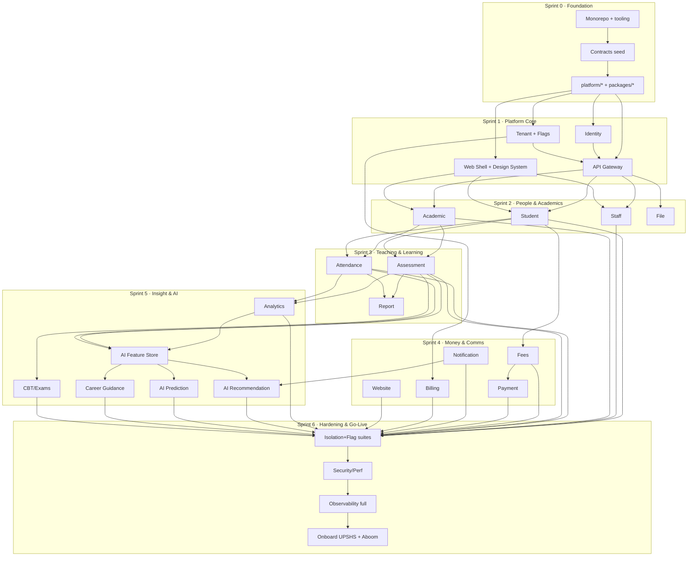

# AuraEDU — Agent Execution Plan

**Project key:** `AURA`
**Version:** 1.0
**Derived from:** `AuraEDU_Microservices_Multi_Tenant_SaaS_Specification.md` (v2.0), `AI_Development_Workflow_Training_Manual`, `AI_Native_Software_Engineering_Operations_Manual`
**Audience:** AI coding agents and engineers building AuraEDU in parallel
**Status:** Ready for Sprint 0

> This is the single source of truth for *how the work is decomposed and sequenced*.
> The spec says **what** to build. This plan says **who builds what, in what order, against which contracts, and how to avoid stepping on each other.**
>
> **Companion docs:** [`DESIGN_SYSTEM.md`](DESIGN_SYSTEM.md) — the mandatory UI/UX + animation spec (theming, sidebar, tour, theme toggle, menus, motion). [`BRAND.md`](BRAND.md) — the AuraEDU visual identity, *Chalkboard & Register* (colour, type, the red-tick signature, per-tenant re-skin rule). Frontend agents (L4/L7) build to both.

---

## Table of Contents

1. [How to Use This Plan (agents read first)](#1-how-to-use-this-plan)
2. [Non-Negotiable Engineering Rules](#2-non-negotiable-engineering-rules)
3. [Technology Decisions](#3-technology-decisions)
4. [Monorepo Folder Structure](#4-monorepo-folder-structure)
5. [Service Internal Structure (Hexagonal)](#5-service-internal-structure-hexagonal)
6. [Contracts-First: The Key to Parallelism](#6-contracts-first-the-key-to-parallelism)
7. [Cross-Cutting Platform Concerns](#7-cross-cutting-platform-concerns)
8. [Parallelization Model — Lanes, Ownership & Collisions](#8-parallelization-model)
9. [Ticket Conventions (Epic / Story / Subtask)](#9-ticket-conventions)
10. [Global Definition of Done](#10-global-definition-of-done)
11. [Dependency Graph](#11-dependency-graph)
12. [Sprint Plan Overview](#12-sprint-plan-overview)
13. [Epic Catalog](#13-epic-catalog)
14. [Detailed Stories — Sprint 0 (Foundation)](#14-sprint-0--foundation--contracts)
15. [Detailed Stories — Sprint 1 (Platform Core)](#15-sprint-1--platform-core)
16. [Domain Service Story Template + Per-Service Specs](#16-domain-service-story-template)
17. [Detailed Stories — Sprints 2–6](#17-sprints-26--epic-story-breakdown)
18. [Frontend Story Breakdown](#18-frontend-story-breakdown)
19. [Quality, Security & Go-Live Epics](#19-quality-security--go-live)
20. [Risk Register](#20-risk-register)
21. [Appendix A — Feature Flag Catalog](#appendix-a--feature-flag-catalog)
22. [Appendix B — Domain Events Catalog](#appendix-b--domain-events-catalog)
23. [Appendix C — RBAC Permission Catalog](#appendix-c--rbac-permission-catalog)
24. [Appendix D — Service Port / DB / Owner Registry](#appendix-d--service-registry)

---

## 1. How to Use This Plan

**If you are an AI agent assigned a story:**

1. Find your story ID (e.g. `AURA-10.3`) in the sprint sections below.
2. Confirm your **lane** and the **directory you exclusively own** for this story (§8). Do not edit files outside your owned paths without a coordination note.
3. Read the story's **Depends-On** field. If a dependency is not `Done`, you build against its **published contract** (`contracts/openapi/*`, `contracts/events/*`) using a stub/mock — never against its live database or internal code.
4. Create your branch: `feature/AURA-10.3-student-crud` (§9).
5. Implement to the **Acceptance Criteria** and the **Global Definition of Done** (§10).
6. Open a PR titled `AURA-10.3 <summary>`. PRs are the only merge path.
7. If you must change a shared contract, that is a **separate PR** to `contracts/` reviewed by the Contracts owner (§6). Never fork a contract locally.

**Reading order for onboarding:** §2 → §3 → §5 → §6 → §8 → §9 → §10, then your epic in §13+.

---

## 1a. Agent Task Board (live)

This section tracks work currently in-flight and recently completed. It is updated by the active agent after every batch of work.

| Story | Epic | Status | Agent | Notes |
|---|---|---|---|---|
| AURA-31.1 | EP-31 AI Prediction Service | **Done** | Kimi Code CLI | FastAPI service with feature-store metrics, rule-based predictions, explainability, approve/reject, CloudEvent publisher, NATS subscriber stub, feature-flag gating, Dockerfile, tests. |
| AURA-32.1 | EP-32 Career Guidance Service | **Done** | Kimi Code CLI | Full FastAPI service with contracts, rule-based guidance, teacher review, feature-flag gating, tests, Dockerfile. |
| AURA-7.1 | EP-07 CI/CD & Developer Experience | **Done** | Kimi Code CLI | Split monolithic `ci.yml` into reusable workflows; `actionlint` passes. |
| AURA-48.1/48.2 | EP-48 Mobile Shell | **Done** | Kimi Code CLI | Expo SDK 57.0.4 + React Native 0.86.0 + React 19.2.3 scaffold with tenant/role-aware `App.tsx`; `pnpm lint` and `typecheck` pass. |
| AURA-3.6 | EP-03 API Gateway | **Done** | Kimi Code CLI | Route-level RBAC permission enforcement; method-aware permissions for `/api/v1/files` and `/api/v1/uploads`. |
| AURA-20.9 | EP-20 File Service | **Done** | Kimi Code CLI | Cloudinary SDK v2 adapter, direct signed upload flow (`POST /uploads/signed` + `POST /files/{id}/complete`), deployment wiring in `docker-compose.yml` and `render.yaml`. |
| AURA-20.10.1 | EP-20 File Service | **Done** | Kimi Code CLI | Transform presets + delivery URL endpoint for Cloudinary-backed files. |
| AURA-20.10.3 | EP-20 File Service | **Done** | Kimi Code CLI | Per-tenant usage accounting: `file_usage` table, record storage/delivery, `GET /files/usage`. |
| AURA-20.10 | EP-20 File Service | **Done** | Kimi Code CLI | Transform presets + delivery, Cloudinary webhook, usage accounting all complete. |
| AURA-23.1 | EP-23 Audit (base) | **Done** | Kimi Code CLI | Audit sink service + worker already implemented; added Docker worker build and deployment wiring in `docker-compose.yml` and `render.yaml`. |
| AURA-10.1 | EP-10 Student Service | **Done** | Kimi Code CLI | Student CRUD spine: domain, repository, service, HTTP, events, feature-flag gating, tenant-isolation tests; wired into gateway, docker-compose, and render.yaml. |
| AURA-10.10 | EP-10 Student Service | **Done** | Kimi Code CLI | Guardian↔student links: Guardian domain, repository, link table, HTTP endpoints, OpenAPI updates, tenant-isolation tests. |
| AURA-10.9 | EP-10 Student Service | **Done** | Kimi Code CLI | Bulk import students+guardians via CSV (`POST /students/import`), per-row error collection, dedupe by guardian email, tenant-scoped. |
| AURA-12.1 | EP-12 Academic Service | **Done** | Kimi Code CLI | Academic Service deployment wiring: `academic_management` core flag, `academic.read`/`academic.manage` RBAC, gateway route, docker-compose, render.yaml, Dockerfile feature registry. |
| AURA-2.4 | EP-02 Platform Core | **Done** | Kimi Code CLI | Added `httpx.RequirePermission` middleware; gateway-injected actor must hold permission; platform super-admins implicitly pass. |
| AURA-2.6 | EP-02 Platform Core | **Done** | Kimi Code CLI | Concrete NATS JetStream DLQ: failed events published to `AURA_DLQ` stream with original event, error, and timestamp. |
| AURA-2.7 | EP-02 Platform Core | **Done** | Kimi Code CLI | `platform/flags.TenantServiceClient` now calls tenant-service `/api/v1/features` with actor headers and falls back to static snapshot. |
| AURA-3.x | EP-03 API Gateway | **Done** | Kimi Code CLI | Gateway tenant resolver calls tenant-service `/api/v1/tenants/{code}`; feature-flag edge check uses live client via request context. |
| AURA-5.x | EP-05 Tenant Service | **Done** | Kimi Code CLI | Postgres+RLS adapter, context-aware repository, `/api/v1/tenants/resolve` public endpoint, `/api/v1/admin/tenants/{code}/features/{key}` override. |
| AURA-5.1 | EP-05 Tenant Service | **Done** | Kimi Code CLI | Full Tenant CRUD: added `PATCH`/`DELETE /api/v1/tenants/{code}`, `domain.TenantUpdate`, memory + postgres adapters, `tenant.updated.v1`/`tenant.deleted.v1` events, unit tests, OpenAPI contract updated. |
| AURA-5.4 | EP-05 Tenant Service | **Done** | Kimi Code CLI | Public tenant resolver now matches OpenAPI: `GET /api/v1/tenants/resolve?domain=` or `?subdomain=`; gateway resolver calls the resolve endpoint. |
| — | Backlog / Deferred | **Done** | Kimi Code CLI | Added cobra-based CLI to every Go service: `cmd/<service>` with `server`, `worker` (where applicable) and `migrate` (where migrations exist) subcommands. Dockerfiles default to `CMD ["server"]`. |

---

## 2. Non-Negotiable Engineering Rules

Lifted from spec §22 and the operations manuals. Every agent enforces these; PRs violating them are rejected automatically in review.

1. **One codebase, many tenants.** Never create a school-specific fork, module, branch, or `if tenant == "upshs"` branch. School differences are **configuration + feature flags** only.
2. **No hardcoded school names, colours, domains, or logic.** Ever.
3. **Each microservice owns its database.** No service reads another service's DB. Cross-service data flows via **REST (sync)** or **events (async)** only.
4. **Every tenant-owned table and event carries `tenant_id`.** No exceptions.
5. **Every protected action checks 4 gates in order:** `authenticated → tenant scope matches → RBAC permission → feature flag enabled → resource belongs to tenant`.
6. **Disabled features are blocked in three places:** frontend (hidden), backend API (403 `feature_disabled`), and workers (job skipped).
7. **Hexagonal architecture inside every service.** No business logic in HTTP handlers.
8. **Contracts are law.** Update `contracts/openapi` and `contracts/events` in the *same PR* that changes an interface. Breaking changes require a version bump.
9. **Never log PII / sensitive student data.** Use structured logs with redaction.
10. **Secure defaults.** Deny by default; secrets only via env / secret manager.
11. **Tests for tenant isolation and feature-flag behaviour are mandatory**, not optional, for any story touching data.
12. **Traceability:** every branch, commit, and PR references its `AURA-x.y` key.

---

## 3. Technology Decisions

The spec is prescriptive; these are the locked choices. Agents do **not** re-litigate these.

| Concern | Decision | Notes |
|---|---|---|
| Domain microservices | **Go 1.26.5**, Hexagonal | spec §12 mandates Go hexagonal; latest stable Go pinned |
| AI microservices | **Python 3.14.6**, FastAPI + `uv` 0.11.28 | spec §15 mandates Python AI services |
| Web frontend | **Next.js 16.2.10 (App Router), React 19.2.7, TypeScript 6.0.3**, Tailwind CSS 4.3.2 | tenant-aware; **deploys to Vercel**. TS 7.0.2 is available but held back until `typescript-eslint` has a stable release that supports it. |
| Company marketing site | **Next.js 16.2.10** (`apps/marketing`) — auraedu.com, Framer Motion allowed | product marketing + school sign-up funnel |
| Mobile apps | **Expo SDK 57.0.4 / React Native 0.86.0 / React 19.2.3**, Expo Router, **NativeWind v4** | one tenant-aware app (parent/student/teacher), ships via **EAS** |
| API Gateway | **Custom Go gateway** (`apps/api-gateway`) | owns auth verify, tenant resolution, rate limit, request-id |
| Inter-service sync | **REST/HTTP + JSON** through gateway; **internal gRPC where latency/throughput matters** | OpenAPI 3.1 contracts; gRPC is allowed now, not deferred |
| Inter-service async | **Kafka** (managed or self-hosted) | CloudEvents 1.0 envelope; Kafka is the production bus now, not a future migration |
| Datastore | **PostgreSQL 18** (Render Postgres), database-per-service, shared schema + `tenant_id`, **Row-Level Security** | spec §5.2 |
| Cache / sessions | **Render Key Value** (Valkey/Redis-compatible 7.x), tenant-prefixed keys | spec §5.3 |
| Media & files | **Cloudinary** (images, documents, video, PDFs) — SDK v2 / `next-cloudinary`; folders prefixed by tenant code; signed uploads + on-the-fly transforms | File Service (EP-20) |
| Contract types (TS) | generated from OpenAPI into `packages/shared-types` | |
| Monorepo (TS/JS) | **pnpm 11.11.0 workspaces + Turborepo 2.10.4** | `apps/{web,marketing,mobile}`, `packages/*` |
| Monorepo (Go) | **Go 1.26.5 workspaces** (`go.work`) across `apps/*-service` | |
| Monorepo (Py) | **uv 0.11.28 workspaces** across `apps/ai-*` | |
| Task orchestration | root **`Makefile`** + Turborepo pipelines | `make dev`, `make test`, `make contracts` |
| Containers | **Docker**; local **docker-compose**; **backend prod = Render**, **frontend prod = Vercel** | replaces spec §18 Kubernetes |
| Deployment | **Render Blueprints (`render.yaml`)** — gateway + domain/AI services = `web`/`pserv`/`worker`/`cron`; Render Postgres + Key Value; PR preview environments. **Web (`apps/web`) and marketing (`apps/marketing`) deploy to Vercel** | user directive |
| Observability | **OpenTelemetry → Grafana Cloud** (or self-host Prometheus/Loki/Tempo on Render), **Sentry** | spec §17 |
| CI/CD | **GitHub Actions** (latest action majors) for lint/test/contract/security gates → **Render auto-deploy via Blueprint** (`buildFilter` paths) with manual prod promotion; **Renovate** for automated dependency updates | spec §13 |
| Auth tokens | **JWT** (access+refresh); claims: `tenant_id, user_id, role, permissions[], features_hash` | Identity Service issues, Gateway verifies |
| Feature flags | Tenant Service is source of truth; **`@auraedu/flags` SDK** + snapshot in JWT for fast reads | spec §3 |

### 3.1 Version policy

**Every package is pinned to its latest stable major and kept current automatically.** Rules for all lanes:

1. **Scaffold with latest.** When generating a service/app, use the toolchain's latest stable at implement time (`go 1.26.5`, `node 26.5.0`, `pnpm 11.11.0`, `python 3.14.6`, latest Next/React/Tailwind/Expo) and **commit lockfiles** (`go.sum`, `pnpm-lock.yaml`, `uv.lock`).
2. **Renovate bot** runs on the repo: grouped weekly PRs for minor/patch, separate PRs for majors, auto-merge for green patch updates. Also updates **GitHub Actions** action versions and **Dockerfile base images**.
3. **Pinned baseline matrix** (verify latest at implement time): Go 1.26.5 · Node 26.5.0 · pnpm 11.11.0 · Turborepo 2.10.4 · TypeScript 6.0.3 (TS 7.0.2 pending typescript-eslint support) · Next.js 16.2.10 · React 19.2.7 (web) / React 19.2.3 (Expo mobile) · Tailwind CSS 4.3.2 · Expo SDK 57.0.4 · React Native 0.86.0 · Python 3.14.6 · FastAPI 0.139.0 · Pydantic v2 · SQLAlchemy 2.0.51 · PostgreSQL 18 · Kafka · Cloudinary SDK v2.
4. **CI enforces** `pnpm audit` / `govulncheck` / `pip-audit`; a failing security scan blocks merge (spec §13).

### 3.1.1 Linting & formatting

All linters are enabled and must pass in CI:

- **Go**: `golangci-lint` v2 with a comprehensive ruleset (standard linters plus `revive`, `gocritic`, `gosec`, `staticcheck`, `errcheck`, `lll` at 160 cols, `misspell`, `unparam`, `prealloc`, etc.), plus `go vet`, `gofmt`, and `govulncheck`.
- **Python**: `ruff` (all stable rule categories), `ruff format`, `mypy` strict, and `pyright` strict.
- **TypeScript/Web**: `ESLint` 10 (flat config, type-checked rules) and `Prettier` 3.9.5.
- **Contracts**: Spectral OpenAPI lint.

`make lint` runs the full suite locally.

> **Assumption note:** The Workflow Manual lists "Node.js/NestJS/Golang" generically. The AuraEDU spec §12 explicitly mandates **Go hexagonal** services and **Python** AI services, so those win. Go for the gateway + all domain services; TypeScript for `apps/{web,marketing,mobile}`; Python for `apps/ai-*`.

### 3.2 What the frontends cover (three distinct surfaces + mobile)

| Surface | App | Audience | Epic |
|---|---|---|---|
| **Company marketing site** | `apps/marketing` (auraedu.com) | Prospective schools — features, pricing, "sign up your school" → creates a tenant via Billing/Tenant onboarding | **EP-47** |
| **Per-school public websites** | `apps/web` route group `(public)/[tenant]` (e.g. `upshs.auraedu.com` / custom domain) | The school's public audience — admissions, news, pages | EP-19 + EP-44 |
| **Tenant app portals** | `apps/web` (admin/teacher/parent/student/super-admin) | Logged-in school users | EP-40–EP-45 |
| **Mobile app** | `apps/mobile` (Expo) — one tenant-aware app, runtime-branded, feature-flagged | Parents/students/teachers on iOS + Android | **EP-48** |

---

## 4. Monorepo Folder Structure

Refined from spec §11 with best-practice additions (`platform/` shared Go libs, `tools/` codegen, `deploy/` env overlays, `.changeset`, `CODEOWNERS`). This is the canonical tree agents scaffold in Sprint 0.

```text
auraedu/
├── apps/
│   ├── web/                        # Next.js — tenant-aware shell, all portals + per-school public sites (TS)
│   ├── marketing/                  # Next.js — auraedu.com company marketing + school sign-up funnel (TS)
│   ├── mobile/                     # Expo/React Native — one tenant-aware app (parent/student/teacher) (TS)
│   ├── api-gateway/                # Go — routing, auth verify, tenant resolution, rate limit
│   ├── identity-service/           # Go — auth, users, roles, sessions
│   ├── tenant-service/             # Go — schools, branding, settings, FEATURE FLAGS
│   ├── student-service/            # Go — students, parents, guardians, enrollment
│   ├── staff-service/              # Go — teachers & non-teaching staff
│   ├── academic-service/           # Go — years, terms, classes, subjects, curriculum, grading
│   ├── attendance-service/         # Go — daily & subject attendance
│   ├── assessment-service/         # Go — assignments, tests, exams, scores
│   ├── report-service/             # Go — report cards, transcripts, PDF
│   ├── fees-service/               # Go — fees, invoices, balances, receipts
│   ├── payment-service/            # Go — gateway integrations, webhooks
│   ├── notification-service/       # Go — email, SMS, WhatsApp, in-app
│   ├── website-service/            # Go — public site content/pages
│   ├── file-service/               # Go — uploads, documents, images, certificates
│   ├── analytics-service/          # Go — KPIs, dashboards, projections
│   ├── billing-service/            # Go — SaaS plans, subscriptions, invoices
│   ├── cbt-service/                # Go — online/CBT exam engine (feature-flagged)
│   ├── audit-service/              # Go — audit logs, compliance events
│   ├── ai-recommendation-service/  # Python — learning recs & interventions
│   ├── ai-prediction-service/      # Python — risk & performance prediction
│   └── career-guidance-service/    # Python — career/course guidance
├── packages/                       # Shared TS libraries (web + marketing + mobile)
│   ├── ui/                         # Web design system (shadcn/Radix based), tenant-themed
│   ├── ui-native/                  # Mobile design system (NativeWind), mirrors ui components
│   ├── tokens/                     # Design tokens — OKLCH (web) + hex mirror (mobile/NativeWind)
│   ├── shared-types/               # Types GENERATED from OpenAPI + event schemas
│   ├── feature-flags/              # @auraedu/flags client SDK (React hooks + guards; web + native)
│   ├── api-client/                 # Typed gateway client (shared web + mobile)
│   ├── config/                     # Shared FE config, zod env parsing
│   ├── logger/                     # FE structured logger
│   └── eslint-config/              # Shared lint config
├── platform/                       # Shared GO libraries (imported by every Go service)
│   ├── tenancy/                    # tenant context extract/propagate/enforce
│   ├── auth/                       # JWT verify, RBAC permission checks
│   ├── flags/                      # feature-flag gate (server + worker)
│   ├── httpx/                      # HTTP server, middleware, error mapping
│   ├── eventbus/                   # NATS publish/subscribe, CloudEvents envelope
│   ├── db/                         # pgx pool, migrations runner, RLS helpers
│   ├── observ/                     # OTel tracing, metrics, structured logging
│   ├── config/                     # env config loader
│   └── testkit/                    # tenant-isolation & flag test harness, fixtures
├── contracts/                      # SOURCE OF TRUTH for all interfaces
│   ├── openapi/                    # <service>.v1.yaml (OpenAPI 3.1) per service
│   ├── events/                     # <event>.v1.json (JSON Schema, CloudEvents) per event
│   ├── permissions/               # permission keys registry (yaml)
│   ├── features/                   # feature-flag keys registry (yaml)
│   └── README.md                   # contract change process + versioning rules
├── infrastructure/
│   ├── docker/                     # base images, per-service Dockerfiles referenced here
│   └── render/                     # Render Blueprint fragments, env-group defs, NATS pserv spec
├── deploy/
│   ├── docker-compose.yml          # full local stack (all services + NATS + PG + Redis)
│   └── docker-compose.infra.yml    # infra-only (PG/Redis/NATS/OTel) for lane devs
├── render.yaml                     # Render Blueprint — all services, DBs, workers, cron, env groups
├── eas.json                        # Expo Application Services build/submit profiles (mobile)
├── tools/
│   ├── codegen/                    # OpenAPI→Go/TS, JSON Schema→types generators
│   ├── new-service/                # scaffolding generator (hexagonal template)
│   └── seed/                       # tenant seed CLI (UPSHS, Aboom)
├── docs/
│   ├── architecture/               # ADRs, C4 diagrams
│   ├── api/                        # rendered API docs
│   ├── onboarding/                 # new-tenant + new-engineer guides
│   ├── ai/                         # AI model cards, eval reports
│   └── runbooks/                   # incident & go-live runbooks
├── scripts/                        # dev helpers (bootstrap, lint-all, test-all)
├── .github/
│   ├── workflows/                  # per-service + web CI, changed-service detection
│   └── CODEOWNERS                  # enforces lane ownership (§8)
├── go.work                         # Go workspace across apps/*-service
├── pnpm-workspace.yaml             # TS workspace (apps/web + packages/*)
├── turbo.json                      # Turborepo pipeline
├── Makefile                        # make dev|test|contracts|lint|migrate|seed
├── CLAUDE.md                       # AI operating rules (per Workflow Manual)
├── AGENTS.md                       # agent standards, lane map, conventions
└── README.md
```

> **`CLAUDE.md` and `AGENTS.md` are mandatory** (Workflow Manual §"CLAUDE.md and AGENTS.md"). They are created in Sprint 0 (`AURA-0.9`) and encode §2, §8, §9, §10 of this plan so any agent joining mid-project self-orients.

---

## 5. Service Internal Structure (Hexagonal)

Every Go service follows this exact layout (spec §12). The `tools/new-service` generator emits it so all 18 Go services are structurally identical — this is what lets one agent context-switch between services and lets reviewers apply one mental model.

```text
<name>-service/
├── cmd/
│   ├── server/main.go              # HTTP server entrypoint
│   └── worker/main.go              # event consumer / background jobs
├── internal/
│   ├── domain/                     # entities, value objects, domain errors, invariants
│   │   ├── <aggregate>.go
│   │   └── errors.go
│   ├── application/                # USE CASES (one file per use case)
│   │   ├── create_<x>.go
│   │   ├── update_<x>.go
│   │   └── list_<x>.go
│   ├── ports/                      # interfaces (driven + driving)
│   │   ├── repository.go
│   │   ├── event_publisher.go
│   │   └── <external>.go
│   └── adapters/
│       ├── postgres/               # repository impl (pgx), migrations-aware
│       ├── http/                   # handlers, request/response DTOs, router
│       └── events/                 # NATS publisher/consumer impls
├── migrations/                     # goose/atlas SQL migrations (tenant_id + RLS)
├── tests/
│   ├── unit/                       # domain + application (no I/O)
│   ├── integration/                # postgres/http adapters (testcontainers)
│   ├── contract/                   # verifies OpenAPI + event schema conformance
│   └── tenant_isolation/           # MUST-HAVE cross-tenant leak tests
├── openapi.gen.go                  # generated from contracts/openapi/<name>.v1.yaml
├── Dockerfile
└── README.md                       # service purpose, entities, events, run instructions
```

**Layer rules (enforced in review):**
- `domain` imports nothing from `application`, `ports`, or `adapters`.
- `application` orchestrates via `ports` interfaces only; it enforces **tenant scope + RBAC + feature flag** here.
- `adapters/http` maps HTTP↔use-case; **zero business logic**.
- `adapters/postgres` sets `tenant_id` on every query and relies on RLS as a second wall.
- The shared enforcement primitives come from `platform/{tenancy,auth,flags}` — services never re-implement them.

**Python AI service layout** (`ai-*`, FastAPI):
```text
<name>-service/
├── app/
│   ├── main.py                     # FastAPI app + health/ready
│   ├── api/                        # routers (thin)
│   ├── domain/                     # scoring/recommendation logic
│   ├── ports/                      # feature-store, model registry, event bus interfaces
│   ├── adapters/                   # nats consumer, feature store, model loader
│   ├── models/                     # model artifacts / loaders (per-tenant aware)
│   └── platform/                   # tenancy, auth, flags, config, observ (py mirror)
├── tests/{unit,integration,eval,tenant_isolation}/
├── pyproject.toml                  # uv
├── Dockerfile
└── README.md
```

---

## 6. Contracts-First: The Key to Parallelism

**This is the mechanism that makes 15+ agents productive simultaneously.** Nothing here is optional.

### 6.1 Principle
No service is built against another service's *code* or *database*. It is built against that service's **published contract**. If the contract exists, the consumer can proceed in parallel using a generated stub — even before the producer service is written.

### 6.2 Order of operations for any new interface
1. **Contract PR first.** Author/modify `contracts/openapi/<service>.v1.yaml` (REST) and/or `contracts/events/<event>.v1.json` (events). Merge it before implementation.
2. **Generate.** `make contracts` runs `tools/codegen` to produce Go server/client stubs, TS types (`packages/shared-types`), and JSON-Schema validators. Generated code is committed.
3. **Implement producer & consumers in parallel.** The producer fills the stub; consumers code against the generated client/types + a local mock.
4. **Contract tests** (`tests/contract/`) run in CI on both sides and fail the build on drift.

### 6.3 Versioning
- Path/topic carries the version: `/api/v1/...`, event `assessment.score_recorded.v1`.
- **Additive changes** (new optional field) → no version bump.
- **Breaking changes** → new `v2` file; old version kept until all consumers migrate.
- CloudEvents envelope is standard for all events:
```json
{
  "specversion": "1.0",
  "type": "assessment.score_recorded.v1",
  "source": "assessment-service",
  "subject": "student-uuid",
  "tenant_id": "upshs",
  "id": "evt-uuid",
  "time": "2026-07-08T10:00:00Z",
  "data": { "student_id": "…", "subject_id": "…", "score": 72 }
}
```

### 6.4 Ownership
- `contracts/` has a dedicated **CODEOWNER** (the Platform/Contracts lead agent). All contract PRs require that review. This prevents two lanes silently diverging on a shared shape.
- The full seed of contracts is created in **Sprint 0 (EP-01)** so every downstream sprint starts with stubs ready.

---

## 7. Cross-Cutting Platform Concerns

These live in `platform/` (Go) and `packages/` (TS) and are built **once, first** (Sprint 0–1). Every feature story consumes them; no story re-implements them.

| Concern | Package | What it provides | Built in |
|---|---|---|---|
| Tenant context | `platform/tenancy` | extract `tenant_id/code/request_id/actor` from request/JWT/event; propagate on outbound calls; reject if missing | AURA-2.x (EP-02) |
| AuthN/Z | `platform/auth` | JWT verify, claims parse, `RequirePermission(perm)` middleware | EP-02 |
| Feature flags | `platform/flags` + `packages/feature-flags` | `IsEnabled(tenant, key)` gate for API + worker; React `<FeatureGate>` + `useFeature()` for web | EP-02 / EP-06 |
| DB + RLS | `platform/db` | pgx pool, migration runner, `SET app.tenant_id` session var powering RLS policies | EP-02 |
| Event bus | `platform/eventbus` | typed publish/subscribe, CloudEvents envelope, `tenant_id` required, dead-letter | EP-02 |
| Observability | `platform/observ` + `packages/logger` | OTel spans, Prom metrics, structured logs w/ PII redaction, health/ready | EP-02 / EP-08 |
| Test harness | `platform/testkit` | spin ephemeral PG (testcontainers), seed 2 tenants, assert no cross-tenant leak | EP-02 |
| Errors | `platform/httpx` | canonical error envelope incl. `feature_disabled`, `forbidden`, `tenant_mismatch` | EP-02 |

**Tenant isolation is enforced at 3 layers** (defense in depth): (a) application-layer `tenant_id` scoping, (b) Postgres **Row-Level Security** keyed on `app.tenant_id` session var, (c) `platform/testkit` isolation tests in every service's CI. A single miss cannot leak data.

---

## 8. Parallelization Model

### 8.1 Lanes (agent pools)
Each lane is a pool of one or more agents. **A lane owns a set of top-level directories.** Two agents never edit the same service directory at the same time within a sprint.

| Lane | Owns (directories) | Skills | Typical concurrent agents |
|---|---|---|---|
| **L0 Platform** | `platform/*`, `contracts/*`, `tools/*`, `packages/{shared-types,feature-flags,api-client,config,logger}` | Go, contracts, codegen | 1–2 |
| **L1 Gateway/Identity/Tenant** | `apps/{api-gateway,identity-service,tenant-service}` | Go, auth, security | 2–3 |
| **L2 Domain-Go** | one agent per `apps/<x>-service` (student, staff, academic, attendance, assessment, report, fees, payment, notification, website, file, analytics, billing, cbt, audit) | Go hexagonal | up to 15 |
| **L3 AI-Python** | `apps/ai-*`, `apps/career-guidance-service`, `docs/ai` | Python, ML, FastAPI | 1–3 |
| **L4 Frontend** | `apps/web`, `apps/marketing`, `packages/{ui,tokens}` | Next.js, React, TS | 2–4 (sub-split by portal + marketing) |
| **L5 Infra/DevX** | `infrastructure/*`, `deploy/*`, `render.yaml`, `.github/workflows`, `Makefile` | Docker, Render, CI/CD | 1–2 |
| **L6 Quality** | `tests/` cross-service, `platform/testkit`, contract-test harness, security/perf | QA, security | 1–2 |
| **L7 Mobile** | `apps/mobile`, `packages/{ui-native,tokens}`, `eas.json` | Expo, React Native, NativeWind | 1–2 |

### 8.2 Collision-avoidance rules
1. **One owner per service directory per sprint.** The Service Registry (Appendix D) assigns it. Reassignment between sprints is fine.
2. **Shared code changes are their own PRs.** Touching `platform/*`, `packages/*`, or `contracts/*` is never bundled into a feature story — it is a separate ticket reviewed by L0. This keeps feature branches from fighting over shared files.
3. **`CODEOWNERS` enforces it.** `contracts/` → L0; `platform/` → L0; `infrastructure/` + `render.yaml` → L5; `apps/mobile/` + `packages/ui-native/` → L7; `packages/tokens/` → L4 (shared, coordinate with L7); each `apps/<x>-service/` → its assigned lane. GitHub blocks merge without the owning lane's review.
4. **Generated files are committed, never hand-edited.** `*.gen.go`, `packages/shared-types/*` change only via `make contracts`.
5. **Migrations are additive & service-local.** Each service owns `apps/<x>-service/migrations/`; no shared migration files exist.
6. **DB-per-service** means no schema-level collisions between lanes by construction.

### 8.3 What unblocks what (parallel windows)
- After **Sprint 0** (contracts + platform packages exist), *every* domain service can start in parallel because each has a stub + platform libs.
- Identity/Tenant/Gateway (Sprint 1) are the only true serial prerequisite: they mint the tenant context + JWT everything else assumes. Domain services can begin their domain/application layers against the `platform/auth` + `platform/tenancy` interfaces **before** Identity is fully live (using test tokens from `testkit`).
- Frontend shell (Sprint 1) unblocks all portal modules; portal modules are independent of each other and run in parallel in Sprints 2–5.

---

## 9. Ticket Conventions

Per Workflow Manual. Hierarchy: **Client → Project(AURA) → Epic → Story → Subtask.**

### 9.1 Every Story must contain
- **User Story** — "As a `<role>`, I want `<capability>`, so that `<value>`."
- **Business Value**
- **Acceptance Criteria** (testable, Given/When/Then friendly)
- **Technical Notes** (entities, endpoints, events, flags, permissions, owned paths)
- **Definition of Done** (points to §10 + story-specific)
- **Estimate** (story points, Fibonacci)
- **Dependencies** (`Depends-On:` other AURA keys)
- **Lane / Owner** (from §8)

### 9.2 Git conventions
- Branch: `feature/AURA-10.3-student-crud`
- Commit: `AURA-10.3 implement student create use case`
- PR title: `AURA-10.3 Student create/list/update`
- Merged PR auto-updates Jira status + dashboard (Automation 3/4 from Ops Manual).

### 9.3 Estimation scale
`1` = <½ day · `2` = ½–1 day · `3` = 1–2 days · `5` = 2–3 days · `8` = ~1 week · `13` = needs decomposition.

---

## 10. Global Definition of Done

A story is Done only when **all** are true (spec §21 + Workflow Manual):

- [ ] Tenant-aware (all reads/writes scoped by `tenant_id`; RLS policy present).
- [ ] Controlled by the correct feature flag (API 403s `feature_disabled` when off; worker skips; UI hides).
- [ ] RBAC permission enforced at application layer.
- [ ] Resource-ownership check (actor may only touch their tenant's / their own records).
- [ ] OpenAPI updated in `contracts/openapi`; events updated in `contracts/events`.
- [ ] Unit tests pass (domain + application).
- [ ] Integration tests pass (adapters).
- [ ] Contract tests pass (no drift from published contract).
- [ ] **Tenant isolation test** passes (cannot read/write another tenant's data).
- [ ] **Feature flag test** passes (disabled path blocked in API + worker).
- [ ] Frontend handles enabled AND disabled states (where UI applies).
- [ ] Structured logs + audit event emitted (no PII in logs).
- [ ] Health/readiness endpoints green; OTel spans present.
- [ ] CI/CD pipeline green; Docker image builds; migrations validate.
- [ ] Staging smoke test passes.
- [ ] `README.md` for the service updated.

---

## 11. Dependency Graph



**Critical path:** `Foundation → Contracts → platform → Identity/Tenant/Gateway → (everything fans out) → Isolation/Security → Go-Live`. Everything to the right of the gateway is broadly parallel.

---

## 12. Sprint Plan Overview

| Sprint | Theme | Primary Epics | Parallel lanes active | Exit criteria |
|---|---|---|---|---|
| **0** | Foundation & Contracts | EP-00, EP-01, EP-02, EP-07(skel), EP-08(skel), **EP-09(skel)** | L0, L5 | Repo scaffolded; all contracts + platform libs published; `make dev` boots infra; service generator works; `render.yaml` deploys a hello service to Render |
| **1** | Platform Core | EP-03, EP-04, EP-05, EP-06, EP-46, EP-45(min), **EP-47(marketing)** | L0, L1, L4, L5 | Login works; tenant resolved by domain; JWT with flags; web shell themes per tenant; super-admin CRUDs tenants+flags; **auraedu.com marketing site live with sign-up funnel** |
| **2** | People & Academics | EP-10, EP-11, EP-12, EP-20(Cloudinary), EP-40, EP-23, **EP-48(mobile shell)** | L2×4, L4, L6, L7 | Students/staff/academic CRUD live & tenant-isolated; Cloudinary uploads; admin console; audit base; **mobile app shell (tenant resolve + login + theming)** |
| **3** | Teaching & Learning | EP-13, EP-14, EP-15, EP-41, EP-42, EP-43, **EP-48(teacher/parent/student mobile)** | L2×3, L4×3, L6, L7 | Attendance marked; scores recorded; report cards (PDF); teacher/parent/student **web + mobile** portals |
| **4** | Money & Comms | EP-16, EP-17, EP-18, EP-22, EP-19, EP-44 | L2×5, L4×2, L7 | Fees/invoices; payment webhooks; notifications (email/SMS + **mobile push**); billing plans gate features; per-school public websites |
| **5** | Insight & AI | EP-21, EP-33, EP-30, EP-31, EP-32, EP-24 | L2×2, L3×3, L4, L7 | Analytics projections; feature store; AI recs/predictions/career (explainable, teacher-approved); CBT exams; **mobile parity for new features** |
| **6** | Hardening & Go-Live | EP-50, EP-51, EP-53, EP-54, EP-08(full), EP-09(full), EP-55, EP-52 | L6, L5, L7, all | Isolation+flag suites green; security & load pass; observability complete; **Render prod + preview envs**; **mobile apps submitted to App Store/Play**; UPSHS + Aboom onboarded & live |

**Backlog (post-MVP):** EP-25 Library, EP-26 Hostel/Transport, WhatsApp channel hardening, custom-domain automation, per-tenant model training pipeline, **optional per-school white-label mobile builds via EAS**.

---

## 13. Epic Catalog

Legend — **Lane** (§8), **Feature flag(s)** gating the epic, **DB** owned.

### Platform & Foundation
| Epic | Title | Lane | Flag | DB |
|---|---|---|---|---|
| EP-00 | Monorepo Foundation & Tooling | L0/L5 | — | — |
| EP-01 | Contracts Seed (OpenAPI + Events + registries) | L0 | — | — |
| EP-02 | Shared Platform Packages | L0 | — | — |
| EP-03 | API Gateway | L1 | — | — |
| EP-04 | Identity Service | L1 | — | `identity_db` |
| EP-05 | Tenant Service + Feature Flags | L1 | — | `tenant_db` |
| EP-06 | Web Shell (tenant/feature-aware) | L4 | — | — |
| EP-07 | CI/CD & Developer Experience | L5 | — | — |
| EP-08 | Observability Platform | L5 | — | — |
| EP-09 | Render Deployment (Blueprints, envs, previews) | L5 | — | — |
| EP-46 | Design System (`packages/ui` + `tokens`) | L4 | — | — |

### Domain Services
| Epic | Title | Lane | Flag | DB |
|---|---|---|---|---|
| EP-10 | Student Service | L2 | `student_management` | `student_db` |
| EP-11 | Staff Service | L2 | `staff_management` | `staff_db` |
| EP-12 | Academic Service | L2 | (core, always on) | `academic_db` |
| EP-13 | Attendance Service | L2 | `attendance` | `attendance_db` |
| EP-14 | Assessment Service | L2 | `assessments`,`assignments` | `assessment_db` |
| EP-15 | Report Service | L2 | `report_cards` | `report_db` |
| EP-16 | Fees Service | L2 | `fees` | `fees_db` |
| EP-17 | Payment Service | L2 | `online_payments` | `payment_db` |
| EP-18 | Notification Service | L2 | `email_notifications`,`sms_notifications`,`whatsapp_notifications`,`announcements` | `notification_db` |
| EP-19 | Website Service | L2 | `public_website` | `website_db` |
| EP-20 | File Service | L2 | (core) | `file_db` |
| EP-21 | Analytics Service | L2 | `analytics` | `analytics_db` |
| EP-22 | Billing Service | L2 | `billing` | `billing_db` |
| EP-23 | Audit Service | L2 | (core) | `audit_db` |
| EP-24 | CBT / Online Exams Service | L2 | `cbt_exams` | `cbt_db` |

### AI Services
| Epic | Title | Lane | Flag | DB |
|---|---|---|---|---|
| EP-33 | AI Feature Store & Data Pipeline | L3 | (core for AI) | `ai_db` |
| EP-30 | AI Recommendation Service | L3 | `ai_recommendations` | `ai_db` (schema) |
| EP-31 | AI Prediction Service | L3 | `ai_predictions` | `ai_db` (schema) |
| EP-32 | Career Guidance Service | L3 | `career_guidance` | `ai_db` (schema) |

### Frontend Modules (web) + Marketing + Mobile
| Epic | Title | Lane | Flag | Platform |
|---|---|---|---|---|
| EP-40 | School Admin Console | L4 | per-module | **web only** |
| EP-41 | Teacher Portal | L4 | `teacher_portal` | web + mobile |
| EP-42 | Parent Portal | L4 | `parent_portal` | web + mobile |
| EP-43 | Student Portal | L4 | `student_portal` | web + mobile |
| EP-44 | Public Website Rendering (per-school sites) | L4 | `public_website` | web |
| EP-45 | Platform Super-Admin (company admin) Console | L4 | — | **web only** |
| EP-47 | Company Marketing Website (auraedu.com) | L4 | — | web |
| EP-48 | Mobile App (Expo — teacher/parent/student) | L7 | per-module | mobile |

> **Platform rule (user directive):** the two admin roles — **School Admin** (EP-40) and **Platform Super Admin / company admin** (EP-45) — are **web only**. Every other stakeholder — **teacher, parent, student** (and future non-admin roles like Support/Accountant where relevant) — gets **both web and mobile**. The mobile app is a single tenant-aware, runtime-branded, feature-flagged Expo app that renders the role-appropriate experience after login; it deliberately ships **no admin consoles**.

### Quality, Security & Release
| Epic | Title | Lane |
|---|---|---|
| EP-50 | Tenant Isolation Test Suite | L6 |
| EP-51 | Feature Flag Test Suite | L6 |
| EP-52 | Onboarding & Tenant Seed (UPSHS, Aboom) | L5/L6 |
| EP-53 | Security & Hardening | L6 |
| EP-54 | Performance & Load | L6 |
| EP-55 | Go-Live Runbooks & Hypercare | L5/L6 |

---

## 14. Sprint 0 — Foundation & Contracts

> **Goal:** by end of Sprint 0, any agent can `git clone`, run `make dev`, generate stubs, and start a service. Nothing here can be parallelized past its dependencies — L0 leads, L5 assists. This sprint is the highest-leverage work in the whole plan; do it right.

### EP-00 · Monorepo Foundation & Tooling

**AURA-0.1 — Scaffold monorepo skeleton**
- *User Story:* As a platform engineer, I want the full monorepo tree and workspace configs, so that every lane has a home directory and consistent tooling.
- *Acceptance Criteria:*
  - Directory tree from §4 exists (empty package stubs allowed).
  - `pnpm-workspace.yaml`, `turbo.json`, `go.work`, root `Makefile`, `uv` workspace config present and valid.
  - `make bootstrap` installs all toolchains; `make lint` and `make test` run (even if trivially green).
  - `.editorconfig`, `.gitignore`, `.nvmrc`/`.tool-versions` set.
- *Technical Notes:* Owns everything at repo root + `tools/`, `scripts/`. Do not create service internals yet.
- *Estimate:* 5 · *Lane:* L0 · *Depends-On:* —

**AURA-0.2 — Service scaffolding generator (`tools/new-service`)**
- *User Story:* As a domain lane agent, I want `make new-service NAME=student`, so that I get a compiling hexagonal Go service identical to every other.
- *Acceptance Criteria:* generates §5 tree; wires `platform/*` imports; adds Dockerfile, README, CI matrix entry, `go.work use`; produces a compiling server + worker with `/health`,`/ready`.
- *Estimate:* 5 · *Lane:* L0 · *Depends-On:* AURA-0.1, AURA-2.x (platform interfaces) — may stub platform imports first, finalize after EP-02.

**AURA-0.9 — Author `CLAUDE.md` + `AGENTS.md` + `CODEOWNERS`**
- *AC:* `CLAUDE.md` encodes §2/§9/§10; `AGENTS.md` encodes lane map §8 + conventions; `.github/CODEOWNERS` enforces lane ownership; `contracts/README.md` documents §6.
- *Estimate:* 3 · *Lane:* L0 · *Depends-On:* AURA-0.1

### EP-01 · Contracts Seed

**AURA-1.1 — Author OpenAPI 3.1 skeletons for all services**
- *AC:* one `contracts/openapi/<service>.v1.yaml` per service in Appendix D with resource paths from spec §7, standard error envelope (`forbidden`,`feature_disabled`,`tenant_mismatch`,`validation_error`), and the tenant/auth header conventions. Lints clean (`spectral`).
- *Estimate:* 8 · *Lane:* L0 · *Depends-On:* AURA-0.1

**AURA-1.2 — Author event schemas (CloudEvents + JSON Schema)**
- *AC:* every event in Appendix B has `contracts/events/<event>.v1.json`; all include `tenant_id`; validated against CloudEvents 1.0; example payloads included.
- *Estimate:* 5 · *Lane:* L0 · *Depends-On:* AURA-0.1

**AURA-1.3 — Permission + feature-flag registries**
- *AC:* `contracts/permissions/permissions.yaml` (Appendix C) and `contracts/features/features.yaml` (Appendix A) are the machine-readable source of truth; codegen emits typed constants for Go + TS.
- *Estimate:* 3 · *Lane:* L0 · *Depends-On:* AURA-0.1

**AURA-1.4 — Codegen pipeline (`make contracts`)**
- *AC:* generates Go server/client + TS types (`packages/shared-types`) + JSON-schema validators; output committed; drift check in CI; documented in `contracts/README.md`.
- *Estimate:* 8 · *Lane:* L0 · *Depends-On:* AURA-1.1, AURA-1.2, AURA-1.3

### EP-02 · Shared Platform Packages

One story per package; all buildable in parallel within L0 once AURA-0.1 lands.

| Story | Package | Key AC | Est |
|---|---|---|---|
| AURA-2.1 | `platform/config` | env loader + validation, typed config | 2 |
| AURA-2.2 | `platform/observ` + `packages/logger` | OTel init, Prom metrics, structured JSON logs with **PII redaction**, `/health` `/ready` helpers | 5 |
| AURA-2.3 | `platform/tenancy` | extract/propagate/enforce tenant context from JWT + event; reject missing; cache-key + file-path helpers include tenant | 5 |
| AURA-2.4 | `platform/auth` | JWT verify, claims parse, `RequirePermission()` middleware, deny-by-default | 5 |
| AURA-2.5 | `platform/db` | pgx pool, migration runner, **RLS session-var helper** (`SET app.tenant_id`), tenant-scoped query helpers | 5 |
| AURA-2.6 | `platform/eventbus` | NATS JetStream publish/subscribe, CloudEvents envelope, `tenant_id` required, DLQ, idempotency key | 5 |
| AURA-2.7 | `platform/flags` + `packages/feature-flags` | server/worker `IsEnabled`; React `useFeature()`,`<FeatureGate>`; reads Tenant Service + JWT snapshot | 5 |
| AURA-2.8 | `platform/httpx` | HTTP server, middleware chain, canonical error envelope, request-id | 3 |
| AURA-2.9 | `platform/testkit` | testcontainers PG, seed 2 tenants, **cross-tenant leak assertions**, flag-toggle fixtures, fake JWT minter | 8 |

*Depends-On for all EP-02:* AURA-0.1. `platform/flags` also soft-depends on EP-05 contract (uses the stub).

### EP-07 (skeleton) · CI/CD

**AURA-7.1 — Changed-service CI matrix** — path-filtered GitHub Actions (latest action majors: `checkout@v4`, `setup-go@v5`, `setup-node@v4`, `docker/build-push-action@v6`): per-service lint/test/build/contract-test/docker/migration-validate + security scan (`govulncheck`/`pnpm audit`/`pip-audit`) per spec §13 PR pipeline. *Est 8 · L5 · Depends-On AURA-0.1, AURA-1.4.*

**AURA-7.2 — Local stack `deploy/docker-compose.yml`** — PG(×N logical DBs), Redis, NATS JetStream, OTel collector, Grafana/Loki/Tempo; `make dev` boots it; healthchecks. (Media uses **Cloudinary** even in dev via a dev cloud/folder — no MinIO.) *Est 5 · L5 · Depends-On AURA-0.1.*

**AURA-7.3 — Renovate + version policy** — Renovate config (grouped weekly minor/patch, separate majors, auto-merge green patches; also bumps GitHub Actions + Dockerfile bases); lockfiles committed; per §3.1. *Est 3 · L5 · Depends-On AURA-0.1.*

### EP-09 (skeleton) · Render Deployment

**AURA-9.1 — `render.yaml` Blueprint** — declare every service: gateway/web/marketing = `web`, domain/AI services = private services (`pserv`), event/report workers = `worker`, scheduled jobs = `cron`; wire per-service **Render Postgres** + shared **Render Key Value**; **NATS JetStream** as a `pserv` with a persistent disk; **env groups** for shared secrets (Cloudinary keys, JWT secret, provider keys). *Est 8 · L5 · Depends-On AURA-0.1.*

**AURA-9.2 — Deploy pipeline + preview envs** — GitHub Actions gates (lint/test/contract/security) must pass → Render auto-deploys via Blueprint with `buildFilter` paths (only changed services redeploy); **PR preview environments**; `staging` vs `production` environments with **manual prod promotion** (spec §13 main pipeline). *Est 5 · L5 · Depends-On AURA-9.1, AURA-7.1.* (Full prod hardening, autoscaling, backups land Sprint 6, EP-09 full.)

### EP-08 (skeleton) · Observability

**AURA-8.1 — Observability baseline** — OTel collector + Prom + Grafana + Loki + Tempo + Sentry wired into `docker-compose` (self-host on Render or Grafana Cloud in prod); `platform/observ` exports to it; one golden dashboard. *Est 5 · L5 · Depends-On AURA-2.2, AURA-7.2.* (Full dashboards/alerts land in Sprint 6, EP-08 full.)

---

## 15. Sprint 1 — Platform Core

> **Goal:** authentication, tenant resolution, and feature flags work end-to-end; the web shell themes itself per tenant and hides disabled modules; a super-admin can create the two schools. This is the last mostly-serial sprint. After it, domain lanes explode in parallel.

### EP-04 · Identity Service (`identity_db`)

| Story | Title | AC highlights | Est | Depends-On |
|---|---|---|---|---|
| AURA-4.1 | User & credential model | users, password hashing (argon2id), email/username, per-tenant uniqueness, RLS | 5 | EP-02 |
| AURA-4.2 | Login + JWT issue | access+refresh JWT; claims `tenant_id,user_id,role,permissions[],features_hash`; refresh rotation | 5 | AURA-4.1 |
| AURA-4.3 | Roles & permission assignment | roles from spec §8.1; permission keys from registry; `user.role_changed` event | 5 | AURA-4.1, AURA-1.3 |
| AURA-4.4 | Session/logout + token revoke | Redis session store, tenant-prefixed keys | 3 | AURA-4.2 |
| AURA-4.5 | Password reset + invite flow | tokenized, emits notification event | 3 | AURA-4.2, EP-18 contract |

### EP-05 · Tenant Service + Feature Flags (`tenant_db`)

| Story | Title | AC highlights | Est | Depends-On |
|---|---|---|---|---|
| AURA-5.1 | Tenant CRUD | schools, `tenant_code`, domain/subdomain, status; `tenant.created` event | 5 | EP-02 |
| AURA-5.2 | Branding & settings | logo, colours, locale, academic settings; served to web shell | 3 | AURA-5.1 |
| AURA-5.3 | **Feature flag store + API** | `tenant_features` table (spec §3.2); `GET /features` returns tenant snapshot; enable/disable emits `tenant.feature_enabled/disabled`; gradual rollout field; plan gating hook | 8 | AURA-5.1, AURA-1.3 |
| AURA-5.4 | Tenant resolution API | resolve `tenant_id` by domain/subdomain/header for the gateway | 3 | AURA-5.1 |
| AURA-5.5 | Super-admin overrides | platform super admin can force-enable/disable any flag (spec §3.3) | 3 | AURA-5.3 |

### EP-03 · API Gateway

| Story | Title | AC highlights | Est | Depends-On |
|---|---|---|---|---|
| AURA-3.1 | Routing + service registry | route `/api/v1/*` to services; version prefix; timeouts/retries | 5 | EP-02 |
| AURA-3.2 | Auth verification | verify JWT via `platform/auth`; reject unauth; inject actor into context | 3 | AURA-4.2 |
| AURA-3.3 | Tenant resolution middleware | resolve tenant (via EP-05), attach `tenant_id`; **reject requests without tenant context** | 5 | AURA-5.4 |
| AURA-3.4 | Rate limiting + request-id + CORS + logging | Redis token bucket per tenant+route; request-id gen; structured access logs | 5 | AURA-3.1 |
| AURA-3.5 | Feature-flag pre-check (optional fast path) | 403 `feature_disabled` at edge using flag snapshot for known module routes | 3 | AURA-3.3, AURA-5.3 |

### EP-46 · Design System (`packages/ui`)

> **Build to [`DESIGN_SYSTEM.md`](DESIGN_SYSTEM.md)** — the mandatory UI/UX spec distilled from the `aura` and `uposa` reference apps. Every component below is fully specified there (with copy-paste code + concrete values). Owned by the L4 design-system lead; portal agents consume, never fork.

| Story | Title | AC | Est |
|---|---|---|---|
| AURA-46.1 | Token layer + per-tenant theming | Tailwind v4 `@theme` **OKLCH** tokens; brand slots (`--brand`,`--brand-dark`,`--brand-tint`) as CSS vars with defaults; shadcn semantic binding (`--primary`/`--ring`/`--accent`→brand); light `:root` + dark `.dark`; global `prefers-reduced-motion` kill-switch. DESIGN §3–4 | 5 |
| AURA-46.2 | Core primitives | shadcn/ui install; AppShell, DataTable, Form primitives, `FeatureUnavailable`, Toast, Avatar, Badge, Card, Dialog, Sheet, Tooltip | 5 |
| AURA-46.3 | `ThemeToggle` (circular reveal) | View Transitions `clip-path: circle(0→150vmax)` from cursor; instant + reduced-motion fallback; `aria-pressed`; persists `auraedu-theme` + cross-tab sync event. DESIGN §6 | 3 |
| AURA-46.4 | `AppSidebar` (+ NavGroup/NavItem/NavConnector) | collapsible icon-rail (persisted), collapsible groups (grid-rows anim, persisted, auto-open active), **curved SVG tree connectors** (brand on active), active pill, mobile Radix Sheet drawer w/ close-on-navigate, string-icon registry, permission+feature server filtering. DESIGN §7 | 8 |
| AURA-46.5 | `AppTopbar` + `UserMenu` + `NotificationsBell` | rich `MenuRow` (icon+title+description) dropdown; sign-out preventDefault gotcha; bell Popover w/ per-type tiles, unread badge, SSE/poll (tenant-scoped); `data-tour` anchors. DESIGN §8 | 5 |
| AURA-46.6 | `PageHeader` + `PageHelp` popover | brand-tinted icon chip + title + description + "?" help popover (numbered how-to `<ol>`) + primary action; auto-derives help from `page-guides` registry; `data-tour` hooks. DESIGN §9 | 5 |
| AURA-46.7 | `Button` (wave-dot loader) | 3-dot `button-wave` loader, width-stable, `aria-busy`, `motion-safe:` static fallback; all variants. DESIGN §12 | 3 |
| AURA-46.8 | `Skeleton*` set + `loading.tsx` wiring | `animate-pulse` primitive + `TableSkeleton`/`StatsSkeleton`/`CardGridSkeleton`; per-route `loading.tsx` mirrors layout; `aria-busy`. DESIGN §13 | 3 |
| AURA-46.9 | `EmptyState` + `DataPagination` + `StatCard` | animated-icon empty state; cursor Prev/Next + page-size pagination; KPI stat tile. DESIGN §14–16 | 5 |

### EP-06 · Web Shell (tenant + feature aware)

> UX behaviour is specified in [`DESIGN_SYSTEM.md`](DESIGN_SYSTEM.md) (§3 per-tenant theming, §10 tour, §11 TTS, §17 auth).

| Story | Title | AC highlights | Est | Depends-On |
|---|---|---|---|---|
| AURA-6.1 | Tenant bootstrap | Next.js middleware resolves tenant from host; loads branding + `GET /features` at startup; 404s unknown tenant | 5 | AURA-5.4, AURA-5.2 |
| AURA-6.2 | Dynamic per-tenant theming | inject tenant brand as inline `<style>:root{--brand…}` in `<head>` **before paint** (no-FOUC) + blocking mode script; dark surfaces derive via `color-mix`; **no hardcoded names/colours**; validate brand contrast. DESIGN §3 | 5 | AURA-6.1, AURA-46.1 |
| AURA-6.3 | Auth flows | login/logout/refresh against Identity; session handling; role-aware redirect | 5 | AURA-4.2 |
| AURA-6.4 | Feature-aware navigation & route guards | `<FeatureGate>`/`useFeature` hides disabled modules; **direct route access to disabled module blocked**; upgrade message for paid-but-disabled; server-side nav filtering by permission+feature. DESIGN §7.1 | 5 | AURA-2.7, AURA-6.1 |
| AURA-6.5 | `packages/api-client` | typed gateway client from `shared-types`; injects auth + tenant headers | 3 | AURA-1.4 |
| AURA-6.6 | `AppTour` ("show me around") | custom spotlight tour (no lib) via `data-tour` anchors; box-shadow spotlight; smart placement; first-login auto-start persisted `auraedu-tour-complete:<mode>:<tenantId>:<userId>`; **replay via `auraedu:replay-tour` CustomEvent**; keyboard/Esc/←→; feature-aware steps; Save-Data + reduced-motion gates. DESIGN §10 | 5 | AURA-46.4, AURA-46.5 |
| AURA-6.7 | TTS page guide + `page-guides` registry | `speechSynthesis` reader (en-GB) fed by one registry that also powers the `<ol>` + hidden transcript + `/guide` page; Listen/Stop; feature-aware content; cancel on unmount. DESIGN §11 | 5 | AURA-46.6 |
| AURA-6.8 | Auth pages (split-screen, per-tenant) | brand panel + form card; Login/MFA/Forgot/Reset each with icon+title+description+help(TTS)+wave-loader action; tenant-themed; no user-enumeration; icon passed as `ReactNode`. DESIGN §17 | 8 | AURA-6.3, AURA-46.6, AURA-46.7 |

### EP-45 (min) · Super-Admin Console

| Story | Title | AC | Est | Depends-On |
|---|---|---|---|---|
| AURA-45.1 | Tenant management UI | super-admin creates/edits schools, uploads logo/colours (Cloudinary), sets domain | 5 | AURA-5.1/5.2, AURA-6.3 |
| AURA-45.2 | Feature-flag toggle UI | grid of features × tenant; toggle → EP-05; shows plan requirement | 5 | AURA-5.3 |

### EP-47 · Company Marketing Website (`apps/marketing` — auraedu.com)

> Separate Next.js app, **not** tenant-branded — this is AuraEDU-the-company's own site. Framer Motion allowed (DESIGN §18). Built early since it only needs branding + a sign-up funnel that calls Billing/Tenant onboarding.

| Story | Title | AC highlights | Est | Depends-On |
|---|---|---|---|---|
| AURA-47.1 | Marketing app scaffold + design | `apps/marketing` Next.js 16; AuraEDU brand; shared `packages/{ui,tokens}`; deploy to Vercel; SEO/OG/sitemap | 5 | EP-46, AURA-9.1 |
| AURA-47.2 | Content pages | home, features, per-role value, pricing (maps to Billing plans, spec §16), about, contact, blog/CMS-ready | 8 | AURA-47.1 |
| AURA-47.3 | "Sign up your school" funnel | lead capture → creates a tenant + starts subscription via Billing/Tenant onboarding (EP-22/EP-52); confirmation + hand-off to onboarding wizard | 8 | AURA-47.1, EP-05, EP-22 contract |
| AURA-47.4 | Marketing motion primitives | ScrollReveal/StaggerChildren/Parallax/AnimatedCounter (Framer Motion), all reduced-motion safe; optional mega-menu. DESIGN §18 | 5 | AURA-47.1 |

**Sprint 1 exit demo:** create "UPSHS" + "Aboom" tenants, toggle flags, log in to each on its subdomain with different themes/modules; **visit auraedu.com and submit "sign up your school" → a new tenant is provisioned.**

---

## 16. Domain Service Story Template

Every EP-10…EP-24 Go service follows the **same 8-story spine**. Rather than repeat prose 15×, this template + the per-service spec table below fully specify each. An agent expands the template with its row's entities/endpoints/events/flag/permissions.

**Standard story spine (per service):**

| # | Story | Standard Acceptance Criteria | Est |
|---|---|---|---|
| .1 | **Domain + migrations** | entities & invariants in `internal/domain`; SQL migrations with `tenant_id` + **RLS policy**; unit tests for invariants | 5 |
| .2 | **Repository adapter** | pgx repo implementing `ports.Repository`; every query tenant-scoped; integration tests (testcontainers) | 5 |
| .3 | **CRUD use cases + HTTP** | create/read/update/list/delete use cases enforcing **tenant+RBAC+flag+ownership**; thin HTTP handlers matching OpenAPI; contract test | 8 |
| .4 | **Events published** | emit domain events (Appendix B) via `platform/eventbus`; schema-conformant; idempotent | 3 |
| .5 | **Events consumed** (if any) | subscribe to upstream events; update local projections; ignore events for disabled features | 3 |
| .6 | **Feature-flag gating** | API 403 `feature_disabled` when off; **worker skips disabled tenants**; flag test passes | 3 |
| .7 | **Tenant isolation tests** | `platform/testkit` cross-tenant leak tests: tenant A cannot read/write B; RLS verified | 3 |
| .8 | **Observability + audit + README** | OTel spans, metrics, structured logs (no PII), `audit.*` events, service README | 3 |

> Stories `.3` and `.7` are **hard DoD gates** — no service ships without them.

### Per-Service Spec Table (fill the template with these)

| Epic | Service | Key entities | Publishes | Consumes | Flag | Core permissions |
|---|---|---|---|---|---|---|
| EP-10 | Student | student, guardian, enrollment | `student.enrolled`, `student.updated` | `academic.class_created` | `student_management` | `students.{read,create,update,delete}` |
| EP-11 | Staff | teacher, non_teaching_staff, assignment | `staff.created`, `staff.assigned` | `academic.class_created` | `staff_management` | `staff.{read,create,update}` |
| EP-12 | Academic | academic_year, term, class, subject, curriculum, grading_scale | `academic.year_created`, `academic.class_created`, `academic.subject_created` | `tenant.created` | core | `academic.{read,manage}` |
| EP-13 | Attendance | attendance_record (daily+subject) | `attendance.marked` | `academic.class_created`, `student.enrolled` | `attendance` | `attendance.{read,mark}` |
| EP-14 | Assessment | assignment, test, exam, score | `assessment.score_recorded`, `assignment.published` | `academic.subject_created`, `student.enrolled` | `assessments`,`assignments` | `assessments.{read,record_scores,manage}` |
| EP-15 | Report | report_card, transcript, template | `report.published` | `assessment.score_recorded`, `attendance.marked` | `report_cards` | `reports.{read,publish}` |
| EP-16 | Fees | fee_structure, invoice, balance, receipt | `invoice.created`, `fee.assigned` | `student.enrolled`, `academic.year_created` | `fees` | `fees.{read,manage}` |
| EP-17 | Payment | payment, transaction, webhook_event | `payment.received`, `payment.failed` | `invoice.created` | `online_payments` | `payments.{read,initiate}` |
| EP-18 | Notification | message, channel, template, subscription | `notification.sent`, `notification.failed` | *many* (`report.published`,`payment.received`,`attendance.marked`,`invoice.created`…) | `email_notifications`,`sms_notifications`,`whatsapp_notifications`,`announcements` | `notifications.{read,send,manage}` |
| EP-19 | Website | page, section, menu, media_ref | `website.page_published` | `tenant.created` | `public_website` | `website.{read,manage}` |
| EP-20 | File (Cloudinary) | file, upload_session (Cloudinary asset refs) | `file.uploaded` | — | core | `files.{read,upload,delete}` |
| EP-21 | Analytics | projection tables, kpi_snapshot | `analytics.metric_updated` | `assessment.score_recorded`,`attendance.marked`,`payment.received`,`student.enrolled` | `analytics` | `analytics.view` |
| EP-22 | Billing | plan, subscription, saas_invoice | `billing.subscription_changed`, `billing.plan_upgraded` | `tenant.created` | `billing` | `billing.{read,manage}` |
| EP-23 | Audit | audit_log | — | **all** `*` events (audit sink) | core | `audit.read` |
| EP-24 | CBT | exam_session, question_bank, submission, auto_score | `cbt.exam_submitted`, `cbt.graded` | `academic.subject_created`,`student.enrolled` | `cbt_exams` | `cbt.{read,author,take,grade}` |

---

## 17. Sprints 2–6 — Epic → Story breakdown

Each epic below runs its **8-story spine** (§16) plus any listed **special stories**. Owners/DBs in Appendix D. All Sprint-2+ epics are parallel within their sprint (one agent per service).

### Sprint 2 — People & Academics (`Depends-On: Sprint 1`)
- **EP-12 Academic** *(build first in this sprint — many services depend on classes/subjects)*: + special `AURA-12.9 Grading system config` (per-tenant grading scales, spec §19.8) `Est 5`.
- **EP-10 Student**: + `AURA-10.9 Bulk import` (CSV students+parents, spec §19.9) `Est 5`; + `AURA-10.10 Guardian↔student links` `Est 3`.
- **EP-11 Staff**: + `AURA-11.9 Teacher→class/subject assignment` (spec §19.10) `Est 5`.
- **EP-20 File (Cloudinary)**: replace object-storage spine with Cloudinary — `AURA-20.9 Cloudinary adapter` (SDK v2; **signed uploads**; folder = tenant code; store returned `public_id`/`secure_url` + metadata in `file_db`; delete via API; never trust client-side unsigned uploads) `Est 5` + `AURA-20.10 Transform presets + delivery` (responsive images, PDF/doc handling, virus-scan/webhook, per-tenant usage accounting) `Est 5`.
- **EP-23 Audit (base)**: `AURA-23.1 Audit sink` consumes all events → `audit_db`, tenant-scoped, immutable `Est 5`.
- **EP-40 Admin Console** (frontend, parallel L4): students/staff/academic management screens (see §18).
- **EP-48 Mobile (shell)** *(L7, parallel)*: `AURA-48.1 Expo app scaffold` (Expo SDK 54+, Expo Router, NativeWind v4, `packages/{ui-native,tokens}`, `eas.json`) `Est 5`; `AURA-48.2 Tenant resolve + login + per-tenant theming` (tenant via subdomain/deep-link/selector; JWT auth against gateway; runtime brand from Tenant Service using the hex token mirror; feature-flag SDK) `Est 8`; `AURA-48.3 Push notifications setup` (Expo push tokens registered with Notification Service) `Est 5`.

### Sprint 3 — Teaching & Learning (`Depends-On: EP-10, EP-11, EP-12`)
- **EP-13 Attendance**: spine + `AURA-13.9 Bulk class attendance` `Est 3`.
- **EP-14 Assessment**: spine + `AURA-14.9 Assignments` `Est 5` + `AURA-14.10 Gradebook aggregation` `Est 5`.
- **EP-15 Report**: spine + `AURA-15.9 PDF generation` (report cards/transcripts, async worker, store to Cloudinary) `Est 8` + `AURA-15.10 Report templates per tenant` `Est 5`.
- Frontend (web): **EP-41 Teacher Portal**, **EP-42 Parent Portal**, **EP-43 Student Portal** (see §18) — parallel.
- **EP-48 Mobile (teacher/parent/student)** *(L7, parallel with web portals — shares `packages/{api-client,feature-flags,tokens}`)*: `AURA-48.4 Parent mobile` (children, attendance, results, report-card PDF viewer, fees/invoices, notifications) `Est 8`; `AURA-48.5 Student mobile` (timetable, assignments, results, report card, recommendations) `Est 8`; `AURA-48.6 Teacher mobile` (my classes, mark attendance, record scores, approve AI recs) `Est 8`. **No admin console on mobile** (user directive). Each screen feature-gated + role-guarded, mirroring the web portal contracts.

### Sprint 4 — Money & Comms (`Depends-On: EP-10, EP-12`; Payment `Depends-On EP-16`)
- **EP-16 Fees**: spine + `AURA-16.9 Fee structures per class/term` `Est 5` + `AURA-16.10 Invoice generation & balances` `Est 5`.
- **EP-17 Payment**: spine + `AURA-17.9 Gateway adapter (Paystack/Flutterwave)` `Est 8` + `AURA-17.10 Webhook handler + reconciliation` (idempotent, `payment.received`) `Est 5`.
- **EP-18 Notification**: spine + `AURA-18.9 Email adapter` `Est 3` + `AURA-18.10 SMS adapter` `Est 3` + `AURA-18.11 WhatsApp adapter` `Est 5` + `AURA-18.12 In-app + announcements` `Est 3` + `AURA-18.13 Template + preference engine` `Est 5`.
- **EP-22 Billing**: spine + `AURA-22.9 Plan→feature mapping` (spec §16 plans gate flags) `Est 5` + `AURA-22.10 Downgrade policy` (read-only/hidden, warnings, keep history) `Est 5`.
- **EP-19 Website + EP-44 rendering**: spine + `AURA-19.9 Page/section CMS` `Est 5`; frontend renders public site per tenant.

### Sprint 5 — Insight & AI (`Depends-On: EP-14, EP-13, EP-21`)
- **EP-21 Analytics**: spine + `AURA-21.9 Event-sourced projections` (learning metrics per tenant) `Est 8` + `AURA-21.10 KPI dashboards API` `Est 5`.
- **EP-33 AI Feature Store** *(build first — AI services depend on it)*: `AURA-33.1 Tenant-scoped feature store` (consumes approved analytics/assessment/attendance, `ai_db`) `Est 8`; `AURA-33.2 Data-approval + anonymization` (cross-school training uses anonymized data only, spec §15) `Est 8`; `AURA-33.3 Model registry (per-tenant aware)` `Est 5`.
- **EP-30 AI Recommendation** (Python): `AURA-30.1 Recommendation engine` `Est 8`; `AURA-30.2 Explainability + confidence` (spec §15 rules) `Est 5`; `AURA-30.3 Teacher review/override workflow` (recs pending until approved) `Est 5`; `AURA-30.4 Emit ai.recommendation_generated` `Est 3`; `AURA-30.5 Flag + tenant isolation + eval tests` `Est 5`.
- **EP-31 AI Prediction** (Python): `AURA-31.1 Risk/performance model` `Est 8`; `AURA-31.2 Explainability + confidence` `Est 5`; `AURA-31.3 Flag/isolation/eval` `Est 5`.
- **EP-32 Career Guidance** (Python): `AURA-32.1 Career/course recommender` `Est 8`; `AURA-32.2 Teacher approval + student/parent view` `Est 5`; `AURA-32.3 Flag/isolation/eval` `Est 5`.
- **EP-24 CBT/Online Exams**: full spine + `AURA-24.9 Exam engine (timed, question bank)` `Est 8` + `AURA-24.10 Auto-scoring + submission` `Est 5`.
- Frontend: AI review UI (teacher approves recs), analytics dashboards, CBT taking UI.

### Sprint 6 — Hardening & Go-Live
- **EP-50 Isolation suite**: `AURA-50.1 Platform-wide cross-tenant test matrix` (School A cannot see School B anywhere, spec §14.2) `Est 8`; `AURA-50.2 Staging tenant-isolation gate in CI/CD` `Est 5`.
- **EP-51 Flag suite**: `AURA-51.1 Disabled-module blocked in FE/route/API/worker/event` (all 6 checks, spec §14.2) `Est 8`; `AURA-51.2 A-enabled/B-disabled matrix` `Est 5`.
- **EP-53 Security**: `AURA-53.1 AuthN/Z + RBAC pen tests`; `AURA-53.2 Injection + file-upload security`; `AURA-53.3 Secret scan + dependency audit`; `AURA-53.4 PII-in-logs audit`. `Est 5` each.
- **EP-54 Performance**: `AURA-54.1 Load tests per service`; `AURA-54.2 Scaling validation (2→100 tenants)`. `Est 8` / `5`.
- **EP-08 (full) Observability**: dashboards + alerts for all spec §17 metrics (API latency, error rate, failed logins, tenant usage, notification delivery, payment webhook failures, AI latency, job failures). `Est 8`.
- **EP-09 (full) Render production**: `AURA-9.3 Prod hardening` (autoscaling, health-check-gated deploys, zero-downtime, per-service resource plans) `Est 5`; `AURA-9.4 Managed backups + disaster recovery` (Render Postgres PITR, NATS disk snapshots, restore runbook) `Est 5`; `AURA-9.5 Custom domains + TLS` (per-tenant subdomains/custom domains on Render) `Est 5`.
- **EP-48 (release) Mobile store submission**: `AURA-48.7 EAS build + submit` (iOS App Store + Google Play via EAS Submit; store listings/assets) `Est 8`; `AURA-48.8 OTA update channel` (EAS Update for JS-only releases) `Est 3`; `AURA-48.9 Mobile isolation + flag + a11y pass` `Est 5`.
- **EP-55 Go-Live**: `AURA-55.1 Runbooks` (deploy/rollback/incident); `AURA-55.2 Staging→prod pipeline + manual approval gate` (spec §13, Render); `AURA-55.3 Post-deploy checks + hypercare dashboard`. `Est 5` each.
- **EP-52 Onboarding & Seed**: `AURA-52.1 Onboarding flow` (spec §19 wizard: create→plan→features→branding→domain→academic→classes→grading→import→assign→fees→website→golive) `Est 8`; `AURA-52.2 Seed UPSHS` (features per spec §20.1) `Est 3`; `AURA-52.3 Seed Aboom AME Zion C` (features per spec §20.2) `Est 3`.

---

## 18. Frontend Story Breakdown

All portals build to [`DESIGN_SYSTEM.md`](DESIGN_SYSTEM.md) and consume `packages/ui` (EP-46) — never fork shared components. `apps/web` is one Next.js app; portals are **route groups** so L4 sub-agents work in parallel without file collisions (each owns its route group folder).

```text
apps/web/app/                        # portals + per-school public sites (L4)
├── (public)/[tenant-website]/     # EP-44 per-school public site
├── (auth)/                        # login/reset — EP-06
├── (admin)/                       # EP-40 school admin console      [web only]
├── (teacher)/                     # EP-41                           [web + mobile]
├── (parent)/                      # EP-42                           [web + mobile]
├── (student)/                     # EP-43                           [web + mobile]
├── (superadmin)/                  # EP-45 company/platform console   [web only]
└── layout.tsx                     # tenant bootstrap + theming (EP-06)

apps/marketing/                      # EP-47 auraedu.com (L4) — company site, NOT tenant-branded
apps/mobile/                         # EP-48 Expo app (L7) — teacher/parent/student ONLY (no admin)
└── app/(teacher|parent|student)/  # role screens mirror web portal contracts via shared api-client
```

Ownership rule: one L4 agent per web route group; L7 owns `apps/mobile`. Shared pieces (`packages/{ui,ui-native,tokens,api-client,feature-flags}`, root `layout.tsx`) are L4-lead / L0 / L7 owned and changed via separate PRs.

| Epic | Surface | Platform | Representative stories (each: feature-gated, tenant-themed, role-guarded) | Depends-On |
|---|---|---|---|---|
| EP-40 | Admin Console | web only | students list/detail/import, staff, academic setup, fees admin, reports admin, feature/branding settings | Sprint 2 services |
| EP-41 | Teacher | web + mobile | my classes, mark attendance, record scores, assignments, approve AI recs, view analytics | EP-13/14/15/30 |
| EP-42 | Parent | web + mobile | my children, attendance, results, report cards (PDF), fees/invoices, pay, notifications, approved guidance | EP-13/14/15/16/17 |
| EP-43 | Student | web + mobile | timetable, assignments, results, report card, CBT exams, recommendations | EP-14/15/24/30 |
| EP-44 | Per-school Public Website | web | tenant-branded pages, admissions (if enabled), news/announcements | EP-19 |
| EP-45 | Super Admin (company admin) | web only | tenants, feature flags, billing plans, platform metrics | EP-05/22 |
| EP-47 | Company Marketing (auraedu.com) | web | home/features/pricing/about, "sign up your school" funnel | EP-46 |
| EP-48 | Mobile app | mobile | teacher/parent/student role screens; push; runtime tenant branding; **no admin** | EP-41/42/43 contracts |

**Every frontend story DoD adds:** renders correctly with feature ON and OFF (`FeatureUnavailable` when off), no hardcoded tenant strings, direct-URL/route access to disabled module blocked, works on light/dark + tenant theme. **Mobile parity rule:** teacher/parent/student features must be delivered on **both** web and mobile before the epic is Done (mobile consumes the same `packages/api-client` + `contracts`, so no new backend work).

---

## 19. Quality, Security & Go-Live

Detailed in Sprint 6 above (EP-50–EP-55). These are **not** an afterthought — the isolation and flag test *harness* ships in Sprint 0 (`platform/testkit`, AURA-2.9), and every service's spine includes `.7` isolation + `.6` flag stories. Sprint 6 is the *platform-wide* consolidation, gates in CI/CD, and the two-tenant go-live.

**Mandatory CI gates before any production deploy (spec §13 main pipeline):** build changed services → push images → deploy staging → smoke tests → **tenant isolation tests** → manual approval → prod → post-deploy checks.

---

## 20. Risk Register

| Risk | Impact | Likelihood | Mitigation | Owner |
|---|---|---|---|---|
| Contracts churn breaks parallel lanes | High | Med | Contracts frozen in Sprint 0; changes are versioned separate PRs w/ L0 review | L0 |
| Tenant data leak across schools | Critical | Low | 3-layer isolation (app + RLS + tests); isolation story mandatory per service; Sprint-6 platform matrix | L6 |
| Feature-flag bypass in worker/event path | High | Med | `.6` flag story includes worker+event checks; EP-51 verifies all 6 surfaces | L6 |
| AI output treated as academic truth | High | Med | Teacher approval workflow + confidence + explainability enforced (spec §15) | L3 |
| Identity/Gateway becomes serial bottleneck | Med | Med | Domain lanes code against `platform/auth` interface + `testkit` fake JWTs before Identity is live | L0/L1 |
| Payment webhook double-processing | High | Med | Idempotency keys + reconciliation (AURA-17.10) | L2 |
| Polyglot monorepo tooling friction | Med | High | `Makefile` unifies; per-toolchain workspaces; Sprint-0 `make bootstrap` proven before lanes scale | L5 |
| Cross-service lane collisions | Med | Med | CODEOWNERS + one-owner-per-dir + shared-code-is-separate-PR rules (§8) | L0 |

---

## Appendix A — Feature Flag Catalog

Source of truth: `contracts/features/features.yaml` (AURA-1.3). Keys are stable (spec §9). Initial-tenant defaults from spec §20.

```yaml
# key                     plan_required   upshs   aboom
public_website:            starter         on      on
admissions:                growth          on      off
student_management:        starter         on      on
staff_management:          starter         on      on
parent_portal:             starter         on      on
student_portal:            growth          on      off   # aboom optional/later
teacher_portal:            starter         on      on
attendance:                starter         on      on
assignments:               growth          on      off
assessments:               growth          on      on
cbt_exams:                 professional    on      off
report_cards:              starter         on      on
fees:                      growth          on      on
online_payments:           professional    optional off
timetable:                 growth          on      off
library:                   professional    off     off
hostel:                    professional    off     off
transport:                 professional    off     off
announcements:             starter         on      on
email_notifications:       starter         on      on
sms_notifications:         growth          optional optional
whatsapp_notifications:    professional    optional optional
analytics:                 professional    on      off
ai_recommendations:        ai_plus         on      optional
ai_predictions:            ai_plus         on      off
career_guidance:           ai_plus         on      off
billing:                   core            on      on
custom_domain:             professional    on      off
```

---

## Appendix B — Domain Events Catalog

Source of truth: `contracts/events/*.v1.json`. All events use the CloudEvents envelope (§6.3) and **must** carry `tenant_id`.

| Event | Producer | Key consumers |
|---|---|---|
| `tenant.created` | Tenant | Academic, Website, Billing, Audit |
| `tenant.feature_enabled` / `.feature_disabled` | Tenant | Gateway (snapshot), all affected services, Audit |
| `user.role_changed` | Identity | Audit, Analytics |
| `student.enrolled` / `student.updated` | Student | Attendance, Assessment, Fees, Analytics, Audit |
| `staff.created` / `staff.assigned` | Staff | Academic, Audit |
| `academic.year_created` / `.class_created` / `.subject_created` | Academic | Student, Staff, Attendance, Assessment, Fees |
| `attendance.marked` | Attendance | Report, Analytics, AI Feature Store, Notification |
| `assessment.score_recorded` / `assignment.published` | Assessment | Report, Analytics, AI Feature Store, Notification |
| `report.published` | Report | Notification, Analytics, Audit |
| `invoice.created` / `fee.assigned` | Fees | Payment, Notification, Analytics |
| `payment.received` / `payment.failed` | Payment | Fees, Notification, Analytics, Audit |
| `notification.sent` / `.failed` | Notification | Analytics, Audit |
| `website.page_published` | Website | Audit |
| `file.uploaded` | File | (referencing services), Audit |
| `analytics.metric_updated` | Analytics | AI Feature Store |
| `ai.recommendation_generated` | AI Recommendation | Notification, Analytics, Audit |
| `billing.subscription_changed` / `.plan_upgraded` | Billing | Tenant (flag sync), Notification, Audit |
| `cbt.exam_submitted` / `.graded` | CBT | Assessment, Report, Analytics |

---

## Appendix C — RBAC Permission Catalog

Source of truth: `contracts/permissions/permissions.yaml`. Format `<resource>.<action>` (spec §8.2). Roles from spec §8.1 map to permission sets.

```text
# Identity / platform
features.manage        users.read     users.create    users.update    roles.assign
# Domain
students.read          students.create students.update students.delete
staff.read             staff.create    staff.update
academic.read          academic.manage
attendance.read        attendance.mark
assessments.read       assessments.record_scores        assessments.manage
reports.read           reports.publish
fees.read              fees.manage
payments.read          payments.initiate
notifications.read     notifications.send               notifications.manage
website.read           website.manage
files.read             files.upload    files.delete
analytics.view
billing.read           billing.manage
cbt.read               cbt.author      cbt.take         cbt.grade
audit.read
ai.view_recommendations ai.approve_recommendations
```

**Role → scope (spec §8.1):** Platform Super Admin = all tenants; School Admin/Principal/Academic Head/Accountant = single tenant (varying permission subsets); Teacher = assigned classes/subjects only; Parent = own children only; Student = own records only; Support Agent = limited platform support.

**Authorization rule (spec §8.3), enforced in `application` layer of every service:**
`authenticated == true AND tenant_id matches request AND role has required permission AND feature enabled AND resource belongs to tenant`.

---

## Appendix D — Service Registry

Ports are local-dev conventions. **Render service type** = how each deploys (§3): `web` (public HTTP), `pserv` (private, internal-only), `worker`, `cron`. Owner = assigned lane agent per sprint.

| Service | Dir | Lang | DB | Local port | Render type | Flag | Sprint |
|---|---|---|---|---|---|---|---|
| API Gateway | `apps/api-gateway` | Go | — | 8080 | web (public) | — | 1 |
| Identity | `apps/identity-service` | Go | identity_db | 8081 | pserv | — | 1 |
| Tenant | `apps/tenant-service` | Go | tenant_db | 8082 | pserv | — | 1 |
| Student | `apps/student-service` | Go | student_db | 8090 | pserv | student_management | 2 |
| Staff | `apps/staff-service` | Go | staff_db | 8091 | pserv | staff_management | 2 |
| Academic | `apps/academic-service` | Go | academic_db | 8092 | pserv | core | 2 |
| File (Cloudinary) | `apps/file-service` | Go | file_db | 8093 | pserv | core | 2 |
| Attendance | `apps/attendance-service` | Go | attendance_db | 8094 | pserv | attendance | 3 |
| Assessment | `apps/assessment-service` | Go | assessment_db | 8095 | pserv | assessments | 3 |
| Report | `apps/report-service` | Go | report_db | 8096 | pserv + worker | report_cards | 3 |
| Fees | `apps/fees-service` | Go | fees_db | 8097 | pserv | fees | 4 |
| Payment | `apps/payment-service` | Go | payment_db | 8098 | pserv | online_payments | 4 |
| Notification | `apps/notification-service` | Go | notification_db | 8099 | pserv + worker | *_notifications | 4 |
| Billing | `apps/billing-service` | Go | billing_db | 8100 | pserv | billing | 4 |
| Website | `apps/website-service` | Go | website_db | 8101 | pserv | public_website | 4 |
| Analytics | `apps/analytics-service` | Go | analytics_db | 8102 | pserv + worker | analytics | 5 |
| CBT | `apps/cbt-service` | Go | cbt_db | 8103 | pserv | cbt_exams | 5 |
| Audit | `apps/audit-service` | Go | audit_db | 8104 | pserv + worker | core | 2 |
| AI Recommendation | `apps/ai-recommendation-service` | Python | ai_db | 8110 | pserv + worker | ai_recommendations | 5 |
| AI Prediction | `apps/ai-prediction-service` | Python | ai_db | 8111 | pserv + worker | ai_predictions | 5 |
| Career Guidance | `apps/career-guidance-service` | Python | ai_db | 8112 | pserv | career_guidance | 5 |
| Kafka | (infra) | — | — | 9092 | pserv + disk | — | 0 |
| Web (portals + school sites) | `apps/web` | TS/Next | — | 3000 | Vercel | — | 1+ |
| Marketing (auraedu.com) | `apps/marketing` | TS/Next | — | 3001 | Vercel | — | 1 |
| Mobile (teacher/parent/student) | `apps/mobile` | TS/Expo | — | 8085(metro) | EAS (App Store/Play) | — | 2+ |

**Infra:** Render Postgres (one per service DB), Render Key Value (shared Redis/Valkey), Kafka (event bus), Cloudinary (media), env groups for shared secrets. Scheduled work (spec cron jobs) → Render `cron` services.

---

*End of plan. Agents: start at §1, find your story, build against contracts, respect your lane. Ship tenant-isolated, feature-flagged, tested code — nothing less is Done.*
