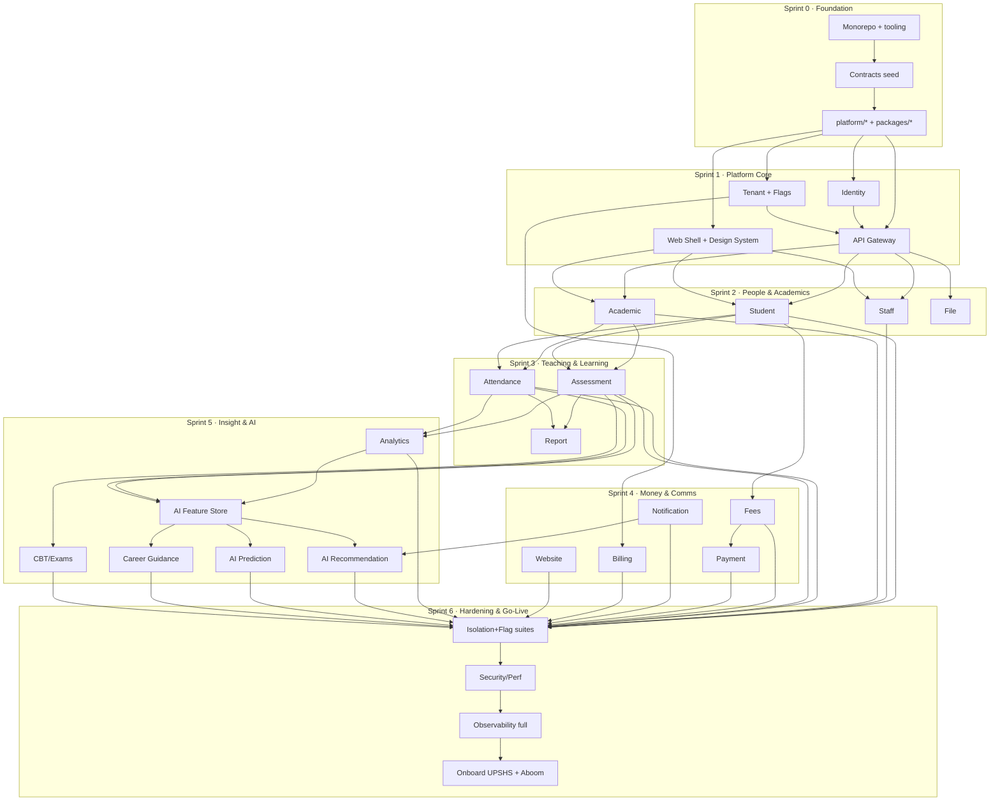

# AuraEDU — Agent Execution Plan

**Project key:** `AURA`
**Version:** 1.0
**Governed by:** `docs/README.md`, `docs/SUMMARY.md`, `AI_Development_Workflow_Training_Manual`, `AI_Native_Software_Engineering_Operations_Manual`
**Audience:** AI coding agents and engineers building AuraEDU in parallel
**Status:** Ready for Sprint 0

> This is the single source of truth for *how the work is decomposed and sequenced*.
> The Engineering Handbook says **what and why** to build. This plan says **who builds it, in what order, against which contracts, and how to avoid stepping on each other.**
>
> **Companion docs:** [`DESIGN_SYSTEM.md`](DESIGN_SYSTEM.md) — the mandatory UI/UX + animation spec (theming, sidebar, tour, theme toggle, menus, motion). [`BRAND.md`](BRAND.md) — the AuraEDU visual identity, *Learning Orbit* (colour, type, logo, motion and per-tenant identity rule). Frontend agents (L4/L7) build to both.
> **Engineering authority:** [`docs/README.md`](docs/README.md) and [`docs/SUMMARY.md`](docs/SUMMARY.md) define the living AuraEDU Engineering Handbook. This file remains the live delivery ledger and execution sequence.

---

## Table of Contents

1. [How to Use This Plan (agents read first)](#1-how-to-use-this-plan)
2. [Non-Negotiable Engineering Rules](#2-non-negotiable-engineering-rules)
3. [Technology Decisions](#3-technology-decisions)
4. [Monorepo Folder Structure](#4-monorepo-folder-structure)
5. [Service Internal Structure (Hexagonal)](#5-service-internal-structure-hexagonal)
6. [Contracts-First: The Key to Parallelism](#6-contracts-first-the-key-to-parallelism)
7. [Cross-Cutting Platform Concerns](#7-cross-cutting-platform-concerns)
8. [Parallelization Model — Lanes, Ownership & Collisions](#8-parallelization-model)
9. [Ticket Conventions (Epic / Story / Subtask)](#9-ticket-conventions)
10. [Global Definition of Done](#10-global-definition-of-done)
11. [Dependency Graph](#11-dependency-graph)
12. [Sprint Plan Overview](#12-sprint-plan-overview)
13. [Epic Catalog](#13-epic-catalog)
14. [Detailed Stories — Sprint 0 (Foundation)](#14-sprint-0--foundation--contracts)
15. [Detailed Stories — Sprint 1 (Platform Core)](#15-sprint-1--platform-core)
16. [Domain Service Story Template + Per-Service Specs](#16-domain-service-story-template)
17. [Detailed Stories — Sprints 2–6](#17-sprints-26--epic-story-breakdown)
18. [Frontend Story Breakdown](#18-frontend-story-breakdown)
19. [Quality, Security & Go-Live Epics](#19-quality-security--go-live)
20. [Risk Register](#20-risk-register)
21. [Appendix A — Feature Flag Catalog](#appendix-a--feature-flag-catalog)
22. [Appendix B — Domain Events Catalog](#appendix-b--domain-events-catalog)
23. [Appendix C — RBAC Permission Catalog](#appendix-c--rbac-permission-catalog)
24. [Appendix D — Service Port / DB / Owner Registry](#appendix-d--service-registry)

---

## 1. How to Use This Plan

**If you are an AI agent assigned a story:**

1. Find your story ID (e.g. `AURA-10.3`) in the sprint sections below.
2. Confirm your **lane** and the **directory you exclusively own** for this story (§8). Do not edit files outside your owned paths without a coordination note.
3. Read the story's **Depends-On** field. If a dependency is not `Done`, you build against its **published contract** (`contracts/openapi/*`, `contracts/events/*`) using a stub/mock — never against its live database or internal code.
4. Create your branch: `feature/AURA-10.3-student-crud` (§9).
5. Implement to the **Acceptance Criteria** and the **Global Definition of Done** (§10).
6. Open a PR titled `AURA-10.3 <summary>`. PRs are the only merge path.
7. If you must change a shared contract, that is a **separate PR** to `contracts/` reviewed by the Contracts owner (§6). Never fork a contract locally.

**Reading order for onboarding:** §2 → §3 → §5 → §6 → §8 → §9 → §10, then your epic in §13+.

---

## 1a. Agent Task Board (live)

This section tracks work currently in-flight and recently completed. It is updated by the active agent after every batch of work.

| Story | Epic | Status | Agent | Notes |
|---|---|---|---|---|
| AURA-31.1 | EP-31 AI Prediction Service | **Done** | Kimi Code CLI | FastAPI service with feature-store metrics, rule-based predictions, explainability, approve/reject, CloudEvent publisher, NATS subscriber stub, feature-flag gating, Dockerfile, tests. |
| AURA-32.1 | EP-32 Career Guidance Service | **Done** | Kimi Code CLI | Full FastAPI service with contracts, rule-based guidance, teacher review, feature-flag gating, tests, Dockerfile. |
| AURA-7.1 | EP-07 CI/CD & Developer Experience | **Done** | Kimi Code CLI | Split monolithic `ci.yml` into reusable workflows; `actionlint` passes. |
| AURA-7.2/53.3 | EP-07/53 Production CI Gates | **Done** | Codex | Replaced non-blocking audits and no-op frontend tests with real gates. The canonical Node 26.5/pnpm 11.11 workspace now passes all 21 lint, typecheck and test tasks (Web 46, Mobile 16 and Marketing 8 assertions), plus 24-route Marketing, 65-route Web and 1,739-module Android production builds. Expo SDK compatibility and the complete pnpm peer graph are clean; workspace overrides remove the vulnerable transitive `js-yaml` release without weakening the audit. Full `pnpm audit` and `pip-audit` report no known vulnerabilities; Python Ruff/format/strict mypy/Pyright (0 errors) and the 106-pass/1-intentional-skip suite pass; every Go module passes test/vet/race/lint, including fresh PostgreSQL integration coverage. Added a reusable migration gate covering all canonical/embedded files and fixed Identity's embedded runner so Goose rollback sections are never executed during upgrades. The complete root `make ci-check` now passes contracts (33 OpenAPI documents, 118 event schemas/types, 24 Go route-parity services), generated TS/Go compilation, both Compose configurations, repository formatting and all language gates in one clean run. |
| AURA-7.3/53.11 | EP-07/53 Reproducible Onboarding E2E Gate | **Done** | Codex | Restored the production onboarding smoke after the platform health/outbox changes and made its infrastructure reproducible. The harness now uses digest-pinned PostgreSQL, NATS and Valkey; probes Tenant and Identity through the current `/health` contract; starts and captures the required Tenant transactional-outbox worker; and deliberately starts Tenant server/worker together to exercise the shared database migration lock used by Render deployments. The isolated eight-stage run passes against real binaries and dependencies, proving gateway replay safety, `429` abuse protection with `Retry-After`, reviewed approval, durable administrator-invite delivery, unauthorized private-activation denial, recoverable Tenant outage, one-time invite retry, idempotent activation and usable administrator login. The static gate rejects future mutable smoke-script images. |
| AURA-7.4 | EP-07 Workflow Semantic and Routing Gate | **Done** | Codex | Closed a path-filter hole where edits to reusable Go, Web, Docker, Contracts or other workflow files could skip the gate being changed. Every `.github/workflows/**` edit now sets the root output and therefore runs the complete reusable matrix; the always-running change-detector job asserts that routing invariant before evaluating filters. Security CI executes actionlint v1.7.12 through an exact Go module version. All 13 workflows pass both YAML parsing and actionlint, the immutable CI gate passes and the routing assertion succeeds. |
| AURA-7.5 | EP-07 Clean Workspace Quality Gate | **Done** | Codex | Restored the repository's actual root quality contract after accumulated frontend/mobile/tooling work left 156 files outside the committed Prettier policy and codegen's `tsx` IPC socket made `pnpm test` fail in restricted runners. Applied the configured formatter mechanically, moved every official codegen generate/validate/test command to compiled Node 26 ESM, and preserved generated contract output. The clean `pnpm format:check`, all 21 lint tasks, all 21 typecheck tasks, all 21 test tasks, 33-contract zero-warning lint, 118 event-schema/type validation, 24-service route parity, generated Go build, migration inventory, Render/RLS/DR/security gates and diff checks pass. |
| AURA-7.6 | EP-07 Python Strict Quality Gate | **Done** | Codex | Restored the root Python gate against the repository-owned virtual environment, fixed the Recommendation test suite's real strict-typing defects and configured Pyright to resolve the checked-in workspace environment instead of reporting hundreds of false missing-dependency errors. Ruff lint/format, MyPy across 96 source files, Pyright with zero errors and the complete 106-pass/1-skip Python test suite now pass together. All three distributable service packages now ship PEP 561 `py.typed` markers, reducing Pyright's non-blocking third-party/unknown-type warnings from 195 to 92 while retaining the strict zero-error gate. |
| AURA-55.4 | EP-55 Semantic Release Evidence Gate | **Done** | Codex | Closed a release-governance bypass where deployment, observability, mobile-store, OTA, recovery, custom-domain, onboarding-email and browser stories could be marked verified with any non-empty checksummed file. Every one of the 15 production evidence IDs now has a registered semantic validator. Operational records require exact scenario/environment/provenance, the complete story-specific provider check set, bounded proof times and sanitized observation fingerprints; visual records require the complete named state/viewport matrix, unique manifest-hashed PNGs and matching image dimensions. Every verified JSON record must also match one exact 40-character release-candidate commit, and approval cannot predate the observed proof window, so candidate drift or pre-approved evidence fails closed. Unknown IDs and sensitive or unsupported fields fail closed. Eleven verifier regressions and the live 15-item pending manifest pass; the final readiness command correctly refuses the unset candidate and all pending evidence. |
| AURA-30.5/31.3/32.3 | EP-30/31/32 AI Feature Isolation | **Done** | Codex | Closed service-boundary feature bypasses across all three Python AI services. Recommendation has the `ai_recommendations` gate; Prediction and Career Guidance no longer enable unknown tenants; Career Guidance reads its correctly namespaced registry variable. Every service normalizes Render's scheme-less Tenant Service binding, resolves the live snapshot with a one-second timeout and, in production, denies access when the binding is missing, unavailable or malformed instead of re-enabling a checked-in tenant default. Production startup rejects missing/private-service credentials, local endpoints, SQLite, debug mode and other development defaults; both Render's `postgresql://` and Compose's `postgres://` DSNs are normalized to SQLAlchemy's asyncpg driver while preserving the correct libpq `sslmode` form for direct migration connections. Canonical tenant codes flow through aligned 64-character schemas, serialized versioned PostgreSQL migrations, forced RLS policies and transaction-local tenant context for HTTP plus NATS consumers; protected routes reject actor/request tenant confusion before DB access. A non-superuser PostgreSQL probe saw only `upshs` data and its cross-school insert was denied. Compose/Render runtime wiring, Recommendation 27 tests, Prediction 31 tests, Career Guidance 20 tests, Ruff, mypy, Pyright, static security, lock and deployment validation pass. |
| AURA-53.4 | EP-53 PII-in-Logs Audit | **Done** | Codex | Added deterministic CI gates for credential signatures, committed runtime env files, direct sensitive/raw-payload log arguments and production Go entrypoints that bypass the shared redactor. Removed full CloudEvent payload logging from Prediction and Career Guidance; regression tests prove email, phone and tokens cannot appear. Hardened `platform/observ` to redact sensitive attribute names plus PII/credentials embedded inside messages and errors, with runtime sentinel capture tests, and migrated all 41 Go server/worker entrypoints to install that logger process-wide. The EP-62 CRM executor retains only lead/owner IDs and redacts error bodies. Static scan, 44 Python AI tests, platform runtime tests and every Go workspace package compile pass. |
| AURA-53.5 | EP-53 Frontend Runtime Hardening | **Done** | Codex | Hardened both production Next surfaces at the browser and container boundaries. Every response now carries two-year HSTS, MIME-sniffing protection, clickjacking denial, strict-origin referrers, same-origin opener isolation and a deny-by-default camera/microphone/geolocation policy. Web and Marketing standalone images install the pinned package manager required by Node 26 only in the build stage, consume validated production public origins at build time, disable Next telemetry, copy runtime artifacts with unprivileged ownership and execute as UID 1000 without pnpm. Clean runtime stages reduced the images to 76.5 MB Web / 76.8 MB Marketing. Manifest-first Docker layering keeps ordinary source edits from invalidating the frozen dependency install; app-scoped installs reduced each image graph from 779 monorepo packages to 271 Web / 273 Marketing packages, and the shared locked BuildKit store subsequently reused every cached package. The CI gate protects the bootstrap, per-app filters, cache ordering, BuildKit cache, telemetry setting, clean runtime stage, public build arguments and non-root runtime. Docker checks, final real image builds, two-container health/homepage smoke and live six-header/UID/tool-absence inspection pass; Web has 18 tests and 60 production routes, Marketing has 8 tests and 24 production routes. |
| AURA-53.6 | EP-53 Container Runtime Least Privilege | **Done** | Codex | Closed the final root-container exception across every application and infrastructure Dockerfile. The custom Render NATS JetStream image now prepares `/data` for numeric UID/GID 65532 and runs the server as that unprivileged identity. The static security gate derives every final Docker stage and fails on a missing, root or UID 0 `USER`, protecting all 30 deployable Dockerfiles. The hardened NATS image builds; a real container reports UID 65532, passes JetStream-only health, writes storage as 65532:65532 and reads the same marker after restart through a temporary named volume. |
| AURA-53.7 | EP-53 Immutable Container Bases | **Done** | Codex | Pinned every Go, Python, Node, distroless and NATS `FROM` tag to the resolved multi-platform SHA-256 manifest while retaining the readable version tag. Renovate's existing Docker manager continues to raise reviewed digest updates, so builds are reproducible without freezing security maintenance. The static security gate now rejects any mutable base reference in all 30 Dockerfiles, and Docker BuildKit successfully resolves and checks every pinned build graph across the six registries/base families. |
| AURA-53.8 | EP-53 Immutable CI Actions | **Done** | Codex | Pinned every remote workflow dependency to its exact upstream 40-character commit while retaining the readable release annotation for Renovate: Checkout, Setup Go, Setup Node, Setup UV, Paths Filter, pnpm Setup and Changesets. Local reusable workflows remain repository-scoped. The static security gate now rejects mutable remote action branches/tags; all 13 workflow files parse, the gate passes, no mutable `uses:` refs remain and `git diff --check` is clean. |
| AURA-53.9 | EP-53 Reproducible and Bounded CI Toolchain | **Done** | Codex | Removed the remaining mutable CI execution inputs: PostgreSQL 17 Alpine is pinned to its multi-platform digest, contracts use Go 1.26.5 instead of `stable`, Spectral is fixed at 6.16.1 and govulncheck at v1.6.0. Every one of the 13 runnable jobs now has an explicit positive timeout suited to its workload. The static security gate rejects unpinned workflow images, `@latest`, stable-Go selectors, unversioned global npm tools and a runs-on/timeout mismatch. All workflows parse, the hardened gate passes, the exact Spectral/govulncheck binaries report the pinned versions and the PostgreSQL manifest resolves across supported architectures. |
| AURA-53.10 | EP-53 Immutable Infrastructure Images | **Done** | Codex | Pinned all 11 third-party Compose dependencies to resolved multi-platform SHA-256 manifests: PostgreSQL, Valkey, NATS, OpenTelemetry Collector, Prometheus, Alertmanager, Alpine, Loki, Tempo, Alloy and Grafana. Closed a second bypass by pinning every direct `docker run` validator in the observability gate. The security scan now rejects mutable images in workflows, deployment manifests and CI scripts; Renovate covers both Dockerfile and Compose digest updates. Compose renders the exact digest graph, the native Prometheus/Alertmanager/Collector/Loki/Tempo/Alloy validators pass, all 24 server and 21 worker instrumentation checks pass, and a clean live stack reports every dependency healthy with nine alert rules, three Grafana datasources, the Golden Signals dashboard and Alloy discovery restricted to the AuraEDU infrastructure project. |
| AURA-53.1 | EP-53 AuthN/Z and RBAC Penetration Tests | **Done** | Codex | Closed three ingress trust-boundary flaws: invalid/expired JWTs now stop before every protected or optionally authenticated route, the resolved tenant must match the signed JWT tenant claim, and all client-supplied `X-Actor-*` headers are stripped before proxying (including public routes). Removed internal actor headers from default CORS, made Identity server/worker fail startup without `JWT_SIGNING_KEY`, and added a static regression rule against insecure auth fallbacks. The reusable security matrix passes shared JWT integrity/expiry, Gateway attacks, Identity/Tenant RBAC, platform-admin boundaries and internal service-token checks across eight Go packages. |
| AURA-53.2 | EP-53 Injection and File-upload Security | **Done** | Codex | Added a real PostgreSQL injection-shaped CRM search probe and hardened uploads against total-body overflow, filename/header injection, local path traversal and cross-tenant paths, arbitrary signed-upload folders/resource types, external or mismatched completion URLs, oversized direct uploads and webhook public-ID traversal/mismatch. The reusable CI matrix is wired and its exact combined command passes: File application/storage/unit boundaries plus the real Docker-backed CRM PostgreSQL injection probe. |
| AURA-54.1 | EP-54 Load Tests per Service | **In progress** | Codex | Added a dependency-free thresholded Go load runner with paced arrivals, bounded concurrency and per-request/per-tenant p50/p95/p99/error/throughput results. Hardened evidence integrity after audit: paced scenarios now fail under-delivery against an explicit minimum throughput; percentiles use nearest rank; staging execution rejects placeholder/loopback/plaintext/credential-bearing targets, placeholder auth, missing run IDs and missing deployed Git SHAs; output records sanitized provenance, timing, configured load/thresholds, shutdown drops and tenant cardinality without tokens; write failures fail the run and existing evidence cannot be overwritten. The release verifier independently rejects AURA-54 evidence that is local, below threshold, wrong-cardinality or missing distributions. Runner tests/vet/build, four scenario validations, release-verifier regressions, static security and diff checks pass. Remaining release evidence is executing the authenticated scenario against deployed staging and retaining its result artifact. |
| AURA-54.2 | EP-54 Scaling Validation | **In progress** | Codex | Added an exact-100-unique-tenant scenario and validation gate, with environment-injected tenant contexts so credentials are never committed. The runner now proves both required and observed cardinality, records all 100 per-tenant distributions and requires at least 180 of the configured 200 requests/second. The release verifier will not accept a completed AURA-54.2 artifact unless its staging provenance, Git SHA, threshold results and exact 100-tenant distribution are valid. Local runner validation proves the scenario shape and evidence controls. Completion still requires provisioning 100 disposable staging tenants through the supported onboarding flow, running the thresholded test against staging and retaining the result artifact. |
| AURA-8.1 | EP-08 Observability Platform | **In progress** | Codex | Replaced the scaffold with canonical-route HTTP golden signals and optional bearer-protected OpenMetrics across all 25 Go HTTP servers and all three Python AI APIs. The shared telemetry initializer now exports sampled OTLP traces plus OTLP metrics with graceful flush. All 24 active Go workers initialize it and compile independently while emitting allowlisted job counts/durations; undeclared runtime values collapse to `unknown`. Notification records final provider delivery count/duration by bounded channel/outcome without tenant or recipient labels. Added pinned Prometheus/Alertmanager/Grafana/Loki/Tempo/Alloy/Collector infrastructure, an OTLP-to-Prometheus worker pipeline, stable Compose-service log labels, working Loki-to-Tempo links, a Golden Signals dashboard, owned SLO/security/payment/notification/AI/job alerts, severity/team routing, checked-in incident runbooks and CI gates that prove instrumentation plus alert ownership/runbooks. The native validator matrix and the full 65-service runtime pass; live probes verify NATS, Prometheus, Alertmanager, Grafana, Loki and Tempo alongside all 28 application readiness endpoints with zero container restarts. Alloy discovery is filtered before ingestion and admits only `auraedu`/`auraedu-infra` Compose projects, preventing unrelated host logs from leaking into Loki. Remaining production evidence is secret-backed paging receivers and deployed staging telemetry/alert delivery. |
| AURA-8.2 | EP-08 Platform Dependency Health | **Done** | Codex | Replaced the superadmin console's misleading business-endpoint reachability guesses (including a nonexistent Analytics KPI route) with a gateway-owned `GET /api/v1/platform/health` operator API. It authenticates independently of tenant resolution, requires a signed platform-super-admin actor, concurrently probes the authoritative health/readiness path for all 26 configured private services with a three-second bound, blocks redirects, redacts private hosts/raw transport failures, disables caching and distinguishes healthy, degraded and unreachable states. The live console and dashboard summarize the same typed report with honest unavailable states. OpenAPI/generated Go+TS clients, Gateway auth/redaction/timeout/inventory tests and full suite, 13 web tests/lint/typecheck, Compose/Render validation and the 52-route production build pass. Deployed-environment proof remains covered by AURA-9.1. |
| AURA-50.1 | EP-50 Platform-wide Isolation Matrix | **Done** | Codex | Added structural inventory plus behavioral two-school proof across the repository. CI now requires `ENABLE RLS`, `FORCE RLS` and an `app.tenant_id` policy for all 86 tenant-owned declarations, including `tenant_code` and the Tenant root table. The audit fixed File usage, Identity owner-bypass/processed-event gaps and Tenant root-table owner bypass; Identity worker claims, Tenant platform listing and pre-auth tenant resolution now use explicit scoped/privileged transactions. Non-superuser probes deny UPSHS→Aboom reads/writes for Identity, File, Tenant and all four shared AI tables. A dedicated `GOWORK=off` runner requires and passes named integration isolation tests for all 23 tenant-owning Go services; Python CI passes 45 tests including replay-safe AI PostgreSQL isolation. |
| AURA-50.2 | EP-50 Staging Isolation Gate | **In progress** | Codex | Added reusable local isolation gates and a deployed-staging HTTP harness spanning ten domains in both school directions. Each probe requires an own-resource `200`, non-enumerating cross-resource `404`, and token/header-mismatch `403`; denial bodies are scanned for tenant/resource disclosure and evidence retains only fingerprints and sanitized outcomes in an immutable file. CI validates the harness and scenario, while the release verifier rejects incomplete, duplicate, sensitive, placeholder or failed evidence. Local tests/build/scenario validation are green. Remaining work is the credentialed run against deployed staging and approval of its 60-check artifact. |
| AURA-51.1 | EP-51 Disabled-module Enforcement | **Done** | Codex | Added a reusable six-surface feature-flag gate that proves disabled modules are hidden from navigation, denied on direct portal routes, rejected by the API Gateway with `403 feature_disabled`, skipped by background materialization jobs and ignored by event consumers. Closed gateway and portal fail-open behavior when the flag client/snapshot is absent, added direct guards for autonomous actions and kind-specific Intelligence workspaces, and wired the hermetic Node/Go matrix into CI. |
| AURA-51.2 | EP-51 Per-tenant Flag Matrix | **Done** | Codex | Added explicit School A enabled / School B disabled tests at frontend navigation/direct-route, gateway API and worker execution boundaries. The enabled school reaches the module and materializes its job; the disabled school receives a forbidden response and produces no work. The exact `run-feature-flag-tests.sh` CI command, targeted lint, web typecheck and workflow parsing pass. |
| AURA-51.3 | EP-51 Fail-closed Runtime Entitlements | **Done** | Codex | Removed production fallback to checked-in feature defaults across all 24 feature-gated Go server and worker processes. Production now reads the live Tenant Service snapshot and disables the feature on missing configuration, outage, non-200 or malformed responses; development retains registry fallback for local usability. Student and Payment now use the same live gate as the other domains. Render and Compose wire every gated process to Tenant Service, and the runtime-config CI gate derives that inventory from source so a new gated entrypoint cannot ship without exactly one correct dependency binding. Platform behavior/vet, Fees live-override regression, the complete six-surface/two-tenant feature matrix, all 24 package compile checks and deployment validation pass. |
| AURA-51.4 | EP-51 Python AI Live Entitlements | **Done** | Codex | Extended fail-closed production entitlement enforcement to Recommendation, Prediction and Career Guidance. Render's scheme-less Tenant Service host is normalized before lookup; a missing binding, timeout, transport failure or malformed response disables the AI module instead of using checked-in tenant defaults. The reusable feature CI job now installs the locked Python toolchain and runs all three outage regressions alongside frontend, Gateway, worker and event-consumer gates. The expanded cross-runtime matrix, 71 AI tests, Ruff, mypy, Pyright, runtime/deployment gates and static security scan pass. |
| AURA-48.1/48.2 | EP-48 Mobile Foundation | **Done** | Kimi Code CLI → Codex | Replaced the placeholder `App.tsx` with Expo Router, encrypted session storage, remembered tenant selection, gateway authentication, active-tenant resolution, strict teacher/parent/student-only role guards, fail-closed feature snapshots, validated runtime school branding/logo/theme, a shared typed Gateway client, and role-aware Today/My Work/Notices/Profile tabs. Notices load real server-side role-scoped announcements. Parent workflows load linked children, attendance, published results, learner-owned invoices, learner-owned published report cards and approved career guidance; students load their own published results, current-class assignments, published report cards, current-class timetable, CBT exams, approved recommendations and approved career guidance. Published report PDFs download with the session bearer token and tenant header into app cache, validate the HTTP response and open through the native secure share/view sheet. Parent payments list only owned invoices and launch provider checkout only from a backend-validated HTTPS URL. Fees, Report, Payment, Academic and AI services enforce learner identity ownership, hide unauthorized IDs and fail closed on dependency loss. Teacher mobile loads assigned classes and active rosters, restores/submits idempotent daily attendance, discovers only assigned-class assessments, creates or updates scoped scores, and reviews AI guidance for assigned learners. The shared native UI package, TypeScript, ESLint, contract/scope/security/accessibility tests, and clean Android/iOS Hermes exports prove the scaffold and tenant/login/theming stories. Signed builds and store submission are separately tracked only by AURA-48.7. |
| AURA-48.3 | EP-48 Mobile Push | **Done** | Codex | Added authenticated Expo installation registration/refresh, sign-out removal, tenant/user/device ownership, token transfer safety, PostgreSQL RLS and dead-token retirement. Notification API/worker now deliver native push through Expo over HTTPS, prefer it for registered recipients behind `push_notifications`, fall back safely, and accept production Expo access-token configuration. Mobile no longer invokes the operating-system prompt after sign-in: the redesigned Notices screen explains the benefit, asks only after an explicit user action, retains full in-app access after denial and links blocked users to device settings. Contract generation, mobile type/lint, provider unit tests, worker routing tests, full Docker-backed notification migration/RLS tests and both platform exports pass. |
| AURA-48.7 | EP-48 Mobile Release | **In progress** | Codex | Removed fake App Store IDs and made environment selection executable rather than documentary: development may use an explicit local HTTP gateway, staging requires its own configured URL, and preview/production reject non-HTTPS or credential-bearing API origins. Production EAS builds fail closed without the linked project UUID so push cannot silently disappear. The public app version/runtime policy, encryption declaration, deterministic 1024px icons, EAS environment profiles and an expanded release-check command are committed. The verifier now validates bundle/package identity, icon PNG dimensions, the app-level Apple required-reason manifest and denied-by-default Android sensor/advertising permissions. Secure session restoration is schema validated; access/refresh pairs rotate before expiry and once on an unexpected `401`, concurrent requests share one rotation, identity drift clears the session, and sign-out removes the installation and revokes the server refresh session. Expo SDK 57.0.7 compatibility, the full peer graph, lint, TypeScript, all 16 mobile tests, a fresh 1,739-module Android Hermes export and the prior 1,638-module iOS export pass. Remaining external work is linking the organisation-owned Expo project, installing App Store Connect/Google Play credentials, producing signed builds and submitting them. |
| AURA-48.8 | EP-48 Mobile OTA Updates | **In progress** | Codex | Installed the Expo SDK-compatible update runtime and configured project-scoped `u.expo.dev` delivery only when a valid EAS project is supplied. Development, preview and production builds use isolated channels/environments; development disables remote updates, while release builds check on launch and fall back immediately to the embedded bundle. The app-version runtime policy prevents an OTA bundle from crossing an incompatible native binary. The release gate now verifies the pinned update runtime, channel/environment mapping and runtime policy, and the runbook separates preview promotion from production while requiring a new store binary for native/config/permission changes. Generated production Expo config exposes the expected update URL/runtime, dependency validation, ESLint, TypeScript, eight tests and a clean 1,729-module Android Hermes export pass. Remaining external proof is linking the organisation EAS project and publishing a signed preview update followed by production-channel promotion. |
| AURA-48.9 | EP-48 Mobile Isolation, Flags and Accessibility | **Done** | Codex | Completed the mobile enforcement and accessibility pass without weakening the server boundary: learner-facing roles remain allowlisted, tenant branding/session payloads are validated, modules fail closed behind the tenant feature snapshot, and teacher/parent/student workflows consume only server-scoped records. Replaced bare activity spinners with labelled skeleton loading regions; exposed route titles as headings; made tabs, links, buttons, radio selections, disabled states, form fields, tenant logos and success/error announcements screen-reader legible; enlarged compact touch targets; and removed text-only press interactions. A source-level regression suite now rejects reintroduced spinners, unlabeled inputs, role-less touchables, text press handlers and route titles without heading semantics. ESLint, TypeScript, all eight mobile security/config/accessibility tests and a clean 1,729-module production Android Hermes export pass. |
| AURA-30.6 | EP-30 Learner Recommendation Delivery | **Done** | Codex | Replaced the unsafe identity-user-as-student convention with a fail-closed private Student Service ownership lookup. Student/parent reads now hide out-of-scope learner IDs and expose only approved/overridden recommendations; the student web and mobile clients infer their owned learner record without sending a trusted ID. Corrected prefixed Render AI database/NATS configuration and added Student Service/token wiring. Ruff, four service tests, web/mobile typecheck and lint, contract generation, Compose and Render validation pass. |
| AURA-30.7/48.6 | EP-30/48 Teacher Recommendation Review | **Done** | Codex | Teacher list, generate, detail, explanation, approve, reject and override paths now fail closed against the Student Service assigned-learner scope, while learner detail/explanation paths hide pending guidance. Added the missing Identity permission catalogue/bootstrap entries and a role-guarded mobile review workspace with assigned-class and roster selection. Five AI service tests, Ruff, Identity tests, mobile type/lint and a clean 1,725-module Android export pass. |
| AURA-32.2/48.5 | EP-32/48 Career Guidance Delivery | **Done** | Codex | Secured career-guidance list, generate, detail, explanation and review with explicit permissions, tenant checks and fail-closed Student Service ownership/assignment resolution. Students and parents see approved guidance only; teachers can act only for assigned learners. Added the missing gateway-compatible FastAPI route, contract/permission generation, Compose/Render dependency wiring and a mobile student/parent guidance workspace. Ruff, seven service tests, Identity tests, mobile type/lint, Compose validation and Android export pass. |
| AURA-31.2 | EP-31 AI Prediction Security | **Done** | Codex | Added explicit prediction read/review permissions, gateway-compatible FastAPI routing and fail-closed Student Service scope enforcement across list, generate, detail, explanation and review. Learner/parent reads hide non-approved predictions, teachers are limited to assigned learners, and tenant mismatches are rejected before access. Added Identity/bootstrap permissions plus Compose/Render service discovery. Ruff, 19 service tests, contract generation and Compose validation pass. |
| AURA-24.6 | EP-24 Learner CBT Delivery | **Done** | Codex | Reconciled the CBT contract with the real service routes and added a complete student mobile exam flow. Production attempts resolve the identity actor through the private Student Service scope API, hide out-of-scope attempts, expose answer-safe questions without correct answers, prevent duplicate attempts, accept final answers once and auto-grade server-side. Student exam lists show active sessions only. Go unit tests, full Docker-backed lifecycle/RLS tests, contract generation, mobile type/lint, deployment validation and a clean 1,724-module Android export pass. |
| AURA-12.9 | EP-12 Academic Timetable + Grading | **Done** | Codex | Added contract-generated timetable CRUD, feature-gated Gateway routing, recurring weekly lesson periods, tenant RLS, database-enforced class/teacher overlap exclusion and learner/teacher scope. The student mobile and web experiences now load the real scoped timetable; the redesigned web week groups active lessons by day, resolves subject names, highlights today, exposes honest empty/error states and replaces stale dashboard “coming soon” copy. Completed tenant-owned grading-scale CRUD with normalized non-overlapping 0–100 ranges, JSONB persistence, FORCE RLS and truthful OpenAPI schemas. Academic tests plus 13 web tests, lint/typecheck and the 52-route production build pass. |
| AURA-10.11 | EP-10 Student Enrollment History | **Done** | Codex | Replaced the current-class-only approximation with durable enrollment records. Initial class-assigned creation writes the student and first enrollment atomically; later academic-year assignments enforce one record per learner/year, update the current roster projection in the same transaction, paginate complete history, emit `student.enrolled.v1`, and remain FORCE-RLS tenant isolated. Unit/HTTP tests and the full 91-second fresh-PostgreSQL integration suite pass. |
| AURA-15.9 | EP-15 Durable PDF Publication | **Done** | Codex | Replaced request-bound/local-only generation with a PostgreSQL queue: `POST .../generate` returns `202`, workers claim jobs with `FOR UPDATE SKIP LOCKED`, recover expired leases, retry with bounded exponential backoff and restore terminal failures to draft. PDFs use tenant-confined local volumes in Compose and authenticated Cloudinary delivery in production; production fails closed without object storage. Downloads are authorization-proxied on web/mobile, storage keys are absent from REST/events, and the published transition plus stable-ID event are committed through a tenant-isolated transactional outbox. Unit/vet, the focused 22.7-second Docker-backed generation/outbox suite, full 106-second Report integration suite, contracts, RLS/migration/deployment gates, 52-route Web build and hermetic distroless production image all pass. |
| AURA-15.11 | EP-15 Derived Transcripts | **Done** | Codex | Implemented `GET /transcripts/{student_id}` as a derived record over published/archived report cards, materialized subject scores and attendance rather than a second mutable truth. Parent/student ownership fails closed, tenant isolation is enforced, every runtime Report CRUD/generate/download route is documented, generated clients compile, and unit plus Docker-backed transcript evidence tests pass. Durable asynchronous object-storage PDF publication is complete under AURA-15.9. |
| AURA-15.12 | EP-15 Durable Report Lifecycle | **Done** | Codex | Closed the remaining database-to-broker loss window across report-template and report-card create, update and delete. All six mutations now commit their canonical privacy-safe lifecycle payload to the existing FORCE-RLS outbox in the same PostgreSQL transaction; the deployed Report worker publishes stable aggregate/broker IDs with bounded retry, while non-Postgres test adapters retain direct delivery. Optional UUID fields are omitted instead of emitting schema-invalid empty strings. A real six-transition sequence produces exactly six tenant events, and forced outbox loss proves both template and card creation roll back instead of committing silent state. Unit/adapter tests, vet, all 115 event-contract schemas, the complete 213.9-second PostgreSQL/RLS/generation/materialization suite and the rebuilt `nonroot:nonroot` distroless image pass. |
| AURA-16.9/16.10 | EP-16 Fees, Invoices and Balances | **Done** | Codex | Completed truthful fee-structure/invoice CRUD plus currency-separated learner balances and immutable receipts. The deployed Fees worker consumes `payment.received.v1`, reconciles each payment exactly once under a transaction/advisory lock, records partial/paid state and explicit overpayment, emits invoice lifecycle events only once, and is wired into Compose, Render, runtime-secret and observability gates. Full unit and 45-second Docker-backed migration/RLS/replay/reconciliation suite pass. |
| AURA-16.11 | EP-16 Durable Fees Reconciliation | **Done** | Codex | Closed the payment-consumer-to-broker loss window. Each accepted `payment.received.v1` now atomically commits its immutable receipt, currency-scoped balance/invoice change and tenant-isolated `invoice.updated.v1` plus conditional `invoice.paid.v1` outbox records. The deployed Fees worker claims with `SKIP LOCKED`, publishes stable CloudEvent/JetStream deduplication IDs and retries broker failures with capped backoff. Removing the outbox proves the financial mutation rolls back; replay, partial/paid transition, malformed-payload, broker-failure and RLS tests pass. The complete 156.3-second PostgreSQL suite, nonroot production image, 97-table RLS inventory, additive migration gate, 37-deployment Render configuration, 23-deployment service-token wiring, 14-worker observability gate and Compose topology validation pass. |
| AURA-16.12 | EP-16 Durable Invoice Lifecycle | **Done** | Codex | Extended the Fees outbox to every promised administrative invoice event. Invoice creation now atomically commits both `fee.assigned.v1` and `invoice.created.v1`; meaningful updates commit `invoice.updated.v1` plus a one-time `invoice.paid.v1` transition, and deletion commits `invoice.deleted.v1`. Fee-structure CRUD remains an explicit non-event boundary because no lifecycle contract promises those mutations. Forced outbox loss proves invoice creation rolls back, and the application-level creation test proves both tenant events are queued exactly once. Unit/vet, focused atomicity tests, the complete 44.6-second PostgreSQL suite and rebuilt nonroot image pass. |
| AURA-17.9 | EP-17 Payments | **Done** | Codex | Added the contract-first, service-token-authenticated Fees invoice-access API and generated clients. Payment list/get/transactions/verify/initiate batch-check the authenticated parent/student against the authorized invoice subset, hide unauthorized IDs, and fail closed on dependency loss. Webhook audit reads now require configuration permission. Initiation returns only a validated HTTPS checkout URL, rolls processing back to pending on provider/URL failure, and the parent mobile Fees screen launches secure checkout. Fees/Payment unit and private-client tests, Docker-backed Fees SQL intersection and full Payment PostgreSQL/RLS/reconciliation suites, mobile type/lint and a 1,660-module Android export pass. |
| AURA-17.11 | EP-17 Durable Payment Reconciliation | **Done** | Codex | Closed the payment-to-broker loss window for webhook and manual verification outcomes. Payment status, immutable credit/debit transaction and privacy-safe `payment.received.v1`/`payment.failed.v1` payload now commit atomically to a FORCE-RLS transactional outbox. A separately deployed Compose/Render worker claims with `SKIP LOCKED`, publishes stable CloudEvent/JetStream deduplication IDs, records broker failures and retries with capped exponential delay. Removing the outbox table proves payment and ledger changes roll back. Worker malformed-payload/broker-failure tests, unit/vet, the complete 70.6-second PostgreSQL suite, 96-table RLS inventory, additive migration gate, 37-deployment Render checks, 14-worker observability gate, Compose validation and the nonroot production image build pass. |
| AURA-17.12 | EP-17 Durable Payment Lifecycle | **Done** | Codex | Extended the Payment transactional outbox from reconciliation to every promised aggregate lifecycle event. Create, meaningful update, successful provider initiation and delete now atomically commit `payment.created.v1`, `payment.updated.v1`, `payment.initiated.v1` and `payment.deleted.v1`; the same deployed worker publishes them with stable IDs and retry backoff. Forced outbox loss proves create rollback, while a real create/update/delete sequence proves exactly one tenant event per mutation and webhook redelivery proves lifecycle plus reconciliation counts remain stable. Unit/vet, focused rollback tests, the complete 54.0-second PostgreSQL suite and rebuilt nonroot production image pass. |
| AURA-17.13 | EP-17 Production Payment Provider Boundary | **Done** | Codex | Closed the configuration path that could let Payment Service become healthy with deterministic mock charges or transmit the Paystack secret to an overridden API host. Provider validation now runs before database opening/migrations; production rejects mock mode, non-live Paystack keys and every non-canonical API origin, while development keeps deterministic local payments. Render CI pins `PAYMENTS_PROVIDER=paystack`, requires a secret-backed key and forbids a production base-URL override. Dedicated configuration regressions, the complete 211.4-second PostgreSQL/RLS/reconciliation suite, vet, Render runtime validation, static security scan and diff checks pass. The rebuilt distroless image retains `nonroot:nonroot`, and a real production-mode container exits before database access with the expected mock-provider rejection. |
| AURA-3.6 | EP-03 API Gateway | **Done** | Kimi Code CLI | Route-level RBAC permission enforcement; method-aware permissions for `/api/v1/files` and `/api/v1/uploads`. |
| AURA-20.9 | EP-20 File Service | **Done** | Kimi Code CLI | Cloudinary SDK v2 adapter, direct signed upload flow (`POST /uploads/signed` + `POST /files/{id}/complete`), deployment wiring in `docker-compose.yml` and `render.yaml`. |
| AURA-20.10.1 | EP-20 File Service | **Done** | Kimi Code CLI | Transform presets + delivery URL endpoint for Cloudinary-backed files. |
| AURA-20.10.3 | EP-20 File Service | **Done** | Kimi Code CLI | Per-tenant usage accounting: `file_usage` table, record storage/delivery, `GET /files/usage`. |
| AURA-20.10 | EP-20 File Service | **Done** | Kimi Code CLI | Transform presets + delivery, Cloudinary webhook, usage accounting all complete. |
| AURA-20.11 | EP-20 Durable File Lifecycle | **Done** | Codex | Closed every File metadata-to-event loss window across proxied uploads, signed-upload completion, provider webhooks, updates and deletes. File metadata and `file.uploaded.v1`/`file.updated.v1`/`file.deleted.v1` now commit atomically to a FORCE-RLS outbox. A real Compose/Render worker replaces the removed placeholder, publishes stable IDs, retries malformed/broker/storage failures, and performs durable private-object cleanup before exposing deletion. Failed upload commits compensate newly stored bytes; local Compose server/worker share a persistent volume, while production now fails closed without Cloudinary. Forced outbox loss proves database rollback and orphan compensation. Unit/vet, worker outcome tests, the complete 45.3-second PostgreSQL/storage suite, nonroot image, 99-table RLS inventory, additive migration gate, 38-deployment Render validation, 15-worker observability gate and Compose topology pass. |
| AURA-11.12 | EP-11 Durable Staff Lifecycle | **Done** | Codex | Closed the Staff state-then-publish loss window for create, update and delete. Every promised lifecycle event now commits with the staff mutation in a FORCE-RLS transactional outbox; a real Compose/Render worker publishes stable CloudEvent/idempotency IDs and applies bounded exponential retry for malformed payloads and broker failures. The HTTP service retains direct publishing only for non-Postgres test adapters. Worker outcome tests, vet, the complete real-Postgres suite including forced-outbox rollback, nonroot image, 100-table RLS inventory, additive migrations, 39-deployment Render validation, service-secret checks, Compose topology and the 16-worker observability gate pass. |
| AURA-11.9 | EP-11 Teacher Class/Subject Assignment | **Done** | Codex | Replaced the contract-only assignment placeholders with tenant-isolated `staff_assignments`, additive migration/RLS, permission- and feature-gated list/create/delete APIs, and atomic `staff.assigned.v1` outbox delivery. The authenticated Staff internal scope returns explicit class/subject IDs; Academic Service unions those IDs with class-teacher ownership so web/mobile attendance, scores, reports and rosters inherit assignments. The admin Staff portal is a responsive people-and-scope workspace: administrators create/edit staff, activate/deactivate records, link or unlink a selectable Identity account without raw UUID entry, and map teachers to class, subject and responsibility with honest dependency/empty/error states. The contract exposes runtime tenant/lifecycle/timestamp fields and PATCH preserves omission versus explicit `null`. Contract generation, exact events, Staff race/unit/compile/vet, nullable-patch regressions, warning-free OpenAPI, portal lint/typecheck/tests and the 64-route production build pass. The formerly blocked real-PostgreSQL assignment proof now also passes against a fresh digest-pinned container: all six migrations apply, assignment scope/class resolution is correct, tenant B cannot enumerate tenant A, the atomic outbox item carries the expected tenant/type, and deletion completes. |
| AURA-10.13 | EP-10 Durable Student and Guardian Lifecycle | **Done** | Codex | Closed all ten state-then-publish boundaries across student creation/update/delete, academic-year enrollment, guardian creation/update/delete, guardian link/unlink and bulk-import partial successes. Each promised event is committed atomically with its mutation in a FORCE-RLS outbox. The restored Compose/Render worker publishes stable CloudEvent/idempotency IDs with bounded retry and fails closed without Postgres/NATS. Direct publishing remains only for non-Postgres test adapters. Event/unit/worker tests, vet, the complete 104.8-second real-Postgres suite including forced-outbox rollback, nonroot image, 101-table RLS inventory, additive migrations, 40-deployment Render validation, secrets, Compose topology and the 17-worker observability gate pass. |
| AURA-19.12 | EP-19 Durable Website Lifecycle | **Done** | Codex | Closed all page and section state-then-publish windows, including the two-transaction page/section delete gap. Create, update, publish and delete events now commit atomically with content mutations in a FORCE-RLS outbox. The existing onboarding worker now also drains the outbox with stable IDs and bounded retry; default home-page plus hero-section provisioning is one transaction with three lifecycle events and is replay-safe under repeated `tenant.created.v1` delivery. Worker failure tests, vet, the complete 70.4-second real-Postgres suite with forced-outbox rollback, nonroot image, 102-table RLS inventory, additive migrations, 40-deployment Render validation, secrets, Compose topology and the 17-worker observability gate pass. |
| AURA-12.12 | EP-12 Durable Academic Lifecycle | **Done** | Codex | Closed 11 contracted lifecycle loss windows across academic years, terms, classes and subjects while preserving term creation as an explicitly uncontracted non-event boundary. Four separate repositories now share one FORCE-RLS transactional outbox implementation. The former wait-only worker is a fail-closed dispatcher with stable event IDs and bounded retry, deployed in Compose and Render. Contract/unit/worker tests, vet, the complete 71.7-second real-Postgres suite with forced-outbox rollback, nonroot image, 103-table RLS inventory, additive migrations, 41-deployment Render validation, secrets, topology and the 18-worker observability gate pass. |
| AURA-12.13 | EP-12 Role-Scoped Class Catalogue | **Done** | Codex | Closed the remaining academic read bypass where student and parent actors could list or fetch tenant-wide classes despite timetable scope being authoritative. Class list/detail reads now resolve student, guardian and teacher relationships at the service boundary, return only linked/assigned classes and fail closed when Student or Staff identity resolution is unavailable; privileged administrative roles retain tenant-wide access. Role regressions, the complete 67.1-second Docker-backed Academic suite, vet, 13 portal tests, lint/typecheck, `git diff --check` and the 52-route production build pass. Student, teacher and parent dashboards also distinguish dependency failure from genuine zero/empty lesson, announcement and learner states. |
| AURA-14.12 | EP-14 Durable Assessment Lifecycle | **Done** | Codex | Closed every promised assessment, publication, assignment-publication and score lifecycle loss window. Multi-event assessment publication commits both update and publish events with one mutation in a FORCE-RLS outbox; assignment-specific create/update/delete remain explicitly documented non-event boundaries. A new fail-closed Compose/Render worker publishes stable event IDs with bounded retries. Contract/unit/worker tests, vet, the complete 83.9-second real-Postgres suite with forced-outbox rollback, nonroot image, 104-table RLS inventory, additive migrations, 42-deployment Render validation, secrets, topology and the 19-worker observability gate pass. |
| AURA-14.13 | EP-14 Learner Results + Gradebook Scope | **Done** | Codex | Replaced the student web results facade that rendered every score as an em dash with real published, learner-scoped score records, subject context, bounded percentages, transparent simple-average labeling and honest dependency/empty states. Student and teacher overview dashboards now load scoped timetable, assignment, result, exam, class and staff-announcement summaries while preserving unavailable values instead of inventing zeroes. The audit closed direct-API bypasses: student/parent assessment lists and reads now force published status plus authoritative class scope, and student/parent/teacher gradebook requests fail closed outside resolved learner/class scope or when Student Service is unavailable. New unit scope regressions, the complete 78.4-second Docker-backed Assessment suite, vet, 13 web tests, lint/typecheck and the 52-route production build pass. |
| AURA-42.1 | EP-42 Parent Portal | **Done** | Codex | Replaced the parent portal’s disconnected facades with the authoritative guardian relationship. My Children now renders linked learner identity, code, status and best-effort class context; Career Guidance queries every linked student record instead of misusing the guardian’s identity user ID; Results show only scoped published scores with learner names, subjects, assessment maximums and percentages; Fees use contractual cent fields, fee-structure currency, outstanding balances and learner names instead of a nonexistent amount property. Attendance and report cards now fail honestly on dependency loss and resolve learner/term names instead of exposing internal IDs. The parent overview reports real linked-child, seven-day attendance, open-invoice and published-result summaries without converting dependency failures into fabricated zeroes. Portal tests, lint/typecheck, `git diff --check` and the 52-route production build pass. |
| AURA-13.12 | EP-13 Durable Attendance Lifecycle | **Done** | Codex | Closed create, atomic bulk-upsert, update and delete state-to-event loss windows. Each promised attendance event now commits with its mutation in a FORCE-RLS outbox; bulk marks queue one event per persisted learner record and preserve the authoritative upserted ID. The former wait-only worker is now a fail-closed Compose/Render dispatcher with stable event IDs, bounded retry and malformed/broker failure handling. Unit/worker tests, vet, the complete 51.3-second real-Postgres suite with forced-outbox rollback, nonroot image, 105-table RLS inventory, additive migrations, 43-deployment Render validation, secrets, topology and the 20-worker observability gate pass. |
| AURA-22.12 | EP-22 Durable Billing Lifecycle | **Done** | Codex | Closed the trial/subscription-upgrade/invoice state-to-event loss windows. Trial provisioning atomically commits both `billing.subscription_changed.v1` and `billing.trial_started.v1`; plan changes commit their subscription event plus the conditional upgrade event in one transaction; invoice creation commits its promised event. A FORCE-RLS outbox is drained by the existing onboarding worker with stable IDs and bounded retry, while uncontracted subscription/invoice edits and deletes are explicitly documented non-event boundaries. Publisher/worker/unit/vet, the complete 43.3-second PostgreSQL suite plus onboarding replay suite, forced-outbox rollback, nonroot image, 106-table RLS inventory, additive migrations, 43-deployment Render validation, secrets, topology and the 20-worker observability gate pass. |
| AURA-24.12 | EP-24 Durable CBT Lifecycle | **Done** | Codex | Closed every contracted question and exam create/update/delete event window plus submission and grading publication. Learner submission atomically commits both `cbt.exam_submitted.v1` and `cbt.graded.v1` with its final auto-grade; manual grading commits its event with the grade. A new FORCE-RLS outbox and fail-closed Compose/Render worker publish stable event IDs with bounded retry; submission start remains an explicit uncontracted non-event boundary. Worker/unit/vet, the complete 51.9-second PostgreSQL suite with forced-outbox rollback, nonroot image, 107-table RLS inventory, additive migrations, 44-deployment Render validation, secrets, topology and the 21-worker observability gate pass. |
| AURA-30.8/31.4/32.4 | EP-30/31/32 Durable AI Lifecycle | **Done** | Codex | Closed the final Python state-to-event loss windows. Recommendation, prediction and career-guidance creation now commit each generated lifecycle event with its model in service-specific FORCE-RLS outboxes. Embedded dispatchers publish stable CloudEvent/NATS deduplication IDs, claim in bounded batches and retry broker failure with capped backoff; Prediction and Career Guidance deliberately refuse to count console fallback as durable delivery. A real PostgreSQL forced-outbox failure proves the model mutation rolls back, and also exposed and fixed timezone-naive ORM declarations before release through additive UTC-preserving migrations. Ruff and formatting, 59 Python tests plus the real PostgreSQL atomicity/RLS probe, mypy across 56 source files, Pyright at zero errors, the 110-table RLS and additive-migration gates, Render's 60-requirement/44-deployment validation and three nonroot production image builds pass. |
| AURA-23.1 | EP-23 Audit (base) | **Done** | Kimi Code CLI | Audit sink service + worker already implemented; added Docker worker build and deployment wiring in `docker-compose.yml` and `render.yaml`. |
| AURA-10.1 | EP-10 Student Service | **Done** | Kimi Code CLI | Student CRUD spine: domain, repository, service, HTTP, events, feature-flag gating, tenant-isolation tests; wired into gateway, docker-compose, and render.yaml. |
| AURA-10.10 | EP-10 Student Service | **Done** | Kimi Code CLI | Guardian↔student links: Guardian domain, repository, link table, HTTP endpoints, OpenAPI updates, tenant-isolation tests. |
| AURA-10.9 | EP-10 Student Service | **Done** | Kimi Code CLI | Bulk import students+guardians via CSV (`POST /students/import`), per-row error collection, dedupe by guardian email, tenant-scoped. |
| AURA-10.12 | EP-10 Student Service | **Done** | Kimi Code CLI → Codex | Identity user soft links for students/guardians; `GET /students/me` and `GET /guardians/me/children`; migration, OpenAPI + generated clients, handler and Postgres tenant-isolation tests complete. |
| AURA-12.1 | EP-12 Academic Service | **Done** | Kimi Code CLI | Academic Service deployment wiring: `academic_management` core flag, `academic.read`/`academic.manage` RBAC, gateway route, docker-compose, render.yaml, Dockerfile feature registry. |
| AURA-2.4 | EP-02 Platform Core | **Done** | Kimi Code CLI | Added `httpx.RequirePermission` middleware; gateway-injected actor must hold permission; platform super-admins implicitly pass. |
| AURA-2.6 | EP-02 Platform Core | **Done** | Kimi Code CLI | Concrete NATS JetStream DLQ: failed events published to `AURA_DLQ` stream with original event, error, and timestamp. |
| AURA-1.3 | EP-01 Contracts Seed | **Done** | Kimi Code CLI → Codex | `contracts/permissions/permissions.yaml` and `contracts/features/features.yaml` are executable sources of truth. `make contracts` emits the existing typed Go/TS authorization registry plus committed typed Go/TS feature definitions, constants, key unions and lookup helpers; generation rejects empty, malformed, duplicate or identifier-colliding feature keys. Platform and shared-types regressions prove uniqueness, defensive copies, fail-closed unknown keys and the admissions/push/Growth surface. |
| AURA-1.4 | EP-01 Reproducible Contract Pipeline | **Done** | Kimi Code CLI → Codex | Removed the clean-machine dependency on a globally installed Spectral binary. The pinned `@stoplight/spectral-cli@6.16.1` now lives in the workspace lockfile, `make contracts-lint` executes it through pnpm, and CI consumes the same frozen dependency instead of mutating global npm state. The transitive Scarf analytics install hook is explicitly denied while required `esbuild` and `sharp` native builds remain allowlisted. The canonical gate validates 33 OpenAPI contracts, 119 versioned events and 24 Go service route surfaces, regenerates/builds all Go and TypeScript clients/registries, and compiles the generated Go packages. The complete current-worktree matrix also passes all 26 Go lint modules, all Go unit/PostgreSQL integration suites, Ruff/format/mypy/Pyright, 106 Python tests with one intentional skip, all 81 TypeScript tests, all 21 TypeScript lint/typecheck tasks, repository formatting, actionlint, release-evidence validation and both Compose topologies. |
| AURA-2.7 | EP-02 Platform Core | **Done** | Kimi Code CLI → Codex | `platform/flags.TenantServiceClient` calls Tenant Service `/api/v1/features` with actor headers and a development-only static fallback. Tenant Service now derives its runtime catalogue from the generated Go feature registry, including push and all Growth modules, while a contract-conformance test still catches stale generated output. The local seed tool loads every initial-tenant value directly from the YAML registry, creates missing enabled and disabled rows, rejects malformed or incomplete defaults, and preserves existing administrator overrides on repeat runs. Seed unit/vet checks and a live Docker bootstrap prove 44 rows per school, including push plus all 12 Growth switches; Platform flags, shared-types/codegen and the complete Tenant Service unit, Docker-backed PostgreSQL integration and vet checks pass. |
| AURA-3.x | EP-03 API Gateway | **Done** | Kimi Code CLI | Gateway tenant resolver calls tenant-service `/api/v1/tenants/{code}`; feature-flag edge check uses live client via request context. |
| AURA-5.x | EP-05 Tenant Service | **Done** | Kimi Code CLI | Postgres+RLS adapter, context-aware repository, `/api/v1/tenants/resolve` public endpoint, `/api/v1/admin/tenants/{code}/features/{key}` override. |
| AURA-5.1 | EP-05 Tenant Service | **Done** | Kimi Code CLI | Full Tenant CRUD: added `PATCH`/`DELETE /api/v1/tenants/{code}`, `domain.TenantUpdate`, memory + postgres adapters, `tenant.updated.v1`/`tenant.deleted.v1` events, unit tests, OpenAPI contract updated. |
| AURA-5.4 | EP-05 Tenant Service | **Done** | Kimi Code CLI | Public tenant resolver now matches OpenAPI: `GET /api/v1/tenants/resolve?domain=` or `?subdomain=`; gateway resolver calls the resolve endpoint. |
| AURA-5.5 | EP-05 Tenant Service | **Done** | Kimi Code CLI | Super-admin feature override matches OpenAPI: `POST /api/v1/super-admin/features/{key}/override` with `tenant_code`, `is_enabled`, `reason`; gateway route added; reason persisted in `tenant_features`. |
| AURA-5.3 | EP-05 Tenant Service | **Done** | Kimi Code CLI | Feature-flag rollout model (`config`, `rollout` percentage/updated_by/reason), DB migration, Postgres snapshot scan, and plan-based defaults on tenant creation. |
| AURA-5.2 | EP-05 Tenant Service | **Done** | Kimi Code CLI | Tenant operational settings (`locale`, `timezone`, `date_format`, `academic_year_start_month`, `primary_contact_email`), GET/PATCH `/tenants/{code}/settings`, `tenant.settings_updated.v1` event. |
| AURA-5.6 | EP-05 Durable Tenant Lifecycle | **Done** | Codex | Closed every PostgreSQL-to-broker loss window for Tenant create, onboarding approval, activation, update, settings, feature enable/disable and delete. All mutations now commit privacy-safe, stable-ID CloudEvents to the FORCE-RLS transactional outbox; the deployed worker publishes with JetStream deduplication and bounded retry, while activation replay remains a no-op. Added missing update/settings/delete source contracts and generated validators/types. Tenant deletion now retains the approved onboarding decision while clearing its stale tenant reference through additive migration `0009`. Unit/vet, type-aware contract lint/type/build/tests, generated Go build, fresh-PostgreSQL atomic rollback/RLS/lifecycle tests, a live seven-event JetStream publish-and-drain replay, migration/RLS/Compose/Render validation, and the production image build pass. |
| AURA-4.4 | EP-04 Identity Service | **Done** | Kimi Code CLI | Session/logout: `POST /auth/logout`, `DELETE /auth/sessions/{session_id}`, refresh rotation revokes old session, unit tests, OpenAPI contract updated. |
| AURA-6.8 | EP-06 Tenant-aware Authentication | **Done** | Codex | Completed the missing polished Forgot and Reset surfaces in the unified cobalt/midnight auth shell, including the canonical school-workspace selector, non-enumerating submission, strong matching credentials, accessible success/error states and a direct login recovery path. Reset credentials are read only from a URL fragment and scrubbed immediately. Gateway requires a resolved tenant; Identity scopes duplicate-email lookup and token consumption to that tenant, rejects cross-tenant reset attempts and atomically revokes all refresh sessions after a successful reset. Notification creates only trusted production-origin fragment links and redacts them after provider handoff. Contract lint/codegen/build, Identity/Gateway/Notification tests and vet, 31 web regressions, ESLint, generated route types, TypeScript and the complete 63-page production build pass. |
| AURA-40.1 | EP-40 School Admin Overview | **Done** | Codex | Replaced the school-admin landing facade’s four permanent em dashes and unwired activity copy with a real tenant-scoped command centre. The overview now loads bounded student and staff record counts, today’s attendance marks, pending/partial/overdue invoice attention counts and the latest audit events; cursor-aware `+` labels avoid pretending a bounded page is a complete total, while each dependency preserves an explicit unavailable state. The quick-work area now routes to real student, staff, academic-calendar and admissions surfaces. Portal lint/typecheck, 13 tests, `git diff --check` and the 52-route production build pass. |
| AURA-40.2 | EP-40 Admin Navigation Completion | **Done** | Codex | Closed eight production route holes where enabled school-admin navigation led to 404s. Attendance, Assessments, Reports, Fees, Payments, Communications, Website and Settings now render real tenant-scoped service data, lifecycle/exception metrics, contractual money/date fields, working published-report downloads and explicit dependency failures; Settings reuses the validated tenant operational editor. No stub data or invented totals were introduced. Portal lint/typecheck, 13 tests, `git diff --check` and the expanded 60-route production build pass. |
| AURA-40.3 | EP-40 Navigation + Settings Authorization | **Done** | Codex | Added a filesystem-backed regression that proves every admin, applicant, teacher, student, parent and super-admin navigation destination resolves to a real App Router page. Removed the nonexistent `settings` flag that permanently hid the foundation settings screen, while preserving query-aware intelligence self-guards. Closed the direct-API settings mutation bypass: tenant membership alone no longer lets teachers, parents or students change school locale/timezone/calendar/contact configuration; `features.manage` plus tenant scope is required, with platform-admin override. Portal lint/typecheck, 15 tests, the 60-route production build, Tenant vet and the complete 13.3-second PostgreSQL Tenant suite pass. |
| AURA-40.4 | EP-40 Student Administration Workspace | **Done** | Codex | Replaced the polished-but-read-only student directory with an operational enrolment workspace. Administrators can create learner records, atomically establish an optional first class/year enrolment, link only active tenant student Identity accounts, edit lifecycle state and deliberately unlink portal ownership. The Student API contract now reflects runtime lifecycle fields and nullable ownership; PATCH omission versus explicit null is preserved through the handler, domain and PostgreSQL adapter. The portal carries live class names and operational summaries in the shared motion system. Student race/unit/vet, a PostgreSQL persistence/clear regression, generated contracts, portal lint/typecheck and 42 web tests pass; executing the Docker-backed regression remains part of deployed database evidence. |
| AURA-40.5 | EP-40 Academic Calendar Workspace | **Done** | Codex | Rebuilt Academic Years from a flat display table into a marketing-aligned operating-calendar workspace with current-cycle context, animated summaries, full academic-year create/edit/archive/current controls and teaching-term create/edit flows. Term inputs are constrained to their selected year's date window and retain immutable year ownership; Academic Service independently enforces the same boundary on create and update so direct API calls cannot bypass it. Corrected the Academic contract to expose runtime code/status/timestamps and text tenant identity, regenerated Go/TypeScript clients, and added portal/service regressions for both lifecycle paths. Contract gates, shared-types build, Academic race/unit/vet, portal lint/typecheck and 42 web tests pass; the unrelated socket-listening staff-adapter test remains sandbox-ineligible. |
| AURA-40.6 | EP-40 Role-Aware Communications Workspace | **Done** | Codex | Replaced the school Communications read-only table with a publishable marketing-aligned workspace. Administrators can compose a reviewed announcement, explicitly choose everyone, students, parents and guardians, or staff, publish through Notification Service, and remove obsolete records. Live audience summaries, a role-policy explainer, animated surfaces and human-facing family language replace the former generic listing, while Notification Service remains authoritative for role-filtered web/mobile retrieval. Portal lint/typecheck, 43 web regressions, contract gates and diff checks pass. |
| AURA-6.6/6.7 | EP-06 Guided Portal Experience | **Done** | Codex | Implemented the missing house-style guided experience across every authenticated web portal. A bespoke dependency-free spotlight tour discovers visible `data-tour` targets, skips unavailable actions, recomputes on scroll/resize, smart-places its panel, supports Escape and arrow keys, suppresses first-run motion for Save-Data, honours reduced motion and persists completion by role, tenant and user. The account menu exposes both replay and a new protected `/guide` library. Every one of the 54 existing PageHeader usages now auto-resolves a contextual guide from the central registry; one step array feeds the visible numbered popover, hidden assistive transcript and cancellable British-English Web Speech narration. Shared UI and Web tests/lint/typecheck pass; the complete 64-page production build includes `/guide`. |
| AURA-41.1 | EP-41 Assigned-Class Attendance Register | **Done** | Codex | Removed the stale teacher attendance behavior that loaded every active learner in the tenant and submitted them under whichever class the teacher selected. The web register now loads only the authoritative `class_id` roster for the teacher’s assigned class, fetches each newly selected class through an authenticated server action, caches resolved rosters for the session and blocks submission when roster/class/year dependencies are unavailable. Genuine empty classes, loading and dependency failure are distinct; attendance history likewise no longer converts service failure into an empty register. Portal lint/typecheck, 13 tests, `git diff --check` and the 52-route production build pass. |
| AURA-41.2 | EP-41 Scoped Teacher Reports | **Done** | Codex | Replaced the teacher Reports page’s three `href="#"` cards with real assigned-learner report-card lifecycle metrics, downloadable published PDFs and recent attendance evidence with resolved learner and term context. The supporting audit closed a direct-API privacy gap: Report Service now scopes teacher list/detail/transcript/download reads through Student Service’s authoritative assigned-class learner set, fails closed when scope resolution is unavailable and still permits assigned draft review, while student/parent access remains published-only. New teacher scope regressions, vet, the complete 57.9-second PostgreSQL Report suite, portal lint/typecheck, 13 tests, `git diff --check` and the 52-route build pass. |
| AURA-41.3 | EP-41 Assessment-Scoped Score Entry | **Done** | Codex | Replaced the teacher score form’s raw student UUID input with an assessment-driven learner selector backed by the authoritative assigned-class roster. Selecting an assessment loads and caches only its class roster through an authenticated server action; score submission is blocked for missing class scope, unavailable rosters and empty assignments, while the numeric input inherits the contractual assessment maximum. The assessment table now resolves real subject/class names, scheduled dates and maximums instead of rendering legacy fields as permanent em dashes, and dependency failure remains distinct from a true empty list. Portal lint/typecheck, 13 tests, `git diff --check` and the 52-route production build pass. |
| AURA-0.10 | Foundation Documentation | **Done** | Codex | Established the living AuraEDU Engineering Handbook: seven volumes, 47 structured chapters, GitBook navigation, ADR/API/diagram entrypoints, authority rules, and legacy-spec migration notice. |
| AURA-0.11 | Engineering Documentation Freshness | **Done** | Codex | Replaced the remaining 15 scaffold READMEs with concise operational guidance for the analytics service, shared web/native packages, contract-generated types and tenant/security platform libraries. Added a CI freshness gate that rejects scaffold text, requires substantive ownership guides and proves Mobile still consumes the independent `@auraedu/ui-native` package. Documentation gate, workflow YAML, shared-native lint/type/tests, all affected Platform tests and the full Analytics unit/integration/vet suite pass. |
| AURA-46.12 | Production Release Evidence Gate | **Done** | Codex | Replaced the generic release-process policy with an executable evidence model. A versioned manifest mirrors every unresolved ledger row—not only an exact `In progress` phrase—assigns an accountable owner and exact external requirement, and retains only sanitized evidence below a bounded path. The verifier rejects custom-status bypasses, duplicate story-key reuse, ledger drift, invalid IDs, missing approvals, empty or escaping artifacts, unregistered JSON profiles and SHA-256 tampering. AURA-54 performance evidence additionally requires deployed-staging provenance, Git revision, exact tenant cardinality and passing aggregate/per-request/per-tenant thresholds; AURA-50.2 isolation evidence requires a complete sanitized 60-check staging matrix; AURA-18.9 now requires exact message creation, Resend acceptance, persisted sent state and signed-webhook-delivered state without sensitive fields. Multi-profile stories cannot verify provider operations while omitting their visual evidence. CI validates the model on release, documentation, frontend and Go changes. `make release-evidence-validate`, 13 verifier regressions, actionlint, workflow/JSON parsing and diff checks pass. `make release-readiness` correctly refuses approval with the current 19 pending deployed/browser/provider/store proofs. |
| AURA-47.1 | EP-47 Marketing | **Done** | Codex | Reworked the existing Next.js marketing shell with brand-consistent navigation, metadata, Open Graph defaults, robots and sitemap routes; desktop and mobile visual QA complete. |
| AURA-47.2 | EP-47 Marketing | **Done** | Codex | Repositioned AuraEDU as an education operating system; delivered home, features, pricing, about, contact, platform-notes/blog, and role-specific content without invented customer or pricing claims. Pricing now reads the unauthenticated active Billing catalogue through a dedicated public gateway route, uses the real plan schema and preserves a quote-based fallback instead of exposing fabricated prices. Contract generation, Billing unit/Docker integration, gateway routing, marketing type/lint and a production Next.js build pass. |
| AURA-47.3 | EP-47 Marketing | **In progress** | Codex | The marketing form submits an idempotent, consented request through the Gateway without claiming instant activation, and the isolated real-infrastructure smoke proves replay safety, IP-scoped abuse protection, reviewed approval and first-admin delivery. The production audit found invite acceptance was exposed only on Identity's private/authenticated users prefix and that email supplied a raw token without a usable web flow. A dedicated contract-first public one-time-token endpoint now bypasses pre-existing session/tenant resolution without exposing invite creation. The redesigned `/accept-invite` page validates strong matching credentials, reads the credential from a server-invisible URL fragment, removes the fragment immediately, activates the tenant and remembers it for sign-in. The shared application login is now a tenant-neutral 200 response with a canonical workspace field and remembered-tenant fallback instead of resolving a fake school or 404ing. Notification builds the tenant-aware fragment link only from a production-required HTTPS app origin and redacts the full envelope after delivery. Gateway rate limiting and access logs use canonical routes so tokens/resource IDs never enter Redis or durable logs. Generated clients, route parity, Gateway/Identity/Notification tests and vet, 31 web regressions/lint/typecheck, local shared-host HTTP proof, the 63-page production build, Render/runtime/security/Compose gates and diff checks pass. A fresh browser pass confirms the redesigned marketing homepage, responsive navigation, complete onboarding form and native required-field focus state at desktop and mobile widths; accepted captures are retained under `artifacts/design-audit/2026-07-21-portal-review/`. Resend now uses its HTTPS send API with a stable Aura idempotency key and correlation tag; the existing local credential remains usable through the compatibility fallback, while Render exposes the correctly named `RESEND_API_KEY` secret. Remaining completion evidence is a real provider-backed first-admin email received and accepted against deployed staging. |
| AURA-47.4 | EP-47 Marketing | **Done** | Codex | Added reduced-motion-safe page transitions, scroll reveals, staggered cards, 3D scroll treatment and animated counters with server/no-JavaScript readable fallbacks. |
| AURA-47.5 | EP-47 Marketing redesign | **Done** | Codex | Rebuilt the public visual system by combining the approved Civic Intelligence, Living Campus and Modular Momentum directions: cobalt/midnight/signal tokens, authentic Ghanaian editorial imagery, connected operating-set hero, living-campus timeline, Foundation→Operations→Growth→Intelligence progression, role stories, trust architecture, onboarding conversion, responsive navigation and same-origin pricing fallback. Desktop/mobile visual QA passes; all seven public routes return 200 without console errors; marketing production build plus marketing/tokens/web/mobile type checks pass. |
| AURA-47.6 | EP-47 Full-site creative expansion | **Done** | Codex | Extended the selected direction beyond the homepage and removed the repeated documentation-card treatment: rebuilt Platform as an operating map, Pricing around rollout context, About as a human-system manifesto, Resources as an editorial surface, and Contact/Onboarding as trust-led split-screen journeys. Added active navigation, app sign-in routing, expanded footer, mobile-first reflow and pre-emptive reveal motion so fast scrolling cannot leave blank sections. Desktop/mobile route capture, form/navigation interaction checks, zero-console browser verification, lint, typecheck and production build pass. |
| AURA-47.7 | EP-47 Brand identity | **Done** | Codex | Finalised the Learning Orbit identity around the shipped public visual system: an open A is crossed by a cobalt-to-teal learning orbit and resolved by one lime human-decision signal. Accessible animated light/dark SVG lockups and the mark now replace text-only brand treatments across marketing, auth, portal sidebar/topbar and mobile sign-in while tenant-owned school identities remain distinct. A deterministic generator produces matching six-resolution 16–256px ICOs, 180px Apple touch icons, the 1024px mobile app icon, safe-zone Android adaptive foreground and mobile lockup. The browser metadata and Expo configuration consume those assets. Reduced motion preserves a complete static logo; direct light/dark/mark render inspection, XML validation, Marketing/Web/Mobile lint and TypeScript, 22 tests, the 20-route marketing build, 60-route portal build and 1,728-module Android Hermes export pass. |
| AURA-47.8 | EP-47 Editorial Resources | **Done** | Codex | Replaced the dead-end Resources facade—three apparent articles with reading times but no destinations—with a real editorial system. Each note now has a stable slug, static metadata, accessible linked index treatment, distinct thesis and principles, substantive long-form sections, reduced-motion-safe reveals and circular next-article navigation. All three article URLs are statically generated and included in the sitemap. Marketing lint/typecheck, 3 tests, `git diff --check` and the 20-route production build pass. Fresh browser capture remains unavailable because this session exposes no browser binding. |
| AURA-47.9 | EP-47 Public Trust and Discoverability | **Done** | Codex | Closed the public-site privacy, security, accessibility and SEO gaps from the Growth non-functional requirements. Added substantive, review-dated Privacy, Security and Accessibility statements with direct reporting contacts; linked them from a responsive Trust footer group and the sitemap; blocked marketing API routes from indexing; added a branded generated Open Graph image; and restored route-specific metadata for client-rendered Pricing and Contact pages. Corrected the Contact page's nested main landmark and added a visible keyboard skip link to the single root landmark. A deterministic regression suite covers landmarks, metadata, trust links, sitemap discovery, API robots policy, social preview presence and global browser security headers. ESLint, generated route types, TypeScript, all eight marketing tests, `git diff --check` and the 24-route production build pass. Fresh browser and assistive-technology capture remains external because the in-app browser exposes no attached tab. |
| AURA-46.10 | EP-46 Shared Shell Accessibility | **Done** | Codex | Added visible-on-focus skip navigation to both shared web shells so keyboard users can bypass the full role sidebar/topbar on every authenticated portal route and bypass tenant-site navigation on every public school page. Each link targets a single programmatically focusable main landmark; shared theme tokens preserve tenant-aware contrast. Regression coverage protects both shells, the focus treatment and global browser security headers. Portal ESLint, generated route types, TypeScript, all 18 tests and the complete 60-route production build pass. Fresh keyboard/screen-reader browser capture remains external because no in-app browser tab is attached. |
| AURA-46.11 | EP-46 Unified Portal Experience | **Done** | Codex | Brought every authenticated web frontend into the marketing system's quality bar without turning daily work into a promotional page. The shared shell now provides a 288px midnight operating rail, role-aware workspace identity, tenant-preserving brand treatment, connected-system status, ambient mineral canvas, expanded responsive content area and a richer contextual topbar. Shared PageHeader and StatCard primitives, auth, and admin/teacher/student/parent/super-admin dashboard heroes use the cobalt/midnight/signal language, restrained entrance/hover motion and reduced-motion fallbacks, so all existing portal routes inherit the redesign. The final consistency pass removed redundant layout-level portal banners from all six authenticated role shells, aligned newly created tenant defaults with cobalt/teal, replaced the remaining legacy student collections with responsive editorial cards and added shared depth/focus treatment to older module wrappers without changing workflows. The previously promised but missing `PageHeaderSkeleton`, `StatsSkeleton`, `CardGridSkeleton` and `TableSkeleton` primitives now exist; all six authenticated route groups have branded `aria-busy` loading and recoverable error boundaries instead of framework stalls. A filesystem regression now proves every protected route group uses its role shell and every module keeps a shared or intentionally editorial page hierarchy. A fresh all-frontend audit reconfirmed Web/UI/Tokens ESLint, TypeScript and 39 web regressions plus the complete 64-page production build. Fresh pixel capture remains external because the in-app browser reports no attached tab. |
| AURA-48.10 | EP-48 Unified Mobile Experience | **Done** | Codex | Rebuilt the tenant-aware Expo presentation layer around the same cobalt/midnight/signal system: ambient role screens, branded page introductions, elevated module cards, clear workspace affordances, pressed feedback, a floating four-tab navigation with purpose-built icons, and redesigned sign-in, Today, Work, Notices and Profile compositions. Every feature screen inherits the new background, safe tab clearance, runtime tenant color and upgraded shared loading/button/card primitives; admin remains deliberately web-only. The shared screen primitive adds a calm native entrance and long ambient drift on every route, listens for operating-system reduce-motion changes and replaces motion with an immediate stable state when requested. Promoted those primitives into `@auraedu/ui-native` so future mobile surfaces cannot drift into an app-local visual fork. The final parity audit wired parent Today actions to Children, Fees and Report Cards, replaced the teacher Work screen's two enabled dead cards with a real scoped My Classes route and teacher Reports destination, and prevents draft reports from masquerading as published/downloadable PDFs. Every native PageIntro now opens a visible numbered help sheet with cancellable `expo-speech` narration, and a reduced-motion-aware four-tab coach tour persists by role/tenant/user with Profile replay. A route-wide regression proves every feature workspace stays on the shared animated screen and hierarchy. A fresh all-frontend audit reconfirmed shared-package/mobile ESLint, TypeScript and all 16 tests, then produced clean 1,738-module Android and 1,644-module iOS Hermes exports. Device screenshot capture remains external because no mobile simulator or in-app browser is attached. |
| AURA-48.12 | EP-48 Native Navigation Symbols | **Done** | Codex | Removed the mobile tab bar's hand-drawn shape icons and moved Today, My Work, Notices and Profile to Expo's SDK-matched native cross-platform symbol system, preserving the midnight/signal active treatment and accessible tab labels. The regression suite now rejects restoration of the improvised icon fragments. Expo dependency compatibility, ESLint, TypeScript, all 16 mobile tests and fresh 1,738-module Android plus 1,647-module iOS Hermes exports pass. |
| AURA-44.1 | EP-44 Unified Tenant Public Experience | **Done** | Codex | Rebuilt the remaining flat per-school website surface into the same editorial system as AuraEDU marketing while preserving runtime tenant ownership of name, logo, primary/secondary colour, CMS copy, navigation and feature gates. Public school routes now use a branded glass header, responsive pill navigation, direct portal handoff, midnight editorial hero, signal-accent CTA, staggered feature cards, structured story/contact sections and a stronger powered-by footer. Admissions catalogue and the approved website assistant remain flag-gated; skip navigation, focus treatment and reduced-motion fallbacks remain intact. Web lint, generated route types, TypeScript, 39 regressions and the complete 64-page production build pass. Fresh pixel capture remains external because the in-app browser reports no attached tab. |
| AURA-48.11 | EP-48 Mobile Privacy and Consent | **Done** | Codex | Closed native release and on-device privacy gaps. AuraEDU now aggregates the locked React Native/Expo/Async Storage required-reason APIs in its own Apple privacy manifest, explicitly declares no tracking or tracking domains and blocks unused Android location, camera, contacts, media, microphone and advertising-ID permissions. Push permission is requested only from the contextual Notices call-to-action, with denied and blocked recovery states. Authenticated report-card PDFs are deleted from cache in a guaranteed cleanup path after both successful and failed share flows. The release verifier enforces identifiers, encryption declaration, privacy categories, blocked permissions and exact asset dimensions; Chapter 42 now records the executable architecture and store DoD. TypeScript, ESLint, 12 tests, production Expo configuration and Android/iOS Hermes exports pass. |
| AURA-56.0 | EP-56 AuraEDU Growth Foundation | **Done** | Codex | Read and reconciled the Growth blueprint; accepted ADR 0001; added CRM OpenAPI, lead/interaction/feedback events, Growth permissions, tenant feature flags and generated TS/Go clients. |
| AURA-56.1 | EP-56 AuraEDU Growth CRM | **Done** | Codex | Lead/consent/interaction domain, Postgres repository, RLS, composite tenant ownership, normalized contact dedupe, replay-safe idempotency, staff access gates, service CLI/Docker/Render/local deployment and unit/integration isolation tests. |
| AURA-56.2 | EP-56 AuraEDU Growth CRM | **Done** | Codex | Public `POST /api/v1/public/leads` matches `crm.v1`; gateway tenant resolution, `growth_crm` edge gate, per-tenant route rate limit, CORS headers and CRM proxy wiring complete; `lead.created`/interaction events contain no PII. |
| AURA-56.3 | EP-56 AuraEDU Growth CRM | **Done** | Codex | Permission/flag-gated staff lead list, detail, assignment/stage updates and interaction timeline APIs plus the accessible admissions-officer web workspace are complete. |
| AURA-56.4 | EP-56 AuraEDU Growth CRM | **Done** | Codex | `lead.created` increments `growth.leads.count`; the wildcard audit sink captures immutable evidence; notification worker resolves contact privately from CRM and sends approved welcome copy only after current email consent is confirmed. |
| AURA-56.5 | EP-56 AuraEDU Growth CRM | **Done** | Codex | Public idempotent feedback API, tenant-RLS persistence, pending-review invariant and privacy-safe `growth.feedback_submitted` event are complete; feedback cannot automatically promote knowledge or prompts. |
| AURA-56.6 | EP-56 AuraEDU Growth CRM | **Done** | Codex | Repeatable real-infrastructure smoke passes for canonical tenant `upshs`: public capture → tenant-scoped staff read → JetStream fan-out → analytics increment → privately consent-resolved sent welcome email → immutable audit evidence → feedback intake. The runner reconciles logical DBs and applies migrations before concurrent processes. |
| AURA-57.1 | EP-57 Growth Knowledge | **Done** | Codex | Added Knowledge OpenAPI/event contracts and generated clients; implemented review-gated tenant source lifecycle, PostgreSQL FTS/RLS adapter, effective/expiry/internal filtering, authenticated citation retrieval, feature/RBAC gates, gateway/Compose/Render wiring and admin source register. Docker-backed migration/RLS/retrieval tests and the live approval-to-citation smoke pass. |
| AURA-57.2 | EP-57 Website Admissions Assistant | **In progress** | Codex | Added public assistant contract, idempotent RLS/90-day exchange storage and cleanup cron, authenticated Knowledge retrieval, extractive grounded answers, citations, explicit uncertainty/human escalation, privacy-safe unanswered events, per-tenant+client edge abuse protection, accessible animated tenant-site chat and consented CRM lead capture. English/French support is real locale-aware RAG: curators review a source language, retrieval cannot cross language families, the Orchestrator independently rejects mismatched results, safe fallback/low-confidence copy and the complete chat/follow-up UI are localized, and language changes start a clean session. The assistant now offers a safe callback-time action with explicit voice consent, IANA timezone and 15-minute-to-90-day bounds, stable replay handling and truthful pending-confirmation copy; CRM stores the tenant-RLS request, emits a PII-free event and exposes a protected admissions queue. Its application action now loads only published, currently open catalogue records and carries the selected programme/intake into the authenticated applicant handoff. The public school fallback has been redesigned into a substantive admissions homepage with animated journey, programme and trust sections, responsive portal access, and a full-height mobile assistant; consent, uncertainty, human handoff and English/French states pass local in-app-browser review at desktop and mobile widths. The browser build now reads explicit `NEXT_PUBLIC_*` variables, so configured Gateway URLs are present in client bundles instead of silently falling back to localhost:8080. Generated contracts compile; CRM/Gateway/full PostgreSQL suites, migrations, bilingual assistant smoke, callback replay/Audit proof, 51 web tests, lint/typecheck and the 69-route production Docker build pass. Local captures are retained under `artifacts/design-audit/2026-07-21-admissions-assistant`; deployed staging visual evidence is still required. |
| AURA-57.3 | EP-57 Durable Knowledge Approval | **Done** | Codex | Closed the approval-to-broker loss window before approved content can influence public assistant answers. Source approval and its privacy-safe `knowledge.source_approved.v1` payload now commit atomically to a FORCE-RLS outbox; the separately deployed Compose/Render worker requires PostgreSQL and NATS, publishes stable CloudEvent/JetStream deduplication IDs, accepts Render hostport discovery and records malformed/broker failures with bounded retry. The HTTP server no longer performs best-effort broker delivery. Forced outbox loss proves approval, reviewer and timestamp all roll back; a real PostgreSQL plus JetStream proof publishes exactly once and exposes no content, owner or review note. The complete Knowledge suite, vet, 112-table RLS and additive-migration gates, 22-worker observability gate, 45-deployment runtime configuration, 55-deployment safety, network/secrets/security/Compose validation and the rebuilt fail-closed `nonroot:nonroot` distroless image pass. |
| AURA-57.4 | EP-57 Durable Assistant Escalation | **Done** | Codex | Closed the exchange-to-human-handoff loss window. Every needs-human assistant response now commits its privacy-safe `assistant.question_unanswered.v1` record in the same transaction as the idempotent exchange; a dedicated Compose/Render worker requires PostgreSQL and NATS, handles Render hostport discovery, publishes stable CloudEvent/JetStream IDs and retains malformed/broker failures for bounded retry. The HTTP server no longer performs best-effort event delivery. Removing the FORCE-RLS outbox proves the visitor exchange rolls back rather than promising a stranded handoff; a live PostgreSQL plus JetStream proof publishes exactly once without question, answer or escalation copy. The complete Orchestrator suite, vet, 113-table RLS/additive-migration gates, 23-worker observability, 46-deployment runtime configuration, 56-deployment safety, network/secrets/security/Compose validation and rebuilt nonroot image pass. |
| AURA-58.1 | EP-58 Admissions Conversion | **In progress** | Codex | Added Admissions OpenAPI/lifecycle events; applicant-owned drafts, completion checklist, File Service-backed same-tenant/owner/status/MIME verification before document attachment; staff tenant pipeline; human-only decisions; time-bound offers and applicant acceptance; PostgreSQL RLS; stable-ID transactional outbox worker; idempotent non-regressing CRM funnel projection; gateway/Compose/Render wiring; and admin/applicant web surfaces. Offer events now drive consent-verified email or safe in-app delivery, a leased durable due-message scheduler, and automatic reminder cancellation after acceptance. Unit, HTTP adapter, NATS worker, and Docker-backed lifecycle/RLS/outbox/projection/scheduler tests pass; live lead→verified document→application→human review→offer notice→reminder scheduling→acceptance→reminder cancellation→CRM `offer_accepted` smoke passes; the 45-route web production build includes both admissions routes. Browser visual proof remains. |
| AURA-58.2 | EP-58 Programme Catalogue and Intake Conversion | **Done** | Codex | Added the tenant-RLS programme/intake catalogue, explicit catalogue-management RBAC, optimistic versions, human-only publication controls, feature-gated public discovery and gateway policies. Application creation now transactionally requires a published programme plus an open, in-window intake and snapshots their verified names for immutable applicant/reviewer context. Programme/intake creates and updates commit PII-free lifecycle events in the same transaction for durable Audit ingestion. Staff can manage programmes and intake windows; public school pages, individual programme pages, the bilingual assistant and authenticated applicant screen all use the verified catalogue. Contract generation and Go/event stubs compile; domain/HTTP/full service/Gateway/Identity/fresh-Postgres outbox tests, additive migration gate, seven web tests, lint/typecheck and the 48-page production build pass. The repeatable live smoke proves draft rejection → publish/open → public discovery → application → human decision → offer/notifications → acceptance → CRM `offer_accepted`, disabled-tenant denial and a fully drained outbox. |
| AURA-58.3 | EP-58 Consent-Aware Communication Journeys | **In progress** | Codex | Added versioned tenant-RLS communication journeys to Notification Service with draft/active/paused/archived lifecycle, independent human activation, eight explicit Growth and Admissions triggers, bounded linear steps and deterministic allowlisted branches, active channel-matched templates, cumulative delays, IANA quiet hours, rolling frequency limits, replay-safe enrollment, cancellation events, current feature/consent/contact revalidation immediately before delivery, delivery analytics and privacy-safe transactional lifecycle audit events. Dedicated durable consumers avoid replaying the existing one-off notifications; the Gateway exposes permission/feature-gated APIs and the animated admin studio provides authoring, review, lifecycle controls and outcome monitoring. Resend now returns a correlated provider receipt through its bounded HTTPS API; signed Svix callbacks are raw-body verified, deduplicated by event ID, ordered by provider event time and projected into accepted/delivered/delayed/bounced/complained/failed/suppressed outcomes. Bounce, complaint and provider suppression create tenant-owned address-hash suppressions before any future provider call. Consent-verified admissions emails also carry a signed, fragment-only opt-out; the animated public preference screen removes the credential immediately and creates the same one-way suppression without storing the address or token. The authoritative OpenAPI/event generation covers 33 APIs and 119 events; focused race/vet/zero-issue lint, 50 web regressions, contract generation, the web production build, fresh-PostgreSQL migration/RLS/replay/order/suppression integration, 131-migration inventory, 126-table RLS coverage and Render/Compose deployment gates pass. Completion evidence still requires a secret-backed deployed provider delivery/status proof and browser visual review; Docker Desktop remains unresponsive but no longer blocks database verification. |
| AURA-59.1 | EP-59 Growth Campaign Control | **Done** | Codex | Added Campaign OpenAPI/event contracts and generated clients; tenant RLS persistence; stable UTM attribution; draft/review/schedule/pause lifecycle; four-eyes and paid-budget approval rules; transactional outbox retry worker; gateway/Compose/Render wiring; RBAC backfill; and an accessible admin campaign register. Unit and Docker-backed migration/RLS/outbox tests pass, the live create→self-approval rejection→independent approval→schedule→event-drain smoke passes, and the 43-route web production build includes `/admin/campaigns`. |
| AURA-59.2 | EP-59 Governed AI Content Studio | **In progress** | Codex | Accepted ADR 0002 and extracted a dedicated Content bounded context instead of overloading Campaign. Added warning-free OpenAPI plus privacy-safe draft/status events and generated Go/TS clients; versioned tenant brand policy; evidence-only generation through the OpenAI Responses API with `store:false`; prohibited-claim/disclaimer compliance; immutable versions; expiry; replay-safe idempotency; four-eyes submit/approve/reject lifecycle; FORCE-RLS PostgreSQL persistence; transactional outbox worker; Gateway/Compose/Render/local database wiring; and additive school-admin RBAC. The animated `/admin/content` workspace manages policy, briefs, verified facts, revisions, findings, decisions and history, and intentionally exposes no publish action. Exact retries remain valid after policy changes, malformed filters fail closed, event schemas reject copy/brief/audience/review-note leakage, all Content unit/HTTP/provider/event and real-PostgreSQL lifecycle/isolation/outbox tests pass, Identity migration mirrors pass, all 46 web regressions plus the 65-page production build pass, Render's 72 runtime/25 process, network, secrets and 56-deployment safety gates pass, the non-root image builds, and both Content server and worker run in Docker with `/ready` HTTP 200. A real generation requires `OPENAI_API_KEY`; visual capture remains external because this session exposes no in-app browser instance. |
| AURA-60.1 | EP-60 Growth Executive Analytics | **Done** | Codex | Replaced the single lead counter and placeholder surface with an idempotent, event-driven enquiry→application→admission→offer funnel. Tenant-RLS fact and attribution projections tolerate duplicate and out-of-order JetStream delivery; the protected executive API reports stage conversion, source and programme performance, data-quality gaps, and a transparent confidence-labelled 30-day accepted-offer run-rate without fabricated ML or revenue. OpenAPI/generated clients, dedicated `analytics.executive.read` gateway policy, date bounds, admin Growth intelligence UI and calculation notes are complete. Fresh PostgreSQL RLS/idempotency/out-of-order tests, gateway tests, migration checks, seven web tests, lint/typecheck, the 49-page production build, and repeatable live CRM→Admissions→Analytics source/programme reconciliation pass. |
| AURA-60.2 | EP-60 Explainable Lead Scoring | **Done** | Codex | Added an advisory, rules-based follow-up score that never makes admission decisions and accepts no protected/demographic attributes. Every result includes score, confidence, version, timestamp and ranked positive/negative factors; sparse evidence produces actionable gaps. Scores refresh after capture, staff interaction or lead updates and through a protected manual endpoint; semantic replay detection suppresses unchanged history rows and `lead.scored` events. Tenant-RLS evaluation history, feature gating, PII-free event evidence, generated contracts, priority list/detail UI and the human-decision disclaimer are complete. Domain/HTTP/full fresh-PostgreSQL replay/RLS tests, gateway tests, migration checks, seven web tests, lint/typecheck and the 49-page production build pass; live enquiry→accepted offer smoke proves a high-confidence lifecycle explanation alongside executive analytics. |
| AURA-60.3 | EP-60 Cited Executive Questions | **Done** | Codex | Added a constrained executive-question API and dashboard surface for approved funnel, source, programme and forecast calculations. It does not use free-form model inference: every answer is derived from the same tenant-scoped report, and always returns source datasets, exact date window, tenant filter, calculation notes, confidence and a deep link to the underlying dashboard; unsupported questions fail safely with low confidence and a bounded explanation. Dedicated executive RBAC applies at gateway and service. Analytics/Gateway suites, contract generation, seven web tests, lint/typecheck and the 49-page build pass; the repeatable live conversion smoke verifies evidence-bearing source attribution answers against projected data. |
| AURA-61.1 | EP-61 Lawful Intelligence Sources | **Done** | Codex | Added a dedicated Market Intelligence bounded context on port 8115 with separate enterprise flags for reputation and competitor records. Sources accept only manual research or official APIs, require a canonical URL plus terms/authority evidence, and remain unusable until a different human completes compliance review; AI and service-account approval is denied. OpenAPI, generated clients, RBAC registry/backfill, gateway, PostgreSQL RLS, transactional PII-free lifecycle outbox, worker, Compose/Render/database wiring and integration isolation coverage are complete. |
| AURA-61.2 | EP-61 Reputation + Competitor Review Desk | **Done** | Codex | Added bounded evidence observations for public mentions, recurring issues, misinformation, programmes, fees, scholarships, deadlines and campaigns. Evidence is excerpt-limited and SHA-256 fingerprinted; categories are constrained to their source kind; response drafts stay internal because the service intentionally exposes no publish endpoint. The feature-gated admin Reputation desk and Competitor watch support source compliance, independent evidence approval/rejection and reputation resolution. Domain/application/PostgreSQL isolation/outbox tests, Identity/Gateway suites, contract generation, migration policy, seven web tests, lint/typecheck, the 50-route production build and live manual+official-API workflow pass; the smoke proves disabled-tenant denial, AI denial and full outbox drain. |
| AURA-61.3 | EP-61 Explainable Reputation Alerts | **Done** | Codex | Added tenant-configurable deterministic count/window rules for independently approved recurring-issue and misinformation evidence, grouped explicitly by category, programme and campus. Alert records show their exact observation count, threshold, window, first/latest evidence times and human-readable reason; open-alert dedupe, human-only acknowledgement, tenant RLS, PII-free lifecycle events and the admin queue are complete. Notification Service now consumes alert events into the tenant in-app inbox, with a stable UUID recipient derived from canonical tenant codes and delayed JetStream retries instead of hot loops. Fresh PostgreSQL lifecycle/isolation/outbox tests, notification worker tests, contracts, web lint/type/tests and the production build pass; live smoke proves a 2-in-14-days alert, AI denial, human acknowledgement, staff delivery and outbox drain. |
| AURA-61.4 | EP-61 Versioned Competitor Briefs | **Done** | Codex | Added persisted, tenant-RLS competitor summaries generated only from independently approved observations in a bounded reporting period. Deterministic SQL groups versions by source/category/programme/campus, compares the previous and latest evidence hashes/timestamps, excludes unchanged evidence, distinguishes first-seen from changed records and truncates both excerpts to 280 characters; it never fetches or reproduces source pages. Summaries enter independent human review, deny self/AI approval, emit transactional PII-free lifecycle events and render as prior→latest market briefs in Competitor watch. Fresh PostgreSQL comparison/isolation/outbox tests, generated contracts, shared-types/web lint/type/tests, the 50-route production build and live official-API fee-change→reviewed-summary smoke pass. |
| AURA-62.1 | EP-62 Controlled Action Policy | **Done** | Codex | Added a server-owned, versioned fail-closed action policy behind `growth_autonomous_actions`. Policy `2026-07-19.v1` initially permits only the reversible Level-2 `crm.lead.assign` tool with an exact UUID target, strict payload schema, reason, SHA-256 fingerprint and idempotency/request hashes. Unknown tools and high-impact admissions, grading, fee, spend, publication, bulk, security and destructive actions cannot be proposed. OpenAPI and generated Go/TS clients are complete. |
| AURA-62.2 | EP-62 Independent Approval + Evidence | **Done** | Codex | Added tenant-RLS action proposals and an append-only database-enforced audit ledger covering proposal, approval/rejection, execution start and immutable success/failure evidence. A different human must hold both `ai.action.approve` and the underlying `crm.lead.assign` permission; proposer self-approval, all AI/service reviewers, disabled tenants, tenant mismatches and missing tool permission fail closed. PostgreSQL integration proves isolation and rejects audit mutation. |
| AURA-62.3 | EP-62 Replay-Safe CRM Execution | **Done** | Codex | Human approval executes the exact stored lead-assignment payload through the private CRM boundary with reviewer identity and permission propagation. One proposal key cannot be reused for changed input; duplicate approval cannot execute twice; downstream failures remain visible with bounded evidence and retries reuse only the already-approved payload while incrementing attempt count. Downstream success is reduced to PII-free lead/owner identifiers and error bodies are redacted before persistence. The live PostgreSQL + CRM smoke proves prohibited/AI/tool-permission denials, actual owner mutation, exactly-once approval behavior, PII-free evidence and append-only audit enforcement. |
| AURA-62.4 | EP-62 AI Action Control UI | **Done** | Codex | Added the feature-gated `/admin/automation` control room and Growth navigation entry. The animated operator surface explains the allowlist and prohibited boundary, shows pending/completed/failed KPIs, status filters, exact lead/owner targets, payload fingerprint, policy version, reviewer evidence, attempts, failure/retry controls and the immutable lifecycle timeline. Web lint/typecheck and the 51-page production build pass; Gateway regression and Compose/Render configuration validation pass. |
| AURA-18.6 | EP-18 Notification Service | **Done** | Codex | Migrated notification tenant ownership from legacy UUIDs to canonical tenant codes across messages, templates, subscriptions, announcements and worker idempotency; corrected Growth welcome recipient storage to keep UUID `recipient_id` contract while resolving the consented delivery address privately. Docker-backed migration/RLS tests pass. |
| AURA-18.9 | EP-18 Notification Service | **In progress** | Codex | Added a deadline-bounded Resend HTTPS adapter with stable Aura message idempotency, a correlation tag and validated provider receipts; the TLS 1.2+ SMTP adapter remains an independently tested fallback. Production cannot boot with mock delivery, an unsafe API origin, or a missing Resend API/webhook secret. Identity invite/reset secrets travel only over authenticated private HTTP and are redacted before persistence. Signed raw-body Svix callbacks now project replay-safe and out-of-order-safe accepted/delivered/delayed/bounced/complained/failed/suppressed state; address hashes, not addresses or provider bodies, back the tenant suppression list. Before AuraEDU owns a custom API domain, the Portal exposes a bounded server-only callback relay at `https://auraedugh.vercel.app/api/v1/webhooks/resend`; it holds no provider secret and preserves the exact body and Svix headers for backend verification. Consent-verified Growth email includes a signed 180-day fragment-only opt-out, and the public preference flow stores neither the address nor token. A credential-injected staging probe creates a uniquely labelled message, proves synchronous Resend acceptance and persisted `sent`, then polls the same record until the signed webhook projects `delivery_status=delivered`; immutable evidence retains only deployed provenance, fingerprints, timing and four bounded outcomes. Resend adapter/signature/privacy tests, Vercel relay regression, probe test/vet/zero-issue lint, fresh-PostgreSQL feedback/replay/order/suppression tests, contract generation, Web production build, Render secret isolation and the nonroot production build path pass. Final completion requires deploying the Portal and Gateway, creating the Resend webhook on the Vercel relay URL, supplying its `whsec_...` value, running the staging probe and approving received-mailbox plus delivered-status evidence. |
| AURA-18.10/18.11 | EP-18 Production SMS + WhatsApp Adapters | **In progress** | Codex | Replaced the production unconfigured stubs with independently optional Twilio Programmable Messaging adapters. SMS supports an E.164/alphanumeric sender or Messaging Service SID; WhatsApp requires an approved E.164 sender and applies Twilio's channel prefix internally. Construction validates account/sender formats and rejects partial configuration; production permits only trusted Twilio HTTPS hosts; delivery propagates request deadlines, bounds responses to 64 KiB, accepts only valid provider SIDs and non-failed receipt states. Every send now retains the SID privately, binds a stable Aura message UUID into the exact status callback URL, and removes the raw phone number after hashing it. The public Vercel relay at `auraedugh.vercel.app` forwards bounded untouched forms to the Gateway; Notification uses Twilio's official SDK to authenticate the full URL and every form field, rejects ambiguous/tampered requests, accepts signed provider extensions, maps SMS and WhatsApp lifecycle states, and persists deterministic replay-safe feedback without callback bodies, numbers, provider errors or SIDs in public models. CRM's protected recipient boundary returns current email/phone plus channel-specific capture consent without putting PII on the event bus. Growth `lead.created.v1` welcome delivery uses tenant flags and verified consent in email → WhatsApp → SMS order, with channel-specific template evidence and no silent cross-channel fallback. Render, Compose and the local config generator expose Twilio account/token/SMS/WhatsApp sender keys plus the stable Vercel callback while omitted channels remain fail-closed. The new `tools/twilioprobe` evidence producer exercises both channels through deployed AuraEDU, waits for their signed callbacks, requires accepted/delivered/persisted outcomes independently and writes only bounded fingerprints to exclusive mode-600 output; the release verifier rejects the former ambiguous shared correlation check and now requires all six channel-specific results. Adapter, signature, replay, relay, gateway, address-minimization, partial-config, consent-selection and evidence-probe regressions pass; Notification's Docker-independent suite and vet, Gateway test/vet, all three zero-issue lint gates, 33 OpenAPI/119 event generation, Web lint/typecheck/51 tests/69-page production build, Render runtime/secrets, static security, 14 release-evidence regressions and Compose configuration gates pass. The focused PostgreSQL feedback/replay/order/suppression/tenant-isolation regression passes against a fresh container; the broader suite applied migrations successfully across its first cases but exceeded its five-minute local ceiling while Docker restored the 65-service stack. Completion evidence still requires approved Twilio SMS/WhatsApp senders, secret-backed staging credentials and a live `twilioprobe` run. |
| AURA-18.14 | EP-18 Durable Notification Outcomes | **Done** | Codex | Closed the message-state-to-broker loss window for HTTP, scheduled, consumed-event and private transactional delivery paths. Each provider `sent`/`failed` outcome now atomically commits message state and a FORCE-RLS `notification.sent.v1`/`notification.failed.v1` outbox record; the existing deployed worker claims with `SKIP LOCKED`, publishes stable CloudEvent/JetStream IDs and retries with capped backoff. Missing transactional providers persist a redacted failed record without invite/reset secrets. Forced outbox loss proves state rollback; worker success, malformed-payload and broker-failure cases pass. The complete 196.8-second PostgreSQL suite, unit tests, vet, nonroot image, 98-table RLS inventory, additive migrations, event validation across 113 schemas, Render wiring and 14-worker observability gate pass. Push was added to both delivery event channel enums to match the shipped native provider. |
| AURA-4.5 | EP-04 Identity Service | **Done** | Codex | Added restart/concurrency-safe migrations, durable onboarding worker, private administrator resolution, one-current-invite semantics and non-leaking invite responses. Invite acceptance performs an authenticated, idempotent Tenant activation handshake and safely resumes after a dependency failure. The repeatable isolated smoke now passes against real PostgreSQL, NATS JetStream, service binaries and HTTP endpoints: reviewed approval delivers the school-admin invite, a forced Tenant outage returns `503` without stranding the invite, retry activates the tenant, another retry returns the same user, and administrator login succeeds. Also aligned the Compose Identity worker token with Tenant's default private-service token. |
| AURA-4.6 | EP-04 Durable Authorization Events | **Done** | Codex | Role and permission mutations now commit a privacy-safe `user.role_changed.v1` event in the same PostgreSQL transaction through a mirrored, embedded, FORCE-RLS outbox migration. The existing Identity worker dispatches with SKIP LOCKED bounded retry, stable CloudEvent/JetStream deduplication IDs and idempotent no-op suppression; failed outbox writes roll back authorization state. Omitted create-user permissions now normalize to an empty set instead of violating the database contract. Unit/worker tests, vet, concurrent/restart migration checks, fresh-PostgreSQL atomicity and cross-tenant RLS probes, live JetStream publish-and-drain replay, 90-table RLS inventory, migration mirror, Compose/Render validation and the production image build pass. |
| AURA-4.7 | EP-04 Authorization Registry Enforcement | **Done** | Codex | Made `contracts/permissions/permissions.yaml` the executable source of truth for role and permission keys, including the applicant role, with deterministic generated Go and TypeScript registries. Identity now fails closed on unknown roles, permissions and statuses; rejects duplicate grants, tenant/platform scope mismatches and grants the actor does not hold; requires `roles.assign` for every role/permission mutation or invite while keeping profile updates behind `users.update`; and validates stored invites before acceptance. Public role/permission discovery now uses the same registry instead of drift-prone literals. Platform/Identity unit and HTTP tests, codegen lint/typecheck, generated-package lint/typecheck/build/runtime tests, vet, fresh-PostgreSQL migration/atomicity/RLS tests, live JetStream publish-and-drain proof, 90-table RLS inventory, migration mirror, Compose/Render validation and the nonroot production image build pass. |
| AURA-4.8/6.8 | EP-04 Identity / EP-06 Auth UX | **Done** | Codex | Added mandatory production TOTP for school and platform administrators with password-first five-minute tenant/user/role-bound challenges, insert-once enrolment, AES-256-GCM seed storage, atomic RFC 6238 counter replay denial and refresh-session revocation. The tenant-themed portal completes first-time setup and later six-digit verification without putting challenges or seeds in URLs or browser storage. Identity-only Render secret wiring, fail-closed startup, mirrored FORCE-RLS migration, public-but-tenant-required Gateway route, OpenAPI/generated Go/TS clients, deterministic domain/application/replay tests, web regression coverage, vet, contract generation and deployment configuration gates pass. |
| AURA-4.9 | EP-04 Session Assurance | **Done** | Codex | Closed two post-login privilege paths found during the production completion audit. Refresh tokens are now consumed atomically instead of using a raceable find-then-revoke sequence, so concurrent replay produces exactly one successor. Role, permission, lock and inactive-status changes revoke every existing refresh session; the MFA rollout migration revokes pre-existing privileged sessions; refresh refuses non-active users; and the compatibility login API cannot bypass an MFA challenge. Memory concurrency tests plus fresh-PostgreSQL atomic-consume, transactional role-change revocation and rollback proofs pass with the complete Identity suite and vet. |
| AURA-4.10 | EP-04 Refresh Session Families | **Done** | Codex | Extended one-time refresh rotation into durable session families. Rotation now revokes the predecessor and inserts its successor in one PostgreSQL transaction; replay of any used or expired family member revokes every descendant. Logout and administrative session revocation operate on the whole family, including when called with a rotated predecessor. Family-scoped advisory transaction locks serialize logout against rotation so neither database snapshots nor concurrent inserts can leave a child active. New login families use explicit UUIDs and the additive migration assigns every pre-existing token a deterministic family. Memory race tests, Go race detection, and fresh-PostgreSQL duplicate-refresh, replay-family and logout/rotation race proofs pass with the full Identity suite and vet. |
| AURA-4.11 | EP-04 Authentication Artifact Retention | **Done** | Codex | Added fail-closed, configurable Identity worker retention with startup execution, hourly scheduling, shared worker metrics and bounded retry. Indexed oldest-first queries cap each transaction to a validated batch, while selected refresh families remain atomic. Cleanup deletes a family only after its newest descendant has expired plus the replay-detection window; keeps used reset/invite evidence for explicit periods; deletes only published outbox rows; and never touches pending delivery or durable processed-event idempotency. Compose and Render pin identical reviewed values and the runtime gate rejects drift. Unit policy tests and a fresh-PostgreSQL batch-one proof preserve mixed live families, recent credentials and pending events while removing only eligible rows. |
| AURA-4.12 | EP-04 Redis Session Consistency | **Done** | Codex | Closed the gap where production Redis sessions were written but never enforced. Refresh now resolves the authoritative family owner, requires an exact tenant/user cache match before rotation, revokes the database family on missing or identity-drifted cache state, and maps Redis outages to retryable service-unavailable without consuming the token. Successful rotation replaces the cache key; PostgreSQL remains the revocation authority, so stale cache data cannot reactivate a family. Focused tests prove missing, mismatched, unavailable/retry and successful dual-store rotation outcomes. |
| AURA-4.13 | EP-04 Atomic Account Lockout | **Done** | Codex | Closed the split transaction between locked/inactive status changes and refresh-session revocation. PostgreSQL and memory adapters now expose a durable security-mutation boundary; status and all user sessions commit together, while combined role/status mutations continue through the authorization event transaction. A fresh-PostgreSQL proof shows a successful lock immediately invalidates the token and forced loss of the session table rolls the status change back to active. |
| AURA-4.14 | EP-04 Atomic Password Recovery | **Done** | Codex | Closed the transaction gap that consumed a one-time reset token before credential replacement and session revocation committed. Identity now validates every newly assigned password at 12–256 Unicode characters, with matching OpenAPI constraints, before touching invite/reset state. PostgreSQL and memory adapters atomically consume the tenant-bound token, replace the Argon2id credential and revoke all refresh sessions. A fresh-database injected credential failure proves the same token remains retryable; success changes login, invalidates the prior session and rejects replay. Contracts regenerate and compile. |
| AURA-4.15 | EP-04 Atomic and Revocable Invite Acceptance | **Done** | Codex | Closed the invitation transaction and supersession gaps. Identity now locks the unexpired, non-revoked token and atomically creates or exactly matches the tenant user, installs only a missing first credential and records successful use. Existing credentials require the submitted password and are never replaced; role, permission, tenant or status drift fails closed. Forced credential insertion failure proves token use rolls back, while same-credential replay remains available only through original expiry for recoverable first-admin activation. Replacement issuance records older unused links as revoked rather than used, and both memory plus fresh PostgreSQL proofs reject the superseded token while accepting its replacement. Migration 0015 adds the explicit state and retention indexes. |
| AURA-4.16 | EP-04 Revocable Password-Recovery Credentials | **Done** | Codex | Closed the multiple-live-reset-token gap that allowed an older mailbox link to undo a later recovery. Reset issuance now revokes every older unused token for the exact tenant user, and successful consumption revokes any legacy sibling in the same transaction as credential replacement and complete session revocation. Atomic reset is now required by the base repository contract rather than an optional adapter capability. Memory and fresh PostgreSQL tests reject superseded and sibling tokens, preserve retry after an injected credential failure, deny cross-tenant use, change the password and invalidate the old session. Migration 0016 adds explicit revocation state plus active-token and retention indexes. |
| AURA-4.17 | EP-04 Unambiguous Platform Identity | **Done** | Codex | Closed PostgreSQL's nullable-composite uniqueness gap for tenantless platform identities. Migration 0017 adds a canonical-email partial unique index and explicitly aborts for operator reconciliation when historical privileged duplicates exist instead of selecting, merging or deleting one automatically. A fresh PostgreSQL proof allows the same email in separate school tenants while rejecting a whitespace/case variant of an existing platform identity through the named database constraint. Identity documentation and the security handbook now make the invariant executable. |
| AURA-2.13 | EP-02 Contracts | **Done** | Codex | Replaced the stale Identity OpenAPI surface with the implemented login/session/user/invite contract, generated and compiled all TS/Go clients, added `tenant.activated.v1`, and aligned dependency failures with `503 service_unavailable`. |
| AURA-1.1/1.2/1.4 | EP-01 Contracts + Codegen | **Done** | Codex | Made versioned CloudEvent identity executable instead of documentary: all 116 event schemas now have canonical IDs, `.v1` type constants, required tenant-aware CloudEvents 1.0 envelopes including RFC 3339 `time`, closed envelope and `data` objects, and schema-valid examples for all 115 runtime event types. The codegen gate rejects a contract that omits either `additionalProperties: false` boundary. Added a source-aware route validator that normalizes Go ServeMux paths and fails CI on either runtime-only or contract-only public operations; all 23 Go services now have exact OpenAPI parity after reconciling Academic, Assessment, Attendance, Audit, Billing, CBT, Fees, File, Notification, Payment, Report, Staff, Student and Website. Spectral has zero errors, accidental YAML nulls are rejected, generated Go/TS artifacts compile, and codegen/shared-types lint, typecheck and validator tests pass. |
| AURA-1.5 | EP-01 Runtime Event Contract Parity | **Done** | Codex | Extended event validation beyond schemas and version-looking string discovery to inspect actual producer and consumer declarations. CI now rejects a literal `tenancy.NewCloudEvent` type without an exact contract, an unversioned producer when a `.v1` contract exists, unversioned Go/Python subscription declarations, producer adapters that strip a version during envelope construction, any Go service that constructs production CloudEvents without a shared schema-backed transport test, and any Python service that invokes the bounded production event encoder without an authoritative JSON Schema assertion. The audit migrated CRM's five unversioned Lead, Interaction, Feedback and Callback producers to their existing `.v1` contracts; removed Analytics' legacy unversioned growth dispatch aliases; and moved Analytics plus Notification to `lead.created.v1`. The gate validates 116 schemas covering 115 runtime event types, its eight focused regressions pass, codegen lint/typecheck pass, and all affected CRM/Analytics/Audit/Notification packages compile with focused tests and vet. |
| AURA-1.6 | EP-01 Producer Payload Conformance | **Done** | Codex | Closed direct/outbox payload drift across Recommendation, Prediction and Career Guidance by routing each lifecycle fact through one event-data builder. The audit found `ai.prediction_generated.v1` retained the correct type name while omitting schema-required `data.value` in both publication paths; both now emit the model's real prediction value. Admissions also used aggregate-state-dependent payload assembly that leaked review/expiry fields into strict offer contracts; its canonical builder is now event-type-specific. Campaign status transitions and all Market Intelligence transitions now use canonical direct/outbox payload builders. Notification payloads are canonical and privacy-minimized: failure events use a stable outcome code instead of raw provider errors and sent events omit internal template identity. Identity direct and outbox role-change paths share one authorization-safe builder. A platform audit found the internal JetStream deduplication key was serialized as an undeclared CloudEvent property, violating 40 strict schemas; it is now header-only transport metadata while durable publication still proves the outbox ID matches both the contracted event `id` and `Nats-Msg-Id`. The same audit normalized 14 legacy schemas to require `time` and closed the remaining 75 open envelope/data schemas, so undeclared transport metadata or payload drift is rejected across every event contract. Go producers share recursive `platform/testkit.AssertEventContract` validation for required and strict nested objects, constants, enums, JSON types, UUID/date formats, string lengths, numeric bounds, array item/cardinality/uniqueness rules and current `anyOf` identity alternatives. Every one of the 21 Go services that constructs production CloudEvents now has schema-backed fake-JetStream coverage; Analytics and Audit are consumer-only at runtime. Python now has the equivalent reusable Draft 2020-12 plus format-checking assertion: the exact serialized direct and outbox envelopes for Recommendation, Prediction and Career Guidance are validated for type/source constants, RFC 3339 time, UUIDs, enums, bounds and nested payload rules, and CI derives its three-service producer inventory from production encoder imports. This expansion found and fixed false `student.enrolled.v1` facts for unassigned creates/imports by introducing `student.created.v1`, and declared the stable UUID subjects already emitted by Knowledge and Assistant. Contract generation validates 116 schemas covering 115 runtime types; generated-package lint/typecheck/build and strict unknown-field regressions pass. The full AI matrix passes 106 tests with one intentional PostgreSQL skip; Platform Tenancy/Eventbus race/vet, testkit compile/vet, and the complete 21-service Go producer race/vet matrix pass alongside Ruff, strict mypy and Pyright with zero errors. |
| AURA-1.7 | EP-01 Warning-Free OpenAPI Catalogue | **Done** | Codex | Converted 407 tolerated Spectral warnings into a zero-warning contract standard across all 32 OpenAPI documents. Every API now declares engineering ownership contact, server context, operation descriptions and globally defined operation tags; three genuinely unused tenant-path parameters were removed. A deterministic metadata normalizer detects drift without rewriting clean files, and `make contracts-lint` now fails at warning severity before event and runtime-route parity checks. Warning-free Spectral, 116-event validation, 23-service route parity, codegen lint/typecheck/build, regenerated Go/TypeScript clients, generated Go compilation and five mixed-schema validator regressions pass. |
| AURA-1.8 | EP-01 Deterministic Codegen Test Runtime | **Done** | Codex | Removed `tsx` IPC sockets from every official codegen generate/validate/test command. The Node-26 contract toolchain now compiles TypeScript once and executes deterministic ESM from `dist`, so root `pnpm test` and `make contracts` work in restricted runners that prohibit local listening sockets. Compiled codegen tests, the complete workspace test/typecheck matrices, contract lint and regenerated-artifact drift checks pass. |
| AURA-2.14 | EP-02 Foundation Service Readiness | **Done** | Codex | Migrated Identity and Tenant from liveness-only `/healthz` handlers to the shared `/health` + `/ready` contract used by the rest of the Go platform. Production readiness now performs a bounded two-second PostgreSQL ping and returns `503` without leaking database errors; local memory mode remains intentionally dependency-free. Identity closes its pgx pool during graceful shutdown and now refuses production startup without PostgreSQL, Redis-backed sessions or NATS instead of silently entering development memory/no-event modes. Render liveness probes moved to `/health`, while the platform dependency report probes `/ready`. Identity runtime regression tests, both service command/internal suites and vet, readiness deadline/failure tests, Gateway inventory tests, Compose/Render validation and web health tests/lint/typecheck pass. |
| AURA-2.15 | EP-02 Platform Event Durability | **Done** | Codex | Completed the platform-wide producer audit and removed every identified state-then-publish loss window. Transactional, tenant-isolated outboxes with stable IDs and bounded retry now protect Tenant, Identity, Admissions, Campaign, Market Intelligence, Report, Payment, Fees, Notification, File, Staff, Student/guardian/enrollment, Website/onboarding, Academic, Assessment, Attendance, Billing, CBT and all three Python AI lifecycle producers. Non-event mutation boundaries are explicitly documented. Repository gates cover 110 FORCE-RLS tenant tables, additive migrations, 44 Render deployments, 21 Go workers and nonroot production images. |
| AURA-2.16/53.12 | EP-02/53 Shared Migration Serialization | **Done** | Codex | Eliminated concurrent first-deploy Goose races across Go servers, workers and rolling instances. `platform/db` now holds a database-scoped PostgreSQL advisory lock for the complete migration run and closes the application pool on migration failure. Eight simultaneous `Open` calls against a fresh real database all complete with exactly one applied migration; the full platform test/vet suite passes. The real Tenant server and outbox worker now start concurrently against an empty database and still complete the full onboarding activation smoke. Both shared testcontainers fixtures use the same digest-pinned PostgreSQL 17 image, and the security gate rejects mutable Go testcontainer references. |
| AURA-2.17 | EP-02 Strict CloudEvent Runtime Boundary | **Done** | Codex | Hardened the shared publish-and-consume boundary so a CloudEvent must carry a `.vN` type, non-empty source, ID and tenant plus valid JSON-object data. This closes dynamic producer paths the source validator cannot resolve and prevents malformed or unversioned envelopes from reaching JetStream or domain handlers. Removed the version-strip-then-restore workaround from Admissions, Campaign, AI Orchestrator, Fees, Knowledge, Report, Market Intelligence and Payment; the source-aware contract gate now rejects that pattern. Platform Tenancy/Eventbus race tests and vet, the 24-service event-adapter/worker package matrix, focused Analytics growth projection regression, six contract-validator tests, codegen lint/typecheck, static security and diff checks pass. |
| AURA-2.18 | EP-02 Executable Migration Orchestration | **Done** | Codex | Replaced the root `make migrate` placeholder with a fail-closed, credential-safe orchestrator covering all 26 service-owned histories and 127 ordered SQL migrations. `make migrate-check` proves contiguous numbering, naming, non-empty forward sections and an executable owning runner without touching a database; CI runs the same inventory gate. Go services use their advisory-lock-protected CLIs, while the three Python services now expose migration-only entrypoints that avoid starting HTTP/event runtimes. Maintenance execution requires a chmod-600 untracked service-to-URL file, accepts PostgreSQL only, never prints credentials, supports bounded service selection, applies sequentially with five-minute timeouts and stops at the first failure. Inventory/security tests, complete and selected dry runs, Python Ruff/mypy/compile checks, workflow parsing and diff checks pass. |
| AURA-7.7 | EP-07 Secure Local Runtime Bootstrap | **Done** | Codex | Added idempotent `make local-config` bootstrap that preserves existing values, generates strong JWT/MFA/internal/metrics/Grafana and email-preference signing secrets without printing them, creates ignored mode-600 root/mobile env files and a complete 27-service migration URL map, and exposes every provider, DR and release-evidence input as a fillable key. The local profile is wired for Resend's HTTPS API with the development sender, the Vercel portal origin, local browser/API CORS, Expo, conflict-safe host ports and a mock payment provider until real Paystack credentials exist. When Resend is selected but its key was pasted into the SMTP password slot, the bootstrap now copies that existing secret into `RESEND_API_KEY` atomically without printing or replacing it; regressions prove the value never reaches output and existing/provider-specific configurations are preserved. Compose reads the root env explicitly, and all 25 Go image recipes persist BuildKit caches. Every application/service/worker/frontend image builds, all 127 migrations across 26 services pass, Web and Marketing compile 65/24 routes, and the complete 65-service topology now starts successfully: 64 long-running containers plus the successful Loki initializer, zero restarts, 28 application `/ready` probes, Web/Marketing health and the full observability probe set all pass. The Resend-configured Notification server and worker were recreated from the mode-600 root env and now start with zero restarts alongside healthy Tenant, CRM, assistant, Gateway, Web and Marketing processes. Runtime reconciliation fixed the stale Audit worker executable, Docker browser Gateway routing, Website's Go 1.26 route-pattern conflict and the Python AI services' overlapping JetStream stream subjects while preserving service-owned durables. AuraEDU Web moved to host port 13102 because isolated Aura Media Engine legitimately owns 13100. |
| AURA-7.8 | EP-07 Executable Local Runtime Gate | **Done** | Codex | Added `make dev-verify` and `tools/dev/verify-local-runtime.sh`. The gate derives expected services from rendered Compose, rejects missing/non-running/unhealthy containers and failed one-shot initialization, requires zero restart churn, probes every published application service directly, and verifies Web, Marketing, NATS, Prometheus, Alertmanager, Grafana, Loki and Tempo with bounded retries. A fresh run caught 11 service containers left in `Created` state with stale fallback port mappings plus one historical worker restart; the affected stateless containers were recreated from the mode-600 root `.env` without touching databases or volumes. The repaired live stack now passes with all 65 services present, zero restarts and every application/platform probe healthy. |
| AURA-7.9 | EP-07 Repository Go Quality Recovery | **Done** | Codex | Restored the canonical Go 1.26 / golangci-lint v2 gate module-by-module instead of suppressing failures. Academic, Admissions, AI Orchestrator, Analytics, API Gateway, Assessment, Attendance, Audit, Billing, Campaign, CBT, Content, CRM, Fees, File, Identity, Knowledge, Market Intelligence, Notification, Payment, Report, Staff, Student, Tenant and Website now report zero lint issues with focused unit/package tests and vet passing; focused race and fresh-PostgreSQL suites pass where completed. Identity's full PostgreSQL integration suite also passes, covering invite credential atomicity, auth-artifact retention, concurrent/restart-safe migrations, RLS isolation, platform-email uniqueness, password-reset atomicity, durable role outbox writes, and atomic status/session revocation. The recovery fixed server cleanup paths that were bypassed by `os.Exit`, discarded serialization/database/publication errors, mutable localized/global state, AI action complexity, host/container clock races that delayed fresh outbox claims, Growth attribution query failures that were silently ignored, tenant-resolution complexity, and non-transactional assessment/attendance publication failures. The Content pass additionally hardened provider response cleanup, idempotency serialization, outbox failure persistence, runtime type assertions, and governed lifecycle validation; CRM now checks consent serialization and subscription cleanup, records asynchronous scoring/event failures, and replaces mutable rule registries with explicit validation; Fees now preserves cleanup on server failure, wraps provider errors correctly, validates test/runtime assertions, and emits event-specific contract payloads; File now returns startup and storage failures through the command lifecycle, checks telemetry cleanup, hardens event data assertions, and documents validated tenant-root filesystem access; Identity now propagates refresh-family revocation failures, closes notification/tenant/NATS resources, preserves tracing cleanup, checks migration lock/rollback errors, decomposes MFA and authorization changes, and derives migration-ledger expectations from the embedded migration set; Knowledge now checks telemetry and subscription cleanup, validates event type assertions, replaces mutable source/locale registries with explicit rules, and keeps SQL result scanning reviewable; Market Intelligence now checks outbox failure persistence and telemetry cleanup, uses explicit category/sentiment policies, validates domain-test setup, and keeps lifecycle payload construction reviewable; Notification now checks SMTP/Expo/CRM/NATS and tracing cleanup, preserves processed-event retry claims, validates provider payload assertions, replaces its mutable event registry with explicit policies, decomposes offer delivery and validates the complete unit/package suite under the race detector. Payment now returns server/tracing/database/NATS failures through cleanup-safe command lifecycles, closes Fees and Paystack response bodies, preserves initiation rollback errors, decomposes webhook parsing and emits strict event-specific payloads from both direct and transactional-outbox paths; its focused suite, vet, race and lint gates pass. Report now returns server/worker failures through cleanup-safe lifecycles, closes NATS/Cloudinary/Student/storage resources, checks aggregate transitions, removes stale test doubles, and emits a privacy-minimal `report.published.v1` payload from direct and outbox paths; its focused suite, vet, race and lint gates pass. Staff now preserves server tracing and NATS cleanup, checks worker tracing shutdown, hardens outbox subjects and test serialization, and passes its complete unit, PostgreSQL integration, vet, race and lint matrix. Student now returns cleanup failures safely, closes NATS and academic-client resources, validates event assertions, decomposes lifecycle persistence and teacher-roster pagination, hardens test setup, and passes its full unit, PostgreSQL integration, vet, race and zero-issue lint matrix. Tenant now checks JetStream cleanup/acknowledgement and test serialization, removes misleading lint suppressions and built-in shadowing, keeps onboarding and tenant queries reviewable, and passes its full unit, PostgreSQL integration, vet, race and zero-issue lint matrix. Website now returns startup/server/shutdown failures through a cleanup-safe lifecycle, closes NATS resources, validates outbox assertions and test setup, keeps transactional lifecycle SQL reviewable, and passes its full unit, PostgreSQL integration, vet, race and zero-issue lint matrix. Platform now preserves migration unlock/connection failures, checks event retry and telemetry lifecycle errors, validates schema assertions safely, uses current Prometheus collectors, and removes a macOS Docker proxy race through the canonical two-stage PostgreSQL wait strategy. Isolation, load, provider-probe and seed tools now use checked cleanup, bounded validation helpers, exclusive evidence paths and cleanup-safe entrypoints; all four pass test, vet, race and zero-issue lint. Notification, Payment and Report fresh-PostgreSQL suites now pass after Docker Desktop recovered; their isolated runs completed in 156, 148 and 175 seconds respectively. Contract-backed tests also found and removed undeclared fields from strict `assignment.published.v1`, `cbt.exam_submitted.v1`, `cbt.graded.v1`, `fee.assigned.v1` and `invoice.created.v1` payloads. The official root `make lint-go` inventory passes with zero issues across all 25 services and Platform, and the full polyglot `make ci-check` gate now passes end to end. |
| AURA-9.8 | EP-09 Vercel Frontend Topology | **In progress** | Codex | Aligned hosting with the user directive: Render is backend-only and exposes only API Gateway publicly; its duplicate paid Web and Marketing services were removed. Both Next.js apps have separate app-root `vercel.json` projects that install from the pnpm workspace root, build only their owning app in Frankfurt, and run a fail-closed production-origin validator before compilation. The validator rejects missing, loopback, plaintext, credential-bearing, query/fragment-bearing and path-bearing public origins; three regressions pass. Added `tools/vercelprobe`, a bounded and secret-minimizing AURA-9.8 evidence producer that requires two independently Git-linked Next.js projects at the exact expected roots, production-scoped environment keys without decrypting values, one `READY` production deployment of the exact release Git SHA per project, recognizable public app content, the configured security-header contract, and exact API Gateway CORS preflights from both distinct frontend origins. Eight probe regressions cover success, secret exclusion, incomplete env, stale SHA, partial CORS, query pinning, placeholder/one-origin rejection, Vercel response variants and immutable output; Go test/vet/build/lint, scenario validation, release validation, security/freshness scans, actionlint and diff checks pass. CI now tests/builds the probe, the local config generator exposes every required `AURA_VERCEL_*` placeholder, and deployment/release runbooks describe evidence capture. Web lint/typecheck/43 tests and a 64-route production build plus Marketing lint/typecheck/8 tests and a 24-route production build passed earlier in this slice. The supplied `https://auraedugh.vercel.app` portal origin still returns Vercel `DEPLOYMENT_NOT_FOUND`; actual project IDs/token, a distinct Marketing hostname, the deployed Render Gateway URL, environment entry and first matching production deployments remain external account work. |
| AURA-53.13 | EP-53 Render Network Isolation | **Done** | Codex | Closed a production-default exposure in the Blueprint: Render permits public-IP PostgreSQL connections when `ipAllowList` is omitted, so all 24 service databases now explicitly use an empty allowlist. A fail-closed security gate proves every database and Key Value store denies public ingress, all 27 domain deployments remain private services, NATS remains private, every database binding uses Render's private `connectionString`, workers retain worker topology, and only API Gateway, Marketing and Web are public web services. The same invariant is now part of the disaster-recovery topology check. Blueprint parsing, all Render configuration gates, workflow routing and the static security suite pass. |
| AURA-53.14 | EP-53 Production CORS Boundary | **Done** | Codex | Removed Gateway's wildcard-all browser boundary from production. Render now injects only HTTPS AuraEDU company/app origins plus owned school subdomains; production startup rejects missing, wildcard-all, plaintext, credential-bearing, query-bearing, fragment-bearing or malformed origins. The middleware supports scheme-and-port-bound owned-subdomain matching without accepting the apex accidentally, lookalike suffixes or HTTP downgrade, while development retains its explicit wildcard fixture. The Render deploy gate independently rejects wildcard-all/non-HTTPS production configuration. Gateway unit/full proxy suites and vet, Render gates and static security checks pass. Custom tenant domains remain part of AURA-9.5 and must be added through a verified ownership workflow rather than an unconstrained wildcard. |
| AURA-53.15 | EP-53 Trusted Edge Identity + Log Minimization | **Done** | Codex | Closed public rate-limit evasion through attacker-controlled `X-Forwarded-For`. Production now requires the Render proxy profile and keys abuse controls from Cloudflare's single-address `CF-Connecting-IP`; invalid/missing trusted headers fall back to the direct peer and never to the spoofable forwarding chain, while development fixtures retain validated XFF support. Gateway access logs no longer record raw query strings, eliminating a broad token/PII leak path, and include a bounded `CF-Ray` identifier for Render/Cloudflare incident correlation. The static security scanner rejects future raw-query logging. Spoof/fallback regressions, the complete Gateway suite and vet, Render configuration gates and the security scanner pass. |
| AURA-3.8/53.16 | EP-03/53 Fail-Closed Edge Dependencies | **Done** | Codex | Removed production fail-open modes at the public edge. Gateway startup now requires a parseable, reachable Redis instance before accepting traffic, retains a bounded Redis readiness probe and closes the client on shutdown; public rate limiting can no longer become silently disabled after an initial connection failure. Production tenant resolution no longer accepts arbitrary `X-Tenant-ID` values when Tenant Service is missing, unavailable or returns not found: outages are distinguished as `503`, unknown tenants remain rejected, the private lookup client is deadline bounded, and the UPSHS/Aboom tenant plus feature snapshots are development-only. The pre-proxy Tenant lookup also no longer forwards client-supplied `X-Actor-*` headers around the reverse proxy's stripping boundary. Missing/invalid Redis, unverified-header, outage, not-found, development-mode and forged-private-header regressions pass alongside the complete Gateway/stub/server suites and vet, Render gates and static security checks. |
| AURA-53.17 | EP-53 Sensitive API Response Policy | **Done** | Codex | Added one Gateway-owned response policy across proxied APIs and the protected platform-health surface so downstream omissions cannot make school data browser-cacheable or embeddable. Every response now carries `Cache-Control: no-store`, MIME-sniffing denial, frame denial, no-referrer, camera/microphone/geolocation denial and an API-specific `default-src 'none'` CSP; production adds two-year HSTS with subdomains/preload. The full exact-header regression, complete Gateway suites and vet pass. |
| AURA-53.18 | EP-53 Authoritative Tenant Runtime | **Done** | Codex | Closed a production fail-open path in the platform's tenant and entitlement authority. Tenant Service now refuses production startup without its PostgreSQL system of record or the internal service credential required by Identity activation and administrator resolution; the in-memory repository remains development-only. Its production PostgreSQL adapter continues to commit lifecycle events transactionally for the independently supervised outbox worker, so temporary NATS loss cannot corrupt the authoritative API. Render CI verifies both required bindings. Startup regressions, Tenant server/unit suites, all-package compilation, vet, Render runtime/service-secret gates and diff checks pass. |
| AURA-53.19 | EP-53 Private Service Credential Runtime | **Done** | Codex | Eliminated healthy-but-inoperable private service deployments. All 23 Go/Python servers and workers that expose or call authenticated internal APIs now require `INTERNAL_SERVICE_TOKEN` at production startup while preserving local development fallbacks. The shared Go validator handles normalized environment names; Identity and Tenant include the credential in their broader startup policies; all three Python AI lifespans validate the same secret alongside their private endpoints. The Render gate derives token consumers from source, requires the secret group and verifies that each deployment entrypoint has a fail-closed runtime guard. Platform tests/vet, Identity/Tenant startup suites, every affected Go command package compile, 71 AI tests, Python type/lint, Render gates and static security pass. |
| AURA-53.20 | EP-53 Bounded Entitlement Dependency | **Done** | Codex | Closed a platform-wide availability gap where the shared live feature client inherited Go's unbounded default HTTP client. Tenant Service entitlement lookups now have a four-second total deadline, encode the complete tenant as one query value and reject bodies above 1 MiB before decoding. Existing environment policy remains explicit: development can use its reviewed registry fallback, while production denies missing, slow, non-successful, oversized or malformed authority responses. Regressions prove timeout fallback, reserved-character query safety, response bounding and live disable precedence. Platform race/vet, the complete Gateway suite/vet and a representative Fees service feature-gate/vet pass. |
| AURA-53.21 | EP-53 Bounded Go HTTP Ingress | **Done** | Codex | Added a universal request-body boundary to the shared Go HTTP middleware: standard bodies stop at 1 MiB, multipart uploads have a 40 MiB outer ceiling and File Service keeps its stricter validated 32 MiB payload rule. Known oversized requests receive a canonical request-ID-bearing `413 payload_too_large`; streaming/chunked bodies are capped during reads. The audit gate found and fixed four composition exceptions: Audit, Identity and Tenant now receive shared request IDs plus limits, while Gateway uses the limit layer directly without duplicating its own request context. CI now rejects any production Go server missing either shared boundary. Platform full/race/vet, Gateway full/vet, File handler/server checks, static security and all 24 server entrypoint compilations pass. |
| AURA-53.22 | EP-53 Bounded Internal JSON Responses | **Done** | Codex | Replaced direct network JSON decoding in all 15 identified Go internal-service clients with one shared 1 MiB decoder. Academic teacher/learner scope, Analytics, Assessment, Attendance, Fees, CBT, Payment invoice access, Student academic scope, Admissions file ownership, Report scope, AI Knowledge retrieval, Identity onboarding resolution, Notification CRM resolution and Gateway tenant resolution now reject oversized, malformed, multi-value and trailing-data dependency responses without unbounded allocation. The static security gate rejects future direct body decoding in client adapters. Shared valid/multi-value/oversize tests and race/vet plus every affected adapter package regression pass. |
| AURA-53.23 | EP-53 Bounded Python AI Dependencies | **Done** | Codex | Closed the equivalent internal-response gap across Recommendation, Prediction and Career Guidance. Their live Tenant Service feature snapshots no longer use unbounded `json.load`, and learner-scope reads no longer risk treating a truncated 1 MiB prefix as a complete response. Both paths read one byte beyond the 1 MiB ceiling, reject overflow before decoding and preserve production fail-closed entitlement behavior. Dedicated regressions prove oversized snapshots return no live grant and oversized learner scopes raise the unavailable boundary in all three services. All 81 AI tests pass with one intentional PostgreSQL skip, Ruff format/lint and strict mypy pass, Pyright reports zero errors, and the static security gate rejects new unbounded AI dependency reads. |
| AURA-53.24 | EP-53 Bounded Python AI Ingress | **Done** | Codex | Added streaming-safe 1 MiB ASGI request limits to Recommendation, Prediction and Career Guidance before FastAPI/Pydantic body parsing. The middleware rejects a known oversized `Content-Length` immediately and counts unknown-length chunks as they arrive, returning the same JSON `413 payload_too_large` for either path. Middleware order keeps Prometheus outside the limit so rejected traffic remains visible. CI now rejects any AI API missing the boundary. Dedicated tests in all three services prove declared overflow, chunked overflow and a valid body; the complete AI suite passes 84 tests with one intentional PostgreSQL skip, plus Ruff format/lint, strict mypy, Pyright zero errors and static security. |
| AURA-53.25 | EP-53 Bounded Event Consumption | **Done** | Codex | Closed silent-loss, subject-drift, unbounded-retention and poison-loop gaps across JetStream consumers. Recommendation, Prediction and Career Guidance subscribe to the versioned Attendance and Analytics contracts producers actually emit through canonical `AURA_EVENTS` limits retention (`AURA.>`, seven days, one million messages), use service-owned durable names, manual explicit acknowledgement, reject malformed or over-1 MiB envelopes, separate permanent validation failures from transient dependency failures and cap delivery at five attempts. Startup reconciles already-deployed durable consumer policy rather than deleting delivery state. All Go services consume through the shared eventbus path: Audit, Fees, Notification and Report were migrated from raw subscriptions, gaining the same 1 MiB envelope boundary, explicit acknowledgement, five-delivery retry and dead-letter behavior; the shared path repairs existing durable policy before binding. CI rejects future raw Go subscribers, unversioned AI subjects, unbounded retention or incomplete AI consumer policy. The complete AI suite, strict lint/type checks, affected Go packages, platform eventbus race tests, static security, 15 focused canonical-stream regressions and the zero-restart 65-service runtime pass. |
| AURA-53.26 | EP-53 Bounded Event Publication | **Done** | Codex | Closed the outbound half of the event-size boundary. `platform/eventbus.Publisher` now rejects a serialized CloudEvent over 1 MiB with an `errors.Is`-compatible permanent error before `PublishMsg`; a focused fake-broker regression proves zero publication. Recommendation, Prediction and Career Guidance share one encoder per independently deployed service across direct publishers, outbox dispatchers and subscribers, so the same 1 MiB policy cannot drift between ingress and egress and oversized facts are rejected rather than truncated. The static security gate now rejects an unbounded shared Go publisher or any AI publisher/outbox that bypasses bounded encoding. Platform Eventbus race/vet, 106 AI tests with one intentional PostgreSQL skip, Ruff, strict mypy, Pyright with zero errors, static security and diff checks pass. |
| AURA-9.3 | EP-09 Production Deployment Hardening | **In progress** | Codex | Made deployment safety executable across the full Render topology. NATS no longer inherits Render's deploy-on-commit default: its persistent-disk deployment now waits for linked CI and rebuilds only for its Dockerfile or Blueprint. A new gate proves all 54 deployable services use `checksPass`, every Docker deployment has a non-empty build scope covering its Dockerfile, every HTTP/private service has an absolute health check, all plans are explicit and paid, all services stay in one production region and environment keys are unique. The gate exposed and removed a duplicate Gateway `SERVICE_TENANT_URL`. Resource-class sizing, minimum instance counts/autoscaling and provider-observed zero-downtime evidence remain incomplete because enabling them changes recurring infrastructure spend and requires deployed-environment measurements. |
| AURA-9.4 | EP-09 Managed Backups + Disaster Recovery | **In progress** | Codex | Replaced the placeholder DR chapter with explicit Tier 0–2 RPO/RTO targets, accountable incident roles, provider/logical/NATS recovery architecture, cutover/rollback rules and a production-oriented runbook. CI proves all 24 Render databases remain paid, pinned PostgreSQL 18 services and NATS retains its minimum 10 GB `/data` disk; mutable recovery images fail the security scan. The PostgreSQL and source-destruction JetStream restore drills pass with deterministic data fingerprints. CI-gated recovery crons now cover both authoritative stores: daily `nats-backup` snapshots every file stream and durable consumer through the official pinned CLI, while hourly `postgres-backup` uses private connections to create and catalogue-validate ownership-neutral custom-format exports for all 24 service databases. Both hash artifacts, sign S3-compatible writes with SigV4, require AES-256, non-overwrite and 35-day `COMPLIANCE` Object Lock, and use independent authenticated success/failure monitors; missing storage, monitor or database coverage fails startup or topology CI. The PostgreSQL image is pinned PostgreSQL 18.4 and UID 70; its committed live smoke proves least-privilege database access, real `pg_dump`, `pg_restore --list`, a 1,713-byte TLS upload and accepted heartbeat. NATS unit/race/vet, hardened URL/path validation, nonroot distroless image build and the real account-backup smoke also pass. Full DR/deploy/network/runtime/security gates and both isolated restore drills are green. Provider PITR configuration, successful deployed cron runs, recovery-bucket versioning/Object Lock inspection, received heartbeat/page evidence and a provider-hosted restore/cutover drill remain required before Done. |
| AURA-9.5 | EP-09 Verified Custom Domains + TLS | **In progress** | Codex | Replaced the unsafe generic tenant-domain patch with a tenant-scoped, permission/plan/feature-gated ownership lifecycle. Hostnames are normalized and globally unique; platform-owned, IP, local, malformed and lookalike inputs fail closed. DNS TXT challenges are returned once, persisted only as SHA-256, deadline verified, and kept non-resolvable until a platform administrator records provider TLS evidence and atomically activates the domain plus a privacy-safe outbox event. A separate platform-only provider-referenced deactivation atomically removes public resolution, preserves the claim for safe audit/re-registration and emits its own durable event. Gateway CORS admits only an exact active custom hostname through Tenant Service and rejects first-label attacker domains, HTTP, custom ports and suffix lookalikes. Redesigned admin and super-admin settings expose separate DNS, TLS activation and safe deactivation stages. OpenAPI/event generation, generated Go/TS builds, Tenant unit/vet and PostgreSQL migration/RLS/lifecycle suite, Gateway full suite/vet, portal tests/lint/typecheck and the 60-route production build pass. Completion still requires provisioning a real Render custom domain, observing certificate issuance and retaining deployed activation/deactivation HTTPS/routing evidence. |
| AURA-9.6 | EP-09 Private Service Discovery | **Done** | Codex | Completed Render hostport normalization across internal HTTP clients. The controlled-action CRM executor was the remaining client constructing requests directly from a scheme-less `SERVICE_CRM_URL`; it now uses the shared `config.ServiceURL` path like learner scope, file ownership, Knowledge, notification, Identity and Gateway clients. Runtime CI derives internal adapter constructors that issue HTTP requests and rejects any new client that omits normalization. The direct hostport regression, complete executor suite, vet, Render runtime gate and diff checks pass. |
| AURA-9.7 | EP-09 AI Database Readiness | **Done** | Codex | Replaced shallow traffic health for all three Python AI services with bounded, redacted PostgreSQL readiness. `/health` remains liveness; `/ready` executes `SELECT 1` within two seconds and returns `503 not_ready` without connection details on failure. Render and Compose health checks plus the protected platform dependency dashboard now use `/ready`; the local Gateway waits for all three AI databases to become ready, and runtime CI prevents reverting either topology to liveness-only routing. Corrected both Render and Compose PostgreSQL DSN dialect/SSL normalization discovered by the live readiness path. All three rebuilt non-root images reached `healthy` simultaneously against isolated real PostgreSQL and JetStream. Ready/unavailable regressions, Gateway dependency tests/vet, all 78 AI tests, Ruff/mypy, runtime gates and diff checks pass. |
| AURA-32.5 | EP-32 Service-Owned Guidance Consumers | **Done** | Codex | The simultaneous readiness smoke first exposed a production startup race where Career Guidance reused Prediction's `ai-pred-*` durable names; Guidance now owns `ai-guidance-*`. The complete-stack reconciliation then exposed a second boundary defect: Recommendation, Prediction and Guidance attempted to create a separate `AURA_AI` stream whose subjects overlapped canonical `AURA_EVENTS` (`AURA.>`). All three now bind their service-owned durable consumers to the canonical limits-retention stream, with aligned subject/retention reconciliation and 15 focused subscriber regressions. Rebuilt images run concurrently as UID/GID `65532:65532`, report database-backed readiness and remain stable with zero restarts in the 65-service runtime. |
| AURA-9.1 | EP-09 Render Deployment | **In progress** | Codex | Corrected scheme-less Render `hostport` handling, invalid env-group secret declarations, identity/tenant health checks, production provider selection, Identity worker wiring and server-to-Tenant activation discovery. Gateway `/ready` now runs the actual Redis dependency check instead of a disconnected empty health state, with a regression test. A deployment-wide private-auth audit found Payment, CBT and all three Python AI services would start without the shared internal token, causing their authoritative Fees/Student ownership checks to fail closed in production; all five now receive `auraedu-secrets`. Recommendation's publisher/subscriber also normalize Render's scheme-less NATS hostname before connecting. Frontend production configuration fails closed on unsafe public origins, and Web/Marketing Dockerfiles retain hermetic local/container builds while production deployment is now Vercel-owned. Replaced the removed Node 26 Corepack bootstrap with pinned pnpm and made both standalone runtime images ownership-safe and non-root. The reusable Render gate proves 72 hard requirements across 48 backend deployments and all 25 live feature-gated process bindings; the separate Vercel gate proves both frontend project configurations and production origins. Config lint/typecheck/security tests, Blueprint/workflow YAML, Compose validation, 65-route Web and 24-route Marketing production builds, real full-topology Docker readiness, the AuthN/Z matrix, Payment private-client tests, complete CBT suite, and Recommendation tests plus Ruff pass. Provider/deployed-environment proof remains. |
| AURA-2.10 | EP-02 Platform Event Bus | **Done** | Codex | Repaired the production JetStream topology: canonical `AURA_EVENTS` uses `AURA.>` plus limits retention so dotted events are stored and multiple services receive each event; legacy work-queue streams are moved non-destructively; DLQ subjects no longer overlap. Broker-backed filtered + wildcard consumer tests pass. |
| AURA-2.12 | EP-02 Platform Event Bus | **Done** | Codex | Failed handlers now receive five bounded delayed deliveries before automatic JetStream DLQ publication; malformed envelopes terminate instead of retrying forever, and subscriptions can no longer silently use a no-op DLQ. A failed onboarding notification was recovered after the dependency returned. |
| AURA-21.2 | EP-21 Analytics | **Done** | Codex | Migrated analytics tenant ownership to canonical tenant codes, added the Growth lead projection, assigned one durable per filter subject, and verified `lead.created` delivery/projection against live JetStream plus PostgreSQL RLS. |
| AURA-21.9 | EP-21 Learning analytics projections | **In progress** | Codex | Replaced the teacher analytics placeholder with a real 30-day score/attendance/enrolment/report view and honest empty/error states. Assessment score record/update/delete now have complete source contracts and publisher conformance tests; Analytics stores tenant-RLS current-state score facts, deduplicates lifecycle events atomically, and recomputes count/sum/average/percentage rollups after edits or deletion. Every other non-Growth metric event is also applied behind an atomic processed-event claim. Teacher queries resolve the authoritative Student Service learner scope, fail closed when unavailable, and inject server-owned student filters into PostgreSQL. Mixed Draft-07/2020 generated validators have a runtime CI gate. Assessment unit/publisher tests, Analytics projection/scope/client tests and vet, real-PostgreSQL migration/idempotency/lifecycle/tenant/teacher-scope tests, compose/Render config validation, shared-types/codegen lint/type/build/runtime tests, 11 web tests/lint/typecheck, and the 52-route web production build pass. Local correctness is complete; fresh browser visual proof remains because the in-app browser binding is unavailable to this session. |
| AURA-23.4 | EP-23 Audit | **Done** | Codex | Migrated immutable audit storage, domain model and public contract to canonical tenant strings while preserving platform-admin policy; verified non-UUID tenant isolation, cross-tenant admin reads, and coexistence of the audit wildcard with analytics consumers on live JetStream. |
| AURA-2.11 | EP-02 Canonical Tenancy | **Done** | Codex | Removed the platform-wide UUID/code split for service-owned tenant keys. Added forward-only tenant-code migrations and rebuilt composite tenant FKs/RLS for academic, attendance, assessment, CBT, fees, payment, report and website; focused Docker-backed migration/isolation tests pass for every affected service. |
| — | Backlog / Deferred | **Done** | Kimi Code CLI → Codex | Added cobra-based CLI to every Go service: `cmd/<service>` with `server`, real `worker` commands only where background work exists, and `migrate` where migrations exist. Removed the nonfunctional File, Student and Staff worker commands instead of shipping signal-waiting placeholders. Dockerfiles default to `CMD ["server"]` and bundle each service-local migration directory; identity-service keeps its existing embedded migrations. |

---

## 2. Non-Negotiable Engineering Rules

Lifted from spec §22 and the operations manuals. Every agent enforces these; PRs violating them are rejected automatically in review.

1. **One codebase, many tenants.** Never create a school-specific fork, module, branch, or `if tenant == "upshs"` branch. School differences are **configuration + feature flags** only.
2. **No hardcoded school names, colours, domains, or logic.** Ever.
3. **Each microservice owns its database.** No service reads another service's DB. Cross-service data flows via **REST (sync)** or **events (async)** only.
4. **Every tenant-owned table and event carries `tenant_id`.** No exceptions.
5. **Every protected action checks 4 gates in order:** `authenticated → tenant scope matches → RBAC permission → feature flag enabled → resource belongs to tenant`.
6. **Disabled features are blocked in three places:** frontend (hidden), backend API (403 `feature_disabled`), and workers (job skipped).
7. **Hexagonal architecture inside every service.** No business logic in HTTP handlers.
8. **Contracts are law.** Update `contracts/openapi` and `contracts/events` in the *same PR* that changes an interface. Breaking changes require a version bump.
9. **Never log PII / sensitive student data.** Use structured logs with redaction.
10. **Secure defaults.** Deny by default; secrets only via env / secret manager.
11. **Tests for tenant isolation and feature-flag behaviour are mandatory**, not optional, for any story touching data.
12. **Traceability:** every branch, commit, and PR references its `AURA-x.y` key.

---

## 3. Technology Decisions

The spec is prescriptive; these are the locked choices. Agents do **not** re-litigate these.

| Concern | Decision | Notes |
|---|---|---|
| Domain microservices | **Go 1.26.5**, Hexagonal | spec §12 mandates Go hexagonal; latest stable Go pinned |
| AI microservices | **Python 3.14.6**, FastAPI + `uv` 0.11.28 | spec §15 mandates Python AI services |
| Web frontend | **Next.js 16.2.10 (App Router), React 19.2.7, TypeScript 6.0.3**, Tailwind CSS 4.3.2 | tenant-aware; **deploys to Vercel**. TS 7.0.2 is available but held back until `typescript-eslint` has a stable release that supports it. |
| Company marketing site | **Next.js 16.2.10** (`apps/marketing`) — auraedu.com, Framer Motion allowed | product marketing + school sign-up funnel |
| Mobile apps | **Expo SDK 57.0.7 / React Native 0.86.0 / React 19.2.3**, Expo Router, **NativeWind v4** | one tenant-aware app (parent/student/teacher), ships via **EAS** |
| API Gateway | **Custom Go gateway** (`apps/api-gateway`) | owns auth verify, tenant resolution, rate limit, request-id |
| Inter-service sync | **REST/HTTP + JSON** through gateway; **internal gRPC where latency/throughput matters** | OpenAPI 3.1 contracts; gRPC is allowed now, not deferred |
| Inter-service async | **Kafka** (managed or self-hosted) | CloudEvents 1.0 envelope; Kafka is the production bus now, not a future migration |
| Datastore | **PostgreSQL 18** (Render Postgres), database-per-service, shared schema + `tenant_id`, **Row-Level Security** | spec §5.2 |
| Cache / sessions | **Render Key Value** (Valkey/Redis-compatible 7.x), tenant-prefixed keys | spec §5.3 |
| Media & files | **Cloudinary** (images, documents, video, PDFs) — SDK v2 / `next-cloudinary`; folders prefixed by tenant code; signed uploads + on-the-fly transforms | File Service (EP-20) |
| Contract types (TS) | generated from OpenAPI into `packages/shared-types` | |
| Monorepo (TS/JS) | **pnpm 11.11.0 workspaces + Turborepo 2.10.4** | `apps/{web,marketing,mobile}`, `packages/*` |
| Monorepo (Go) | **Go 1.26.5 workspaces** (`go.work`) across `apps/*-service` | |
| Monorepo (Py) | **uv 0.11.28 workspaces** across `apps/ai-*` | |
| Task orchestration | root **`Makefile`** + Turborepo pipelines | `make dev`, `make test`, `make contracts` |
| Containers | **Docker**; local **docker-compose**; **backend prod = Render**, **frontend prod = Vercel** | replaces spec §18 Kubernetes |
| Deployment | **Render Blueprints (`render.yaml`)** — gateway + domain/AI services = `web`/`pserv`/`worker`/`cron`; Render Postgres + Key Value; PR preview environments. **Web (`apps/web`) and marketing (`apps/marketing`) deploy to Vercel** | user directive |
| Observability | **OpenTelemetry → Grafana Cloud** (or self-host Prometheus/Loki/Tempo on Render), **Sentry** | spec §17 |
| CI/CD | **GitHub Actions** (latest action majors) for lint/test/contract/security gates → **Render auto-deploy via Blueprint** (`buildFilter` paths) with manual prod promotion; **Renovate** for automated dependency updates | spec §13 |
| Auth tokens | **JWT** (access+refresh); claims: `tenant_id, user_id, role, permissions[], features_hash` | Identity Service issues, Gateway verifies |
| Feature flags | Tenant Service is source of truth; **`@auraedu/flags` SDK** + snapshot in JWT for fast reads | spec §3 |

### 3.1 Version policy

**Every package is pinned to its latest stable major and kept current automatically.** Rules for all lanes:

1. **Scaffold with latest.** When generating a service/app, use the toolchain's latest stable at implement time (`go 1.26.5`, `node 26.5.0`, `pnpm 11.11.0`, `python 3.14.6`, latest Next/React/Tailwind/Expo) and **commit lockfiles** (`go.sum`, `pnpm-lock.yaml`, `uv.lock`).
2. **Renovate bot** runs on the repo: grouped weekly PRs for minor/patch, separate PRs for majors, auto-merge for green patch updates. Also updates **GitHub Actions** action versions and **Dockerfile base images**.
3. **Pinned baseline matrix** (verify latest at implement time): Go 1.26.5 · Node 26.5.0 · pnpm 11.11.0 · Turborepo 2.10.4 · TypeScript 6.0.3 (TS 7.0.2 pending typescript-eslint support) · Next.js 16.2.10 · React 19.2.7 (web) / React 19.2.3 (Expo mobile) · Tailwind CSS 4.3.2 · Expo SDK 57.0.7 · React Native 0.86.0 · Python 3.14.6 · FastAPI 0.139.0 · Pydantic v2 · SQLAlchemy 2.0.51 · PostgreSQL 18 · Kafka · Cloudinary SDK v2.
4. **CI enforces** `pnpm audit` / `govulncheck` / `pip-audit`; a failing security scan blocks merge (spec §13).

### 3.1.1 Linting & formatting

All linters are enabled and must pass in CI:

- **Go**: `golangci-lint` v2 with a comprehensive ruleset (standard linters plus `revive`, `gocritic`, `gosec`, `staticcheck`, `errcheck`, `lll` at 160 cols, `misspell`, `unparam`, `prealloc`, etc.), plus `go vet`, `gofmt`, and `govulncheck`.
- **Python**: `ruff` (all stable rule categories), `ruff format`, `mypy` strict, and `pyright` strict.
- **TypeScript/Web**: `ESLint` 10 (flat config, type-checked rules) and `Prettier` 3.9.5.
- **Contracts**: Spectral OpenAPI lint.

`make lint` runs the full suite locally.

> **Assumption note:** The Workflow Manual lists "Node.js/NestJS/Golang" generically. The AuraEDU spec §12 explicitly mandates **Go hexagonal** services and **Python** AI services, so those win. Go for the gateway + all domain services; TypeScript for `apps/{web,marketing,mobile}`; Python for `apps/ai-*`.

### 3.2 What the frontends cover (three distinct surfaces + mobile)

| Surface | App | Audience | Epic |
|---|---|---|---|
| **Company marketing site** | `apps/marketing` (auraedu.com) | Prospective schools — features, pricing, "sign up your school" → creates a tenant via Billing/Tenant onboarding | **EP-47** |
| **Per-school public websites** | `apps/web` route group `(public)/[tenant]` (e.g. `upshs.auraedu.com` / custom domain) | The school's public audience — admissions, news, pages | EP-19 + EP-44 |
| **Tenant app portals** | `apps/web` (admin/teacher/parent/student/super-admin) | Logged-in school users | EP-40–EP-45 |
| **Mobile app** | `apps/mobile` (Expo) — one tenant-aware app, runtime-branded, feature-flagged | Parents/students/teachers on iOS + Android | **EP-48** |

---

## 4. Monorepo Folder Structure

Refined from spec §11 with best-practice additions (`platform/` shared Go libs, `tools/` codegen, `deploy/` env overlays, `.changeset`, `CODEOWNERS`). This is the canonical tree agents scaffold in Sprint 0.

```text
auraedu/
├── apps/
│   ├── web/                        # Next.js — tenant-aware shell, all portals + per-school public sites (TS)
│   ├── marketing/                  # Next.js — auraedu.com company marketing + school sign-up funnel (TS)
│   ├── mobile/                     # Expo/React Native — one tenant-aware app (parent/student/teacher) (TS)
│   ├── api-gateway/                # Go — routing, auth verify, tenant resolution, rate limit
│   ├── identity-service/           # Go — auth, users, roles, sessions
│   ├── tenant-service/             # Go — schools, branding, settings, FEATURE FLAGS
│   ├── student-service/            # Go — students, parents, guardians, enrollment
│   ├── staff-service/              # Go — teachers & non-teaching staff
│   ├── academic-service/           # Go — years, terms, classes, subjects, curriculum, grading
│   ├── attendance-service/         # Go — daily & subject attendance
│   ├── assessment-service/         # Go — assignments, tests, exams, scores
│   ├── report-service/             # Go — report cards, transcripts, PDF
│   ├── fees-service/               # Go — fees, invoices, balances, receipts
│   ├── payment-service/            # Go — gateway integrations, webhooks
│   ├── notification-service/       # Go — email, SMS, WhatsApp, in-app
│   ├── website-service/            # Go — public site content/pages
│   ├── file-service/               # Go — uploads, documents, images, certificates
│   ├── analytics-service/          # Go — KPIs, dashboards, projections
│   ├── billing-service/            # Go — SaaS plans, subscriptions, invoices
│   ├── cbt-service/                # Go — online/CBT exam engine (feature-flagged)
│   ├── audit-service/              # Go — audit logs, compliance events
│   ├── ai-recommendation-service/  # Python — learning recs & interventions
│   ├── ai-prediction-service/      # Python — risk & performance prediction
│   └── career-guidance-service/    # Python — career/course guidance
├── packages/                       # Shared TS libraries (web + marketing + mobile)
│   ├── ui/                         # Web design system (shadcn/Radix based), tenant-themed
│   ├── ui-native/                  # Mobile design system (NativeWind), mirrors ui components
│   ├── tokens/                     # Design tokens — OKLCH (web) + hex mirror (mobile/NativeWind)
│   ├── shared-types/               # Types GENERATED from OpenAPI + event schemas
│   ├── feature-flags/              # @auraedu/flags client SDK (React hooks + guards; web + native)
│   ├── api-client/                 # Typed gateway client (shared web + mobile)
│   ├── config/                     # Shared FE config, zod env parsing
│   ├── logger/                     # FE structured logger
│   └── eslint-config/              # Shared lint config
├── platform/                       # Shared GO libraries (imported by every Go service)
│   ├── tenancy/                    # tenant context extract/propagate/enforce
│   ├── auth/                       # JWT verify, RBAC permission checks
│   ├── flags/                      # feature-flag gate (server + worker)
│   ├── httpx/                      # HTTP server, middleware, error mapping
│   ├── eventbus/                   # NATS publish/subscribe, CloudEvents envelope
│   ├── db/                         # pgx pool, migrations runner, RLS helpers
│   ├── observ/                     # OTel tracing, metrics, structured logging
│   ├── config/                     # env config loader
│   └── testkit/                    # tenant-isolation & flag test harness, fixtures
├── contracts/                      # SOURCE OF TRUTH for all interfaces
│   ├── openapi/                    # <service>.v1.yaml (OpenAPI 3.1) per service
│   ├── events/                     # <event>.v1.json (JSON Schema, CloudEvents) per event
│   ├── permissions/               # permission keys registry (yaml)
│   ├── features/                   # feature-flag keys registry (yaml)
│   └── README.md                   # contract change process + versioning rules
├── infrastructure/
│   ├── docker/                     # base images, per-service Dockerfiles referenced here
│   └── render/                     # Render Blueprint fragments, env-group defs, NATS pserv spec
├── deploy/
│   ├── docker-compose.yml          # full local stack (all services + NATS + PG + Redis)
│   └── docker-compose.infra.yml    # infra-only (PG/Redis/NATS/OTel) for lane devs
├── render.yaml                     # Render Blueprint — all services, DBs, workers, cron, env groups
├── eas.json                        # Expo Application Services build/submit profiles (mobile)
├── tools/
│   ├── codegen/                    # OpenAPI→Go/TS, JSON Schema→types generators
│   ├── new-service/                # scaffolding generator (hexagonal template)
│   └── seed/                       # tenant seed CLI (UPSHS, Aboom)
├── docs/
│   ├── architecture/               # ADRs, C4 diagrams
│   ├── api/                        # rendered API docs
│   ├── onboarding/                 # new-tenant + new-engineer guides
│   ├── ai/                         # AI model cards, eval reports
│   └── runbooks/                   # incident & go-live runbooks
├── scripts/                        # dev helpers (bootstrap, lint-all, test-all)
├── .github/
│   ├── workflows/                  # per-service + web CI, changed-service detection
│   └── CODEOWNERS                  # enforces lane ownership (§8)
├── go.work                         # Go workspace across apps/*-service
├── pnpm-workspace.yaml             # TS workspace (apps/web + packages/*)
├── turbo.json                      # Turborepo pipeline
├── Makefile                        # make dev|test|contracts|lint|migrate|seed
├── CLAUDE.md                       # AI operating rules (per Workflow Manual)
├── AGENTS.md                       # agent standards, lane map, conventions
└── README.md
```

> **`CLAUDE.md` and `AGENTS.md` are mandatory** (Workflow Manual §"CLAUDE.md and AGENTS.md"). They are created in Sprint 0 (`AURA-0.9`) and encode §2, §8, §9, §10 of this plan so any agent joining mid-project self-orients.

---

## 5. Service Internal Structure (Hexagonal)

Every Go service follows this exact layout (spec §12). The `tools/new-service` generator emits it so all 18 Go services are structurally identical — this is what lets one agent context-switch between services and lets reviewers apply one mental model.

```text
<name>-service/
├── cmd/
│   ├── server/main.go              # HTTP server entrypoint
│   └── worker/main.go              # event consumer / background jobs
├── internal/
│   ├── domain/                     # entities, value objects, domain errors, invariants
│   │   ├── <aggregate>.go
│   │   └── errors.go
│   ├── application/                # USE CASES (one file per use case)
│   │   ├── create_<x>.go
│   │   ├── update_<x>.go
│   │   └── list_<x>.go
│   ├── ports/                      # interfaces (driven + driving)
│   │   ├── repository.go
│   │   ├── event_publisher.go
│   │   └── <external>.go
│   └── adapters/
│       ├── postgres/               # repository impl (pgx), migrations-aware
│       ├── http/                   # handlers, request/response DTOs, router
│       └── events/                 # NATS publisher/consumer impls
├── migrations/                     # goose/atlas SQL migrations (tenant_id + RLS)
├── tests/
│   ├── unit/                       # domain + application (no I/O)
│   ├── integration/                # postgres/http adapters (testcontainers)
│   ├── contract/                   # verifies OpenAPI + event schema conformance
│   └── tenant_isolation/           # MUST-HAVE cross-tenant leak tests
├── openapi.gen.go                  # generated from contracts/openapi/<name>.v1.yaml
├── Dockerfile
└── README.md                       # service purpose, entities, events, run instructions
```

**Layer rules (enforced in review):**
- `domain` imports nothing from `application`, `ports`, or `adapters`.
- `application` orchestrates via `ports` interfaces only; it enforces **tenant scope + RBAC + feature flag** here.
- `adapters/http` maps HTTP↔use-case; **zero business logic**.
- `adapters/postgres` sets `tenant_id` on every query and relies on RLS as a second wall.
- The shared enforcement primitives come from `platform/{tenancy,auth,flags}` — services never re-implement them.

**Python AI service layout** (`ai-*`, FastAPI):
```text
<name>-service/
├── app/
│   ├── main.py                     # FastAPI app + health/ready
│   ├── api/                        # routers (thin)
│   ├── domain/                     # scoring/recommendation logic
│   ├── ports/                      # feature-store, model registry, event bus interfaces
│   ├── adapters/                   # nats consumer, feature store, model loader
│   ├── models/                     # model artifacts / loaders (per-tenant aware)
│   └── platform/                   # tenancy, auth, flags, config, observ (py mirror)
├── tests/{unit,integration,eval,tenant_isolation}/
├── pyproject.toml                  # uv
├── Dockerfile
└── README.md
```

---

## 6. Contracts-First: The Key to Parallelism

**This is the mechanism that makes 15+ agents productive simultaneously.** Nothing here is optional.

### 6.1 Principle
No service is built against another service's *code* or *database*. It is built against that service's **published contract**. If the contract exists, the consumer can proceed in parallel using a generated stub — even before the producer service is written.

### 6.2 Order of operations for any new interface
1. **Contract PR first.** Author/modify `contracts/openapi/<service>.v1.yaml` (REST) and/or `contracts/events/<event>.v1.json` (events). Merge it before implementation.
2. **Generate.** `make contracts` runs `tools/codegen` to produce Go server/client stubs, TS types (`packages/shared-types`), and JSON-Schema validators. Generated code is committed.
3. **Implement producer & consumers in parallel.** The producer fills the stub; consumers code against the generated client/types + a local mock.
4. **Contract tests** (`tests/contract/`) run in CI on both sides and fail the build on drift.

### 6.3 Versioning
- Path/topic carries the version: `/api/v1/...`, event `assessment.score_recorded.v1`.
- **Additive changes** (new optional field) → no version bump.
- **Breaking changes** → new `v2` file; old version kept until all consumers migrate.
- CloudEvents envelope is standard for all events:
```json
{
  "specversion": "1.0",
  "type": "assessment.score_recorded.v1",
  "source": "assessment-service",
  "subject": "student-uuid",
  "tenant_id": "upshs",
  "id": "evt-uuid",
  "time": "2026-07-08T10:00:00Z",
  "data": { "student_id": "…", "subject_id": "…", "score": 72 }
}
```

### 6.4 Ownership
- `contracts/` has a dedicated **CODEOWNER** (the Platform/Contracts lead agent). All contract PRs require that review. This prevents two lanes silently diverging on a shared shape.
- The full seed of contracts is created in **Sprint 0 (EP-01)** so every downstream sprint starts with stubs ready.

---

## 7. Cross-Cutting Platform Concerns

These live in `platform/` (Go) and `packages/` (TS) and are built **once, first** (Sprint 0–1). Every feature story consumes them; no story re-implements them.

| Concern | Package | What it provides | Built in |
|---|---|---|---|
| Tenant context | `platform/tenancy` | extract `tenant_id/code/request_id/actor` from request/JWT/event; propagate on outbound calls; reject if missing | AURA-2.x (EP-02) |
| AuthN/Z | `platform/auth` | JWT verify, claims parse, `RequirePermission(perm)` middleware | EP-02 |
| Feature flags | `platform/flags` + `packages/feature-flags` | `IsEnabled(tenant, key)` gate for API + worker; React `<FeatureGate>` + `useFeature()` for web | EP-02 / EP-06 |
| DB + RLS | `platform/db` | pgx pool, migration runner, `SET app.tenant_id` session var powering RLS policies | EP-02 |
| Event bus | `platform/eventbus` | typed publish/subscribe, CloudEvents envelope, `tenant_id` required, dead-letter | EP-02 |
| Observability | `platform/observ` + `packages/logger` | OTel spans, Prom metrics, structured logs w/ PII redaction, health/ready | EP-02 / EP-08 |
| Test harness | `platform/testkit` | spin ephemeral PG (testcontainers), seed 2 tenants, assert no cross-tenant leak | EP-02 |
| Errors | `platform/httpx` | canonical error envelope incl. `feature_disabled`, `forbidden`, `tenant_mismatch` | EP-02 |

**Tenant isolation is enforced at 3 layers** (defense in depth): (a) application-layer `tenant_id` scoping, (b) Postgres **Row-Level Security** keyed on `app.tenant_id` session var, (c) `platform/testkit` isolation tests in every service's CI. A single miss cannot leak data.

---

## 8. Parallelization Model

### 8.1 Lanes (agent pools)
Each lane is a pool of one or more agents. **A lane owns a set of top-level directories.** Two agents never edit the same service directory at the same time within a sprint.

| Lane | Owns (directories) | Skills | Typical concurrent agents |
|---|---|---|---|
| **L0 Platform** | `platform/*`, `contracts/*`, `tools/*`, `packages/{shared-types,feature-flags,api-client,config,logger}` | Go, contracts, codegen | 1–2 |
| **L1 Gateway/Identity/Tenant** | `apps/{api-gateway,identity-service,tenant-service}` | Go, auth, security | 2–3 |
| **L2 Domain-Go** | one agent per `apps/<x>-service` (student, staff, academic, attendance, assessment, report, fees, payment, notification, website, file, analytics, billing, cbt, audit) | Go hexagonal | up to 15 |
| **L3 AI-Python** | `apps/ai-*`, `apps/career-guidance-service`, `docs/ai` | Python, ML, FastAPI | 1–3 |
| **L4 Frontend** | `apps/web`, `apps/marketing`, `packages/{ui,tokens}` | Next.js, React, TS | 2–4 (sub-split by portal + marketing) |
| **L5 Infra/DevX** | `infrastructure/*`, `deploy/*`, `render.yaml`, `.github/workflows`, `Makefile` | Docker, Render, CI/CD | 1–2 |
| **L6 Quality** | `tests/` cross-service, `platform/testkit`, contract-test harness, security/perf | QA, security | 1–2 |
| **L7 Mobile** | `apps/mobile`, `packages/{ui-native,tokens}`, `eas.json` | Expo, React Native, NativeWind | 1–2 |

### 8.2 Collision-avoidance rules
1. **One owner per service directory per sprint.** The Service Registry (Appendix D) assigns it. Reassignment between sprints is fine.
2. **Shared code changes are their own PRs.** Touching `platform/*`, `packages/*`, or `contracts/*` is never bundled into a feature story — it is a separate ticket reviewed by L0. This keeps feature branches from fighting over shared files.
3. **`CODEOWNERS` enforces it.** `contracts/` → L0; `platform/` → L0; `infrastructure/` + `render.yaml` → L5; `apps/mobile/` + `packages/ui-native/` → L7; `packages/tokens/` → L4 (shared, coordinate with L7); each `apps/<x>-service/` → its assigned lane. GitHub blocks merge without the owning lane's review.
4. **Generated files are committed, never hand-edited.** `*.gen.go`, `packages/shared-types/*` change only via `make contracts`.
5. **Migrations are additive & service-local.** Each service owns `apps/<x>-service/migrations/`; no shared migration files exist.
6. **DB-per-service** means no schema-level collisions between lanes by construction.

### 8.3 What unblocks what (parallel windows)
- After **Sprint 0** (contracts + platform packages exist), *every* domain service can start in parallel because each has a stub + platform libs.
- Identity/Tenant/Gateway (Sprint 1) are the only true serial prerequisite: they mint the tenant context + JWT everything else assumes. Domain services can begin their domain/application layers against the `platform/auth` + `platform/tenancy` interfaces **before** Identity is fully live (using test tokens from `testkit`).
- Frontend shell (Sprint 1) unblocks all portal modules; portal modules are independent of each other and run in parallel in Sprints 2–5.

---

## 9. Ticket Conventions

Per Workflow Manual. Hierarchy: **Client → Project(AURA) → Epic → Story → Subtask.**

### 9.1 Every Story must contain
- **User Story** — "As a `<role>`, I want `<capability>`, so that `<value>`."
- **Business Value**
- **Acceptance Criteria** (testable, Given/When/Then friendly)
- **Technical Notes** (entities, endpoints, events, flags, permissions, owned paths)
- **Definition of Done** (points to §10 + story-specific)
- **Estimate** (story points, Fibonacci)
- **Dependencies** (`Depends-On:` other AURA keys)
- **Lane / Owner** (from §8)

### 9.2 Git conventions
- Branch: `feature/AURA-10.3-student-crud`
- Commit: `AURA-10.3 implement student create use case`
- PR title: `AURA-10.3 Student create/list/update`
- Merged PR auto-updates Jira status + dashboard (Automation 3/4 from Ops Manual).

### 9.3 Estimation scale
`1` = <½ day · `2` = ½–1 day · `3` = 1–2 days · `5` = 2–3 days · `8` = ~1 week · `13` = needs decomposition.

---

## 10. Global Definition of Done

A story is Done only when **all** are true (spec §21 + Workflow Manual):

- [ ] Tenant-aware (all reads/writes scoped by `tenant_id`; RLS policy present).
- [ ] Controlled by the correct feature flag (API 403s `feature_disabled` when off; worker skips; UI hides).
- [ ] RBAC permission enforced at application layer.
- [ ] Resource-ownership check (actor may only touch their tenant's / their own records).
- [ ] OpenAPI updated in `contracts/openapi`; events updated in `contracts/events`.
- [ ] Unit tests pass (domain + application).
- [ ] Integration tests pass (adapters).
- [ ] Contract tests pass (no drift from published contract).
- [ ] **Tenant isolation test** passes (cannot read/write another tenant's data).
- [ ] **Feature flag test** passes (disabled path blocked in API + worker).
- [ ] Frontend handles enabled AND disabled states (where UI applies).
- [ ] Structured logs + audit event emitted (no PII in logs).
- [ ] Health/readiness endpoints green; OTel spans present.
- [ ] CI/CD pipeline green; Docker image builds; migrations validate.
- [ ] Staging smoke test passes.
- [ ] `README.md` for the service updated.

---

## 11. Dependency Graph



**Critical path:** `Foundation → Contracts → platform → Identity/Tenant/Gateway → (everything fans out) → Isolation/Security → Go-Live`. Everything to the right of the gateway is broadly parallel.

---

## 12. Sprint Plan Overview

| Sprint | Theme | Primary Epics | Parallel lanes active | Exit criteria |
|---|---|---|---|---|
| **0** | Foundation & Contracts | EP-00, EP-01, EP-02, EP-07(skel), EP-08(skel), **EP-09(skel)** | L0, L5 | Repo scaffolded; all contracts + platform libs published; `make dev` boots infra; service generator works; `render.yaml` deploys a hello service to Render |
| **1** | Platform Core | EP-03, EP-04, EP-05, EP-06, EP-46, EP-45(min), **EP-47(marketing)** | L0, L1, L4, L5 | Login works; tenant resolved by domain; JWT with flags; web shell themes per tenant; super-admin CRUDs tenants+flags; **auraedu.com marketing site live with sign-up funnel** |
| **2** | People & Academics | EP-10, EP-11, EP-12, EP-20(Cloudinary), EP-40, EP-23, **EP-48(mobile shell)** | L2×4, L4, L6, L7 | Students/staff/academic CRUD live & tenant-isolated; Cloudinary uploads; admin console; audit base; **mobile app shell (tenant resolve + login + theming)** |
| **3** | Teaching & Learning | EP-13, EP-14, EP-15, EP-41, EP-42, EP-43, **EP-48(teacher/parent/student mobile)** | L2×3, L4×3, L6, L7 | Attendance marked; scores recorded; report cards (PDF); teacher/parent/student **web + mobile** portals |
| **4** | Money & Comms | EP-16, EP-17, EP-18, EP-22, EP-19, EP-44 | L2×5, L4×2, L7 | Fees/invoices; payment webhooks; notifications (email/SMS + **mobile push**); billing plans gate features; per-school public websites |
| **5** | Insight & AI | EP-21, EP-33, EP-30, EP-31, EP-32, EP-24 | L2×2, L3×3, L4, L7 | Analytics projections; feature store; AI recs/predictions/career (explainable, teacher-approved); CBT exams; **mobile parity for new features** |
| **6** | Hardening & Go-Live | EP-50, EP-51, EP-53, EP-54, EP-08(full), EP-09(full), EP-55, EP-52 | L6, L5, L7, all | Isolation+flag suites green; security & load pass; observability complete; **Render prod + preview envs**; **mobile apps submitted to App Store/Play**; UPSHS + Aboom onboarded & live |

**Backlog (post-MVP):** EP-25 Library, EP-26 Hostel/Transport, WhatsApp channel hardening, custom-domain automation, per-tenant model training pipeline, **optional per-school white-label mobile builds via EAS**.

---

## 13. Epic Catalog

Legend — **Lane** (§8), **Feature flag(s)** gating the epic, **DB** owned.

### Platform & Foundation
| Epic | Title | Lane | Flag | DB |
|---|---|---|---|---|
| EP-00 | Monorepo Foundation & Tooling | L0/L5 | — | — |
| EP-01 | Contracts Seed (OpenAPI + Events + registries) | L0 | — | — |
| EP-02 | Shared Platform Packages | L0 | — | — |
| EP-03 | API Gateway | L1 | — | — |
| EP-04 | Identity Service | L1 | — | `identity_db` |
| EP-05 | Tenant Service + Feature Flags | L1 | — | `tenant_db` |
| EP-06 | Web Shell (tenant/feature-aware) | L4 | — | — |
| EP-07 | CI/CD & Developer Experience | L5 | — | — |
| EP-08 | Observability Platform | L5 | — | — |
| EP-09 | Render Deployment (Blueprints, envs, previews) | L5 | — | — |
| EP-46 | Design System (`packages/ui` + `tokens`) | L4 | — | — |

### Domain Services
| Epic | Title | Lane | Flag | DB |
|---|---|---|---|---|
| EP-10 | Student Service | L2 | `student_management` | `student_db` |
| EP-11 | Staff Service | L2 | `staff_management` | `staff_db` |
| EP-12 | Academic Service | L2 | (core, always on) | `academic_db` |
| EP-13 | Attendance Service | L2 | `attendance` | `attendance_db` |
| EP-14 | Assessment Service | L2 | `assessments`,`assignments` | `assessment_db` |
| EP-15 | Report Service | L2 | `report_cards` | `report_db` |
| EP-16 | Fees Service | L2 | `fees` | `fees_db` |
| EP-17 | Payment Service | L2 | `online_payments` | `payment_db` |
| EP-18 | Notification Service | L2 | `email_notifications`,`sms_notifications`,`whatsapp_notifications`,`announcements` | `notification_db` |
| EP-19 | Website Service | L2 | `public_website` | `website_db` |
| EP-20 | File Service | L2 | (core) | `file_db` |
| EP-21 | Analytics Service | L2 | `analytics` | `analytics_db` |
| EP-22 | Billing Service | L2 | `billing` | `billing_db` |
| EP-23 | Audit Service | L2 | (core) | `audit_db` |
| EP-24 | CBT / Online Exams Service | L2 | `cbt_exams` | `cbt_db` |

### AI Services
| Epic | Title | Lane | Flag | DB |
|---|---|---|---|---|
| EP-33 | AI Feature Store & Data Pipeline | L3 | (core for AI) | `ai_db` |
| EP-30 | AI Recommendation Service | L3 | `ai_recommendations` | `ai_db` (schema) |
| EP-31 | AI Prediction Service | L3 | `ai_predictions` | `ai_db` (schema) |
| EP-32 | Career Guidance Service | L3 | `career_guidance` | `ai_db` (schema) |

### Frontend Modules (web) + Marketing + Mobile
| Epic | Title | Lane | Flag | Platform |
|---|---|---|---|---|
| EP-40 | School Admin Console | L4 | per-module | **web only** |
| EP-41 | Teacher Portal | L4 | `teacher_portal` | web + mobile |
| EP-42 | Parent Portal | L4 | `parent_portal` | web + mobile |
| EP-43 | Student Portal | L4 | `student_portal` | web + mobile |
| EP-44 | Public Website Rendering (per-school sites) | L4 | `public_website` | web |
| EP-45 | Platform Super-Admin (company admin) Console | L4 | — | **web only** |
| EP-47 | Company Marketing Website (auraedu.com) | L4 | — | web |
| EP-48 | Mobile App (Expo — teacher/parent/student) | L7 | per-module | mobile |

> **Platform rule (user directive):** the two admin roles — **School Admin** (EP-40) and **Platform Super Admin / company admin** (EP-45) — are **web only**. Every other stakeholder — **teacher, parent, student** (and future non-admin roles like Support/Accountant where relevant) — gets **both web and mobile**. The mobile app is a single tenant-aware, runtime-branded, feature-flagged Expo app that renders the role-appropriate experience after login; it deliberately ships **no admin consoles**.

### Quality, Security & Release
| Epic | Title | Lane |
|---|---|---|
| EP-50 | Tenant Isolation Test Suite | L6 |
| EP-51 | Feature Flag Test Suite | L6 |
| EP-52 | Onboarding & Tenant Seed (UPSHS, Aboom) | L5/L6 |
| EP-53 | Security & Hardening | L6 |
| EP-54 | Performance & Load | L6 |
| EP-55 | Go-Live Runbooks & Hypercare | L5/L6 |

---

## 14. Sprint 0 — Foundation & Contracts

> **Goal:** by end of Sprint 0, any agent can `git clone`, run `make dev`, generate stubs, and start a service. Nothing here can be parallelized past its dependencies — L0 leads, L5 assists. This sprint is the highest-leverage work in the whole plan; do it right.

### EP-00 · Monorepo Foundation & Tooling

**AURA-0.1 — Scaffold monorepo skeleton**
- *User Story:* As a platform engineer, I want the full monorepo tree and workspace configs, so that every lane has a home directory and consistent tooling.
- *Acceptance Criteria:*
  - Directory tree from §4 exists (empty package stubs allowed).
  - `pnpm-workspace.yaml`, `turbo.json`, `go.work`, root `Makefile`, `uv` workspace config present and valid.
  - `make bootstrap` installs all toolchains; `make lint` and `make test` run (even if trivially green).
  - `.editorconfig`, `.gitignore`, `.nvmrc`/`.tool-versions` set.
- *Technical Notes:* Owns everything at repo root + `tools/`, `scripts/`. Do not create service internals yet.
- *Estimate:* 5 · *Lane:* L0 · *Depends-On:* —

**AURA-0.2 — Service scaffolding generator (`tools/new-service`)**
- *User Story:* As a domain lane agent, I want `make new-service NAME=student`, so that I get a compiling hexagonal Go service identical to every other.
- *Acceptance Criteria:* generates §5 tree; wires `platform/*` imports; adds Dockerfile, README, CI matrix entry, `go.work use`; produces a compiling server + worker with `/health`,`/ready`.
- *Estimate:* 5 · *Lane:* L0 · *Depends-On:* AURA-0.1, AURA-2.x (platform interfaces) — may stub platform imports first, finalize after EP-02.

**AURA-0.9 — Author `CLAUDE.md` + `AGENTS.md` + `CODEOWNERS`**
- *AC:* `CLAUDE.md` encodes §2/§9/§10; `AGENTS.md` encodes lane map §8 + conventions; `.github/CODEOWNERS` enforces lane ownership; `contracts/README.md` documents §6.
- *Estimate:* 3 · *Lane:* L0 · *Depends-On:* AURA-0.1

### EP-01 · Contracts Seed

**AURA-1.1 — Author OpenAPI 3.1 skeletons for all services**
- *AC:* one `contracts/openapi/<service>.v1.yaml` per service in Appendix D with resource paths from spec §7, standard error envelope (`forbidden`,`feature_disabled`,`tenant_mismatch`,`validation_error`), and the tenant/auth header conventions. Lints clean (`spectral`).
- *Estimate:* 8 · *Lane:* L0 · *Depends-On:* AURA-0.1

**AURA-1.2 — Author event schemas (CloudEvents + JSON Schema)**
- *AC:* every event in Appendix B has `contracts/events/<event>.v1.json`; all include `tenant_id`; validated against CloudEvents 1.0; example payloads included.
- *Estimate:* 5 · *Lane:* L0 · *Depends-On:* AURA-0.1

**AURA-1.3 — Permission + feature-flag registries**
- *AC:* `contracts/permissions/permissions.yaml` (Appendix C) and `contracts/features/features.yaml` (Appendix A) are the machine-readable source of truth; codegen emits typed constants for Go + TS.
- *Estimate:* 3 · *Lane:* L0 · *Depends-On:* AURA-0.1

**AURA-1.4 — Codegen pipeline (`make contracts`)**
- *AC:* generates Go server/client + TS types (`packages/shared-types`) + JSON-schema validators; output committed; drift check in CI; documented in `contracts/README.md`.
- *Estimate:* 8 · *Lane:* L0 · *Depends-On:* AURA-1.1, AURA-1.2, AURA-1.3

**AURA-1.5 — Runtime producer/consumer contract parity**
- *AC:* source-aware validation rejects unversioned or contractless producer and consumer event types; runtime aliases require a versioned migration contract.
- *Estimate:* 3 · *Lane:* L0 · *Depends-On:* AURA-1.2, AURA-1.4

**AURA-1.6 — Runtime producer payload conformance**
- *AC:* direct and outbox publication share one event-data builder; producer tests load the authoritative event schema, prove required data fields and inspect the serialized envelope.
- *Estimate:* 5 · *Lane:* L0 · *Depends-On:* AURA-1.2, AURA-1.4, AURA-1.5

### EP-02 · Shared Platform Packages

One story per package; all buildable in parallel within L0 once AURA-0.1 lands.

| Story | Package | Key AC | Est |
|---|---|---|---|
| AURA-2.1 | `platform/config` | env loader + validation, typed config | 2 |
| AURA-2.2 | `platform/observ` + `packages/logger` | OTel init, Prom metrics, structured JSON logs with **PII redaction**, `/health` `/ready` helpers | 5 |
| AURA-2.3 | `platform/tenancy` | extract/propagate/enforce tenant context from JWT + event; reject missing; cache-key + file-path helpers include tenant | 5 |
| AURA-2.4 | `platform/auth` | JWT verify, claims parse, `RequirePermission()` middleware, deny-by-default | 5 |
| AURA-2.5 | `platform/db` | pgx pool, migration runner, **RLS session-var helper** (`SET app.tenant_id`), tenant-scoped query helpers | 5 |
| AURA-2.6 | `platform/eventbus` | NATS JetStream publish/subscribe, CloudEvents envelope, `tenant_id` required, DLQ, idempotency key | 5 |
| AURA-2.7 | `platform/flags` + `packages/feature-flags` | server/worker `IsEnabled`; React `useFeature()`,`<FeatureGate>`; reads Tenant Service + JWT snapshot | 5 |
| AURA-2.8 | `platform/httpx` | HTTP server, middleware chain, canonical error envelope, request-id | 3 |
| AURA-2.9 | `platform/testkit` | testcontainers PG, seed 2 tenants, **cross-tenant leak assertions**, flag-toggle fixtures, fake JWT minter | 8 |

*Depends-On for all EP-02:* AURA-0.1. `platform/flags` also soft-depends on EP-05 contract (uses the stub).

### EP-07 (skeleton) · CI/CD

**AURA-7.1 — Changed-service CI matrix** — path-filtered GitHub Actions (latest action majors: `checkout@v4`, `setup-go@v5`, `setup-node@v4`, `docker/build-push-action@v6`): per-service lint/test/build/contract-test/docker/migration-validate + security scan (`govulncheck`/`pnpm audit`/`pip-audit`) per spec §13 PR pipeline. *Est 8 · L5 · Depends-On AURA-0.1, AURA-1.4.*

**AURA-7.2 — Local stack `deploy/docker-compose.yml`** — PG(×N logical DBs), Redis, NATS JetStream, OTel collector, Grafana/Loki/Tempo; `make dev` boots it; healthchecks. (Media uses **Cloudinary** even in dev via a dev cloud/folder — no MinIO.) *Est 5 · L5 · Depends-On AURA-0.1.*

**AURA-7.3 — Renovate + version policy** — Renovate config (grouped weekly minor/patch, separate majors, auto-merge green patches; also bumps GitHub Actions + Dockerfile bases); lockfiles committed; per §3.1. *Est 3 · L5 · Depends-On AURA-0.1.*

### EP-09 (skeleton) · Render Deployment

**AURA-9.1 — `render.yaml` Blueprint** — declare every service: gateway/web/marketing = `web`, domain/AI services = private services (`pserv`), event/report workers = `worker`, scheduled jobs = `cron`; wire per-service **Render Postgres** + shared **Render Key Value**; **NATS JetStream** as a `pserv` with a persistent disk; **env groups** for shared secrets (Cloudinary keys, JWT secret, provider keys). *Est 8 · L5 · Depends-On AURA-0.1.*

**AURA-9.2 — Deploy pipeline + preview envs** — GitHub Actions gates (lint/test/contract/security) must pass → Render auto-deploys via Blueprint with `buildFilter` paths (only changed services redeploy); **PR preview environments**; `staging` vs `production` environments with **manual prod promotion** (spec §13 main pipeline). *Est 5 · L5 · Depends-On AURA-9.1, AURA-7.1.* (Full prod hardening, autoscaling, backups land Sprint 6, EP-09 full.)

### EP-08 (skeleton) · Observability

**AURA-8.1 — Observability baseline** — OTel collector + Prom + Grafana + Loki + Tempo + Sentry wired into `docker-compose` (self-host on Render or Grafana Cloud in prod); `platform/observ` exports to it; one golden dashboard. *Est 5 · L5 · Depends-On AURA-2.2, AURA-7.2.* (Full dashboards/alerts land in Sprint 6, EP-08 full.)

---

## 15. Sprint 1 — Platform Core

> **Goal:** authentication, tenant resolution, and feature flags work end-to-end; the web shell themes itself per tenant and hides disabled modules; a super-admin can create the two schools. This is the last mostly-serial sprint. After it, domain lanes explode in parallel.

### EP-04 · Identity Service (`identity_db`)

| Story | Title | AC highlights | Est | Depends-On |
|---|---|---|---|---|
| AURA-4.1 | User & credential model | users, password hashing (argon2id), email/username, per-tenant uniqueness, RLS | 5 | EP-02 |
| AURA-4.2 | Login + JWT issue | access+refresh JWT; claims `tenant_id,user_id,role,permissions[],features_hash`; refresh rotation | 5 | AURA-4.1 |
| AURA-4.3 | Roles & permission assignment | roles from spec §8.1; permission keys from registry; `user.role_changed` event | 5 | AURA-4.1, AURA-1.3 |
| AURA-4.4 | Session/logout + token revoke | Redis session store, tenant-prefixed keys | 3 | AURA-4.2 |
| AURA-4.5 | Password reset + invite flow | tokenized, emits notification event | 3 | AURA-4.2, EP-18 contract |
| AURA-4.8 | Privileged MFA | production TOTP for school/platform admins; encrypted insert-once enrolment; tenant-bound challenge; atomic replay denial; existing refresh sessions revoked | 5 | AURA-4.2, AURA-4.4 |
| AURA-4.9 | Session assurance | atomically consume refresh tokens; revoke sessions on role, permission or status changes; invalidate pre-MFA privileged sessions; deny inactive refresh | 5 | AURA-4.4, AURA-4.8 |
| AURA-4.10 | Refresh session families | transactional predecessor-to-successor rotation; family-wide reuse detection and logout; serialize logout against rotation | 5 | AURA-4.9 |
| AURA-4.11 | Authentication artifact retention | configurable worker cleanup; retain complete refresh families through replay window; preserve pending delivery and durable idempotency | 3 | AURA-4.10 |
| AURA-4.12 | Redis session consistency | require tenant/user cache match before refresh; revoke drifted family; preserve token across Redis outage; rotate both stores | 3 | AURA-4.11 |
| AURA-4.13 | Atomic account lockout | commit locked/inactive status and complete refresh-session revocation in one transaction; roll back on failure | 3 | AURA-4.12 |
| AURA-4.14 | Atomic password recovery | enforce 12–256 character policy; atomically consume tenant token, replace credential and revoke all sessions; preserve retry on failure | 5 | AURA-4.13 |
| AURA-4.15 | Atomic and revocable invite acceptance | atomically consume token, create/exact-match user and install only a missing credential; distinguish superseded revocation from activation replay | 5 | AURA-4.14 |
| AURA-4.16 | Revocable password-recovery credentials | newest reset credential wins; successful reset revokes legacy siblings atomically with password/session mutation | 3 | AURA-4.15 |
| AURA-4.17 | Unambiguous platform identity | canonical tenantless email is database-unique; migration fails for explicit operator reconciliation instead of permitting arbitrary privileged lookup | 3 | AURA-4.16 |

### EP-05 · Tenant Service + Feature Flags (`tenant_db`)

| Story | Title | AC highlights | Est | Depends-On |
|---|---|---|---|---|
| AURA-5.1 | Tenant CRUD | schools, `tenant_code`, domain/subdomain, status; `tenant.created` event | 5 | EP-02 |
| AURA-5.2 | Branding & settings | logo, colours, locale, academic settings; served to web shell | 3 | AURA-5.1 |
| AURA-5.3 | **Feature flag store + API** | `tenant_features` table (spec §3.2); `GET /features` returns tenant snapshot; enable/disable emits `tenant.feature_enabled/disabled`; gradual rollout field; plan gating hook | 8 | AURA-5.1, AURA-1.3 |
| AURA-5.4 | Tenant resolution API | resolve `tenant_id` by domain/subdomain/header for the gateway | 3 | AURA-5.1 |
| AURA-5.5 | Super-admin overrides | platform super admin can force-enable/disable any flag (spec §3.3) | 3 | AURA-5.3 |

### EP-03 · API Gateway

| Story | Title | AC highlights | Est | Depends-On |
|---|---|---|---|---|
| AURA-3.1 | Routing + service registry | route `/api/v1/*` to services; version prefix; timeouts/retries | 5 | EP-02 |
| AURA-3.2 | Auth verification | verify JWT via `platform/auth`; reject unauth; inject actor into context | 3 | AURA-4.2 |
| AURA-3.3 | Tenant resolution middleware | resolve tenant (via EP-05), attach `tenant_id`; **reject requests without tenant context** | 5 | AURA-5.4 |
| AURA-3.4 | Rate limiting + request-id + CORS + logging | Redis token bucket per tenant+route; request-id gen; structured access logs | 5 | AURA-3.1 |
| AURA-3.5 | Feature-flag pre-check (optional fast path) | 403 `feature_disabled` at edge using flag snapshot for known module routes | 3 | AURA-3.3, AURA-5.3 |

### EP-46 · Design System (`packages/ui`)

> **Build to [`DESIGN_SYSTEM.md`](DESIGN_SYSTEM.md)** — the mandatory UI/UX spec distilled from the `aura` and `uposa` reference apps. Every component below is fully specified there (with copy-paste code + concrete values). Owned by the L4 design-system lead; portal agents consume, never fork.

| Story | Title | AC | Est |
|---|---|---|---|
| AURA-46.1 | Token layer + per-tenant theming | Tailwind v4 `@theme` **OKLCH** tokens; brand slots (`--brand`,`--brand-dark`,`--brand-tint`) as CSS vars with defaults; shadcn semantic binding (`--primary`/`--ring`/`--accent`→brand); light `:root` + dark `.dark`; global `prefers-reduced-motion` kill-switch. DESIGN §3–4 | 5 |
| AURA-46.2 | Core primitives | shadcn/ui install; AppShell, DataTable, Form primitives, `FeatureUnavailable`, Toast, Avatar, Badge, Card, Dialog, Sheet, Tooltip | 5 |
| AURA-46.3 | `ThemeToggle` (circular reveal) | View Transitions `clip-path: circle(0→150vmax)` from cursor; instant + reduced-motion fallback; `aria-pressed`; persists `auraedu-theme` + cross-tab sync event. DESIGN §6 | 3 |
| AURA-46.4 | `AppSidebar` (+ NavGroup/NavItem/NavConnector) | collapsible icon-rail (persisted), collapsible groups (grid-rows anim, persisted, auto-open active), **curved SVG tree connectors** (brand on active), active pill, mobile Radix Sheet drawer w/ close-on-navigate, string-icon registry, permission+feature server filtering. DESIGN §7 | 8 |
| AURA-46.5 | `AppTopbar` + `UserMenu` + `NotificationsBell` | rich `MenuRow` (icon+title+description) dropdown; sign-out preventDefault gotcha; bell Popover w/ per-type tiles, unread badge, SSE/poll (tenant-scoped); `data-tour` anchors. DESIGN §8 | 5 |
| AURA-46.6 | `PageHeader` + `PageHelp` popover | brand-tinted icon chip + title + description + "?" help popover (numbered how-to `<ol>`) + primary action; auto-derives help from `page-guides` registry; `data-tour` hooks. DESIGN §9 | 5 |
| AURA-46.7 | `Button` (wave-dot loader) | 3-dot `button-wave` loader, width-stable, `aria-busy`, `motion-safe:` static fallback; all variants. DESIGN §12 | 3 |
| AURA-46.8 | `Skeleton*` set + `loading.tsx` wiring | `animate-pulse` primitive + `TableSkeleton`/`StatsSkeleton`/`CardGridSkeleton`; per-route `loading.tsx` mirrors layout; `aria-busy`. DESIGN §13 | 3 |
| AURA-46.9 | `EmptyState` + `DataPagination` + `StatCard` | animated-icon empty state; cursor Prev/Next + page-size pagination; KPI stat tile. DESIGN §14–16 | 5 |
| AURA-46.10 | Shared shell skip navigation | visible-on-focus skip links and focusable main landmarks across authenticated role portals and tenant-public school sites; static regression coverage | 2 | AURA-46.4 |

### EP-06 · Web Shell (tenant + feature aware)

> UX behaviour is specified in [`DESIGN_SYSTEM.md`](DESIGN_SYSTEM.md) (§3 per-tenant theming, §10 tour, §11 TTS, §17 auth).

| Story | Title | AC highlights | Est | Depends-On |
|---|---|---|---|---|
| AURA-6.1 | Tenant bootstrap | Next.js middleware resolves tenant from host; loads branding + `GET /features` at startup; 404s unknown tenant | 5 | AURA-5.4, AURA-5.2 |
| AURA-6.2 | Dynamic per-tenant theming | inject tenant brand as inline `<style>:root{--brand…}` in `<head>` **before paint** (no-FOUC) + blocking mode script; dark surfaces derive via `color-mix`; **no hardcoded names/colours**; validate brand contrast. DESIGN §3 | 5 | AURA-6.1, AURA-46.1 |
| AURA-6.3 | Auth flows | login/logout/refresh against Identity; session handling; role-aware redirect | 5 | AURA-4.2 |
| AURA-6.4 | Feature-aware navigation & route guards | `<FeatureGate>`/`useFeature` hides disabled modules; **direct route access to disabled module blocked**; upgrade message for paid-but-disabled; server-side nav filtering by permission+feature. DESIGN §7.1 | 5 | AURA-2.7, AURA-6.1 |
| AURA-6.5 | `packages/api-client` | typed gateway client from `shared-types`; injects auth + tenant headers | 3 | AURA-1.4 |
| AURA-6.6 | `AppTour` ("show me around") | custom spotlight tour (no lib) via `data-tour` anchors; box-shadow spotlight; smart placement; first-login auto-start persisted `auraedu-tour-complete:<mode>:<tenantId>:<userId>`; **replay via `auraedu:replay-tour` CustomEvent**; keyboard/Esc/←→; feature-aware steps; Save-Data + reduced-motion gates. DESIGN §10 | 5 | AURA-46.4, AURA-46.5 |
| AURA-6.7 | TTS page guide + `page-guides` registry | `speechSynthesis` reader (en-GB) fed by one registry that also powers the `<ol>` + hidden transcript + `/guide` page; Listen/Stop; feature-aware content; cancel on unmount. DESIGN §11 | 5 | AURA-46.6 |
| AURA-6.8 | Auth pages (split-screen, per-tenant) | brand panel + form card; Login/MFA/Forgot/Reset each with icon+title+description+help(TTS)+wave-loader action; tenant-themed; no user-enumeration; icon passed as `ReactNode`. DESIGN §17 | 8 | AURA-6.3, AURA-46.6, AURA-46.7 |

### EP-45 (min) · Super-Admin Console

| Story | Title | AC | Est | Depends-On |
|---|---|---|---|---|
| AURA-45.1 | Tenant management UI | super-admin creates/edits schools, uploads logo/colours (Cloudinary), sets domain | 5 | AURA-5.1/5.2, AURA-6.3 |
| AURA-45.2 | Feature-flag toggle UI | grid of features × tenant; toggle → EP-05; shows plan requirement | 5 | AURA-5.3 |

### EP-47 · Company Marketing Website (`apps/marketing` — auraedu.com)

> Separate Next.js app, **not** tenant-branded — this is AuraEDU-the-company's own site. Framer Motion allowed (DESIGN §18). Built early since it only needs branding + a sign-up funnel that calls Billing/Tenant onboarding.

| Story | Title | AC highlights | Est | Depends-On |
|---|---|---|---|---|
| AURA-47.1 | Marketing app scaffold + design | `apps/marketing` Next.js 16; AuraEDU brand; shared `packages/{ui,tokens}`; deploy to Vercel; SEO/OG/sitemap | 5 | EP-46, AURA-9.1 |
| AURA-47.2 | Content pages | home, features, per-role value, pricing (maps to Billing plans, spec §16), about, contact, blog/CMS-ready | 8 | AURA-47.1 |
| AURA-47.3 | "Sign up your school" funnel | lead capture → creates a tenant + starts subscription via Billing/Tenant onboarding (EP-22/EP-52); confirmation + hand-off to onboarding wizard | 8 | AURA-47.1, EP-05, EP-22 contract |
| AURA-47.4 | Marketing motion primitives | ScrollReveal/StaggerChildren/Parallax/AnimatedCounter (Framer Motion), all reduced-motion safe; optional mega-menu. DESIGN §18 | 5 | AURA-47.1 |
| AURA-47.5 | Unified public visual system | Combine the selected systems, human-campus and modular-growth directions; replace maroon/parchment/register styling; retain purposeful motion and reduced-motion fallbacks; responsive desktop/mobile design QA; propagate new default tokens to web/mobile | 8 | AURA-47.1–47.4 |
| AURA-47.6 | Full-site creative expansion | Give every public route a distinct conversion role while extending the unified system; rebuild platform/pricing/about/resources/contact/onboarding; test navigation and form readiness; preserve reduced motion, responsive reflow and truthful public claims | 8 | AURA-47.5 |
| AURA-47.7 | AuraEDU identity and favicon | Create a scalable logo family aligned with the public visual system; replace text-based header/footer lockups; ship light/dark SVGs, standalone mark, favicon and Apple touch icon; verify metadata and live rendering | 3 | AURA-47.5 |

**Sprint 1 exit demo:** create "UPSHS" + "Aboom" tenants, toggle flags, log in to each on its subdomain with different themes/modules; **visit auraedu.com and submit "sign up your school" → a new tenant is provisioned.**

### EP-56 · AuraEDU Growth — Recruitment CRM and enquiry-to-lead slice

> Product brief: [`docs/product/auraedu-growth-platform-specification.md`](docs/product/auraedu-growth-platform-specification.md).
> Accepted architecture: [`docs/decisions/0001-auraedu-growth-bounded-context.md`](docs/decisions/0001-auraedu-growth-bounded-context.md).
> Growth extends the existing monorepo and reuses platform identity, tenancy, flags, notification, analytics and audit controls.

| Story | Title | AC highlights | Est | Depends-On |
|---|---|---|---|---|
| AURA-56.0 | Growth contracts and governance | CRM OpenAPI; lead/interaction/feedback CloudEvents; feature and permission registries; generated Go/TS clients; ADR accepted | 5 | AURA-1.x, AURA-2.x, EP-05 |
| AURA-56.1 | CRM lead aggregate and persistence | Lead, consent and interaction domain invariants; Postgres migrations + RLS; tenant-local normalized email/phone dedupe; idempotency records; forward-only migration | 8 | AURA-56.0 |
| AURA-56.2 | Public enquiry capture | `POST /public/leads`; gateway tenant resolution, rate limit, payload/idempotency validation; create-or-match semantics; `lead.created`; no cross-tenant lookup disclosure | 8 | AURA-56.1, AURA-3.x |
| AURA-56.3 | Admissions officer lead workspace | Permission/flag-gated list, detail, assignment, stage update and interaction timeline; accessible web UI; source/campaign attribution | 8 | AURA-56.1, AURA-6.x |
| AURA-56.4 | Welcome follow-up and projections | Approved notification template; enqueue welcome email only with consent; analytics lead-count projection; immutable audit evidence | 5 | AURA-56.2, EP-18, EP-21, EP-23 |
| AURA-56.5 | Prospect feedback | Public idempotent feedback capture; review permission; `growth.feedback_submitted`; no automatic prompt or knowledge promotion | 5 | AURA-56.2 |
| AURA-56.6 | Vertical-slice E2E | Programme enquiry → CRM lead → staff timeline → approved welcome notification → analytics increment → feedback; tenant isolation and failure-path coverage | 8 | AURA-56.2–56.5 |

**Growth MVP sequencing after EP-56:** EP-57 Knowledge + website assistant → EP-58 Nurturing and admissions conversion → EP-59 Campaigns + content approvals → EP-60 Growth analytics and explainable scoring → EP-61 reputation/competitor discovery → EP-62 controlled low-risk AI actions. No autonomous spend or final admission decisions.

### EP-58 · Nurturing and admissions conversion

| Story | Title | AC highlights | Est | Depends-On |
|---|---|---|---|---|
| AURA-58.1 | Admissions conversion lifecycle | Applicant-owned drafts; verified documents; human decisions; time-bound offers; consented delivery; replay-safe CRM projection | 13 | AURA-56.3, EP-18, EP-20 |
| AURA-58.2 | Programme catalogue and intake conversion | Human-published catalogue; open intake windows; immutable application snapshots; public discovery and applicant handoff | 8 | AURA-58.1, EP-17 |
| AURA-58.3 | Consent-aware communication journeys | Independently activated versioned journeys; explicit triggers/cancellation; deterministic branches; quiet hours and frequency caps; delivery-time consent; lifecycle audit and outcome analytics | 13 | AURA-56.4, AURA-58.1, EP-18, EP-23 |

### EP-59 · Campaigns and governed content

| Story | Title | AC highlights | Est | Depends-On |
|---|---|---|---|---|
| AURA-59.1 | Campaign control | Tenant-RLS campaign lifecycle; stable attribution; budget and independent approval controls; durable events; no autonomous spend | 8 | AURA-56.3, EP-23 |
| AURA-59.2 | Governed AI content studio | Versioned brand policy; explicit facts and brief; provider abstraction; compliance findings; immutable revisions; expiry; four-eyes approval; no auto-publish endpoint; feature/RBAC/tenant gates; privacy-safe outbox; admin workspace | 8 | AURA-59.1, AURA-57.1, EP-04, EP-23 |

### EP-60 · Growth intelligence

| Story | Title | AC highlights | Est | Depends-On |
|---|---|---|---|---|
| AURA-60.1 | Executive conversion analytics | Deduplicated event facts; tenant-RLS funnel; source/programme attribution resilient to delivery order; explicit calculation notes; basic non-ML run-rate forecast; executive RBAC and dashboard | 8 | AURA-56.4, AURA-58.2, AURA-59.1, EP-21 |
| AURA-60.2 | Explainable rules-based lead scoring | Versioned tenant rules; prohibited-sensitive-input guard; score/confidence/positive and negative factors; replay-safe rescore events; admissions queue presentation; human override trail | 8 | AURA-56.3, AURA-60.1 |
| AURA-60.3 | Cited executive questions | Natural-language questions constrained to approved analytics datasets; time range, filters, source datasets, calculation notes, confidence and deep links in every answer; no autonomous action | 8 | AURA-60.1, EP-32 |

### EP-61 · Reputation and competitor discovery

| Story | Title | AC highlights | Est | Depends-On |
|---|---|---|---|---|
| AURA-61.1 | Lawful intelligence source registry | Manual or official-API sources only; canonical URL and terms authority; four-eyes human compliance review; tenant RLS; separate reputation/competitor flags; PII-free audit events | 5 | AURA-56.0, EP-05, EP-23 |
| AURA-61.2 | Review-gated evidence desk | Bounded excerpts and evidence fingerprints; source-kind categories; sentiment as reviewed metadata; internal response drafts with no auto-publish endpoint; human review/rejection and reputation resolution; feature-aware admin UI | 8 | AURA-61.1, AURA-6.4 |
| AURA-61.3 | Recurring issue and misinformation alerts | Deterministic tenant-configured grouping thresholds; explainable alert reasons; programme/campus linkage; notification delivery and acknowledgement; no autonomous public action | 8 | AURA-61.2, EP-18 |
| AURA-61.4 | Periodic competitor change summaries | Versioned observations, effective-date comparisons and reviewable periodic summaries from already-approved sources; respect source rate limits and retention; never reproduce full copyrighted pages | 8 | AURA-61.1, AURA-61.2, EP-21 |

### EP-62 · Controlled low-risk AI actions

| Story | Title | AC highlights | Est | Depends-On |
|---|---|---|---|---|
| AURA-62.1 | Versioned tool allowlist and policy | Fail closed for unknown tools; Level-2 only initial policy; exact target/payload schema and fingerprint; immutable policy version; no spend, publishing, bulk communication, fees, grades, roles, audit deletion or admission decisions | 5 | AURA-56.0, EP-05, EP-23 |
| AURA-62.2 | Independent action approval | Tenant-RLS proposal lifecycle; separate human reviewer; `ai.action.approve` plus underlying tool permission; AI/service and self-approval denied; database-enforced append-only evidence | 8 | AURA-62.1, EP-04 |
| AURA-62.3 | Replay-safe CRM lead assignment | Exact stored payload executed through CRM; changed idempotency replay conflict; duplicate approval cannot re-execute; bounded failure evidence; approved-payload retry only | 8 | AURA-62.2, AURA-56.3 |
| AURA-62.4 | Operator control room and live proof | Feature-gated review UI, policy boundary, KPI/status queue, target and payload evidence, approval/rejection, failure/retry and lifecycle timeline; live denied-action, tenant, approval, execution and audit-tamper proof | 5 | AURA-62.2, AURA-6.4 |

---

## 16. Domain Service Story Template

Every EP-10…EP-24 Go service follows the **same 8-story spine**. Rather than repeat prose 15×, this template + the per-service spec table below fully specify each. An agent expands the template with its row's entities/endpoints/events/flag/permissions.

**Standard story spine (per service):**

| # | Story | Standard Acceptance Criteria | Est |
|---|---|---|---|
| .1 | **Domain + migrations** | entities & invariants in `internal/domain`; SQL migrations with `tenant_id` + **RLS policy**; unit tests for invariants | 5 |
| .2 | **Repository adapter** | pgx repo implementing `ports.Repository`; every query tenant-scoped; integration tests (testcontainers) | 5 |
| .3 | **CRUD use cases + HTTP** | create/read/update/list/delete use cases enforcing **tenant+RBAC+flag+ownership**; thin HTTP handlers matching OpenAPI; contract test | 8 |
| .4 | **Events published** | emit domain events (Appendix B) via `platform/eventbus`; schema-conformant; idempotent | 3 |
| .5 | **Events consumed** (if any) | subscribe to upstream events; update local projections; ignore events for disabled features | 3 |
| .6 | **Feature-flag gating** | API 403 `feature_disabled` when off; **worker skips disabled tenants**; flag test passes | 3 |
| .7 | **Tenant isolation tests** | `platform/testkit` cross-tenant leak tests: tenant A cannot read/write B; RLS verified | 3 |
| .8 | **Observability + audit + README** | OTel spans, metrics, structured logs (no PII), `audit.*` events, service README | 3 |

> Stories `.3` and `.7` are **hard DoD gates** — no service ships without them.

### Per-Service Spec Table (fill the template with these)

| Epic | Service | Key entities | Publishes | Consumes | Flag | Core permissions |
|---|---|---|---|---|---|---|
| EP-10 | Student | student, guardian, enrollment | `student.enrolled`, `student.updated` | `academic.class_created` | `student_management` | `students.{read,create,update,delete}` |
| EP-11 | Staff | teacher, non_teaching_staff, assignment | `staff.created`, `staff.assigned` | `academic.class_created` | `staff_management` | `staff.{read,create,update}` |
| EP-12 | Academic | academic_year, term, class, subject, curriculum, grading_scale | `academic.year_created`, `academic.class_created`, `academic.subject_created` | `tenant.created` | core | `academic.{read,manage}` |
| EP-13 | Attendance | attendance_record (daily+subject) | `attendance.marked` | `academic.class_created`, `student.enrolled` | `attendance` | `attendance.{read,mark}` |
| EP-14 | Assessment | assignment, test, exam, score | `assessment.score_recorded`, `assignment.published` | `academic.subject_created`, `student.enrolled` | `assessments`,`assignments` | `assessments.{read,record_scores,manage}` |
| EP-15 | Report | report_card, transcript, template | `report.published` | `assessment.score_recorded`, `attendance.marked` | `report_cards` | `reports.{read,publish}` |
| EP-16 | Fees | fee_structure, invoice, balance, receipt | `invoice.created`, `fee.assigned` | `student.enrolled`, `academic.year_created` | `fees` | `fees.{read,manage}` |
| EP-17 | Payment | payment, transaction, webhook_event | `payment.received`, `payment.failed` | `invoice.created` | `online_payments` | `payments.{read,initiate}` |
| EP-18 | Notification | message, channel, template, subscription | `notification.sent`, `notification.failed` | *many* (`report.published`,`payment.received`,`attendance.marked`,`invoice.created`…) | `email_notifications`,`sms_notifications`,`whatsapp_notifications`,`announcements` | `notifications.{read,send,manage}` |
| EP-19 | Website | page, section, menu, media_ref | `website.page_published` | `tenant.created` | `public_website` | `website.{read,manage}` |
| EP-20 | File (Cloudinary) | file, upload_session (Cloudinary asset refs) | `file.uploaded` | — | core | `files.{read,upload,delete}` |
| EP-21 | Analytics | projection tables, kpi_snapshot | `analytics.metric_updated` | `assessment.score_recorded`,`attendance.marked`,`payment.received`,`student.enrolled` | `analytics` | `analytics.view` |
| EP-22 | Billing | plan, subscription, saas_invoice | `billing.subscription_changed`, `billing.plan_upgraded` | `tenant.created` | `billing` | `billing.{read,manage}` |
| EP-23 | Audit | audit_log | — | **all** `*` events (audit sink) | core | `audit.read` |
| EP-24 | CBT | exam_session, question_bank, submission, auto_score | `cbt.exam_submitted`, `cbt.graded` | `academic.subject_created`,`student.enrolled` | `cbt_exams` | `cbt.{read,author,take,grade}` |

---

## 17. Sprints 2–6 — Epic → Story breakdown

Each epic below runs its **8-story spine** (§16) plus any listed **special stories**. Owners/DBs in Appendix D. All Sprint-2+ epics are parallel within their sprint (one agent per service).

### Sprint 2 — People & Academics (`Depends-On: Sprint 1`)
- **EP-12 Academic** *(build first in this sprint — many services depend on classes/subjects)*: + special `AURA-12.9 Grading system config` (per-tenant grading scales, spec §19.8) `Est 5`.
- **EP-10 Student**: + `AURA-10.9 Bulk import` (CSV students+parents, spec §19.9) `Est 5`; + `AURA-10.10 Guardian↔student links` `Est 3`; + `AURA-10.12 Identity user→student/guardian links` (soft identity references plus tenant-scoped self-service portal endpoints) `Est 3`.
- **EP-11 Staff**: + `AURA-11.9 Teacher→class/subject assignment` (spec §19.10) `Est 5`.
- **EP-20 File (Cloudinary)**: replace object-storage spine with Cloudinary — `AURA-20.9 Cloudinary adapter` (SDK v2; **signed uploads**; folder = tenant code; store returned `public_id`/`secure_url` + metadata in `file_db`; delete via API; never trust client-side unsigned uploads) `Est 5` + `AURA-20.10 Transform presets + delivery` (responsive images, PDF/doc handling, virus-scan/webhook, per-tenant usage accounting) `Est 5`.
- **EP-23 Audit (base)**: `AURA-23.1 Audit sink` consumes all events → `audit_db`, tenant-scoped, immutable `Est 5`.
- **EP-40 Admin Console** (frontend, parallel L4): students/staff/academic management screens (see §18).
- **EP-48 Mobile (shell)** *(L7, parallel)*: `AURA-48.1 Expo app scaffold` (Expo SDK 54+, Expo Router, NativeWind v4, `packages/{ui-native,tokens}`, `eas.json`) `Est 5`; `AURA-48.2 Tenant resolve + login + per-tenant theming` (tenant via subdomain/deep-link/selector; JWT auth against gateway; runtime brand from Tenant Service using the hex token mirror; feature-flag SDK) `Est 8`; `AURA-48.3 Push notifications setup` (Expo push tokens registered with Notification Service) `Est 5`.

### Sprint 3 — Teaching & Learning (`Depends-On: EP-10, EP-11, EP-12`)
- **EP-13 Attendance**: spine + `AURA-13.9 Bulk class attendance` `Est 3`.
- **EP-14 Assessment**: spine + `AURA-14.9 Assignments` `Est 5` + `AURA-14.10 Gradebook aggregation` `Est 5`.
- **EP-15 Report**: spine + `AURA-15.9 PDF generation` (report cards/transcripts, async worker, store to Cloudinary) `Est 8` + `AURA-15.10 Report templates per tenant` `Est 5`.
- Frontend (web): **EP-41 Teacher Portal**, **EP-42 Parent Portal**, **EP-43 Student Portal** (see §18) — parallel.
- **EP-48 Mobile (teacher/parent/student)** *(L7, parallel with web portals — shares `packages/{api-client,feature-flags,tokens}`)*: `AURA-48.4 Parent mobile` (children, attendance, results, report-card PDF viewer, fees/invoices, notifications) `Est 8`; `AURA-48.5 Student mobile` (timetable, assignments, results, report card, recommendations) `Est 8`; `AURA-48.6 Teacher mobile` (my classes, mark attendance, record scores, approve AI recs) `Est 8`. **No admin console on mobile** (user directive). Each screen feature-gated + role-guarded, mirroring the web portal contracts.

### Sprint 4 — Money & Comms (`Depends-On: EP-10, EP-12`; Payment `Depends-On EP-16`)
- **EP-16 Fees**: spine + `AURA-16.9 Fee structures per class/term` `Est 5` + `AURA-16.10 Invoice generation & balances` `Est 5`.
- **EP-17 Payment**: spine + `AURA-17.9 Gateway adapter (Paystack/Flutterwave)` `Est 8` + `AURA-17.10 Webhook handler + reconciliation` (idempotent, `payment.received`) `Est 5`.
- **EP-18 Notification**: spine + `AURA-18.9 Email adapter` `Est 3` + `AURA-18.10 SMS adapter` `Est 3` + `AURA-18.11 WhatsApp adapter` `Est 5` + `AURA-18.12 In-app + announcements` `Est 3` + `AURA-18.13 Template + preference engine` `Est 5`.
- **EP-22 Billing**: spine + `AURA-22.9 Plan→feature mapping` (spec §16 plans gate flags) `Est 5` + `AURA-22.10 Downgrade policy` (read-only/hidden, warnings, keep history) `Est 5`.
- **EP-19 Website + EP-44 rendering**: spine + `AURA-19.9 Page/section CMS` `Est 5`; frontend renders public site per tenant.

### Sprint 5 — Insight & AI (`Depends-On: EP-14, EP-13, EP-21`)
- **EP-21 Analytics**: spine + `AURA-21.9 Event-sourced projections` (learning metrics per tenant) `Est 8` + `AURA-21.10 KPI dashboards API` `Est 5`.
- **EP-33 AI Feature Store** *(build first — AI services depend on it)*: `AURA-33.1 Tenant-scoped feature store` (consumes approved analytics/assessment/attendance, `ai_db`) `Est 8`; `AURA-33.2 Data-approval + anonymization` (cross-school training uses anonymized data only, spec §15) `Est 8`; `AURA-33.3 Model registry (per-tenant aware)` `Est 5`.
- **EP-30 AI Recommendation** (Python): `AURA-30.1 Recommendation engine` `Est 8`; `AURA-30.2 Explainability + confidence` (spec §15 rules) `Est 5`; `AURA-30.3 Teacher review/override workflow` (recs pending until approved) `Est 5`; `AURA-30.4 Emit ai.recommendation_generated` `Est 3`; `AURA-30.5 Flag + tenant isolation + eval tests` `Est 5`.
- **EP-31 AI Prediction** (Python): `AURA-31.1 Risk/performance model` `Est 8`; `AURA-31.2 Explainability + confidence` `Est 5`; `AURA-31.3 Flag/isolation/eval` `Est 5`.
- **EP-32 Career Guidance** (Python): `AURA-32.1 Career/course recommender` `Est 8`; `AURA-32.2 Teacher approval + student/parent view` `Est 5`; `AURA-32.3 Flag/isolation/eval` `Est 5`; `AURA-32.5 service-owned durable consumers` `Est 2`.
- **EP-24 CBT/Online Exams**: full spine + `AURA-24.9 Exam engine (timed, question bank)` `Est 8` + `AURA-24.10 Auto-scoring + submission` `Est 5`.
- Frontend: AI review UI (teacher approves recs), analytics dashboards, CBT taking UI.

### Sprint 6 — Hardening & Go-Live
- **EP-50 Isolation suite**: `AURA-50.1 Platform-wide cross-tenant test matrix` (School A cannot see School B anywhere, spec §14.2) `Est 8`; `AURA-50.2 Staging tenant-isolation gate in CI/CD` `Est 5`.
- **EP-51 Flag suite**: `AURA-51.1 Disabled-module blocked in FE/route/API/worker/event` (all 6 checks, spec §14.2) `Est 8`; `AURA-51.2 A-enabled/B-disabled matrix` `Est 5`; `AURA-51.3 Go production fail-closed live entitlements` `Est 5`; `AURA-51.4 Python AI production fail-closed live entitlements` `Est 5`.
- **EP-53 Security**: `AURA-53.1 AuthN/Z + RBAC pen tests`; `AURA-53.2 Injection + file-upload security`; `AURA-53.3 Secret scan + dependency audit`; `AURA-53.4 PII-in-logs audit`; `AURA-53.5 Frontend runtime hardening`; `AURA-53.6 Container runtime least privilege`; `AURA-53.7 Immutable container bases`; `AURA-53.8 Immutable CI actions`; `AURA-53.9 Reproducible and bounded CI toolchain`; `AURA-53.10 Immutable infrastructure images`; `AURA-53.11 Reproducible onboarding E2E gate`; `AURA-53.12 Shared migration serialization`; `AURA-53.13 Render network isolation`; `AURA-53.14 production CORS boundary`; `AURA-53.15 trusted edge identity and log minimization`; `AURA-53.16 fail-closed edge dependencies`; `AURA-53.17 sensitive API response policy`; `AURA-53.18 authoritative Tenant runtime`; `AURA-53.19 private service credential runtime`; `AURA-53.20 bounded entitlement dependency`; `AURA-53.21 bounded Go HTTP ingress`; `AURA-53.22 bounded internal JSON responses`; `AURA-53.23 bounded Python AI dependencies`; `AURA-53.24 bounded Python AI ingress`; `AURA-53.25 bounded event consumption`; `AURA-53.26 bounded event publication`. `Est 5` each.
- **EP-54 Performance**: `AURA-54.1 Load tests per service`; `AURA-54.2 Scaling validation (2→100 tenants)`. `Est 8` / `5`.
- **EP-08 (full) Observability**: dashboards + alerts for all spec §17 metrics (API latency, error rate, failed logins, tenant usage, notification delivery, payment webhook failures, AI latency, job failures). `Est 8`.
- **EP-09 (full) Render production**: `AURA-9.3 Prod hardening` (autoscaling, health-check-gated deploys, zero-downtime, per-service resource plans) `Est 5`; `AURA-9.4 Managed backups + disaster recovery` (Render Postgres PITR, NATS disk snapshots, restore runbook) `Est 5`; `AURA-9.5 Custom domains + TLS` (per-tenant subdomains/custom domains on Render) `Est 5`; `AURA-9.6 private service discovery normalization` `Est 3`; `AURA-9.7 AI database readiness` `Est 3`; `AURA-9.8 Vercel frontend topology and production deployment proof` `Est 3`.
- **EP-48 (release) Mobile store submission**: `AURA-48.7 EAS build + submit` (iOS App Store + Google Play via EAS Submit; store listings/assets) `Est 8`; `AURA-48.8 OTA update channel` (EAS Update for JS-only releases) `Est 3`; `AURA-48.9 Mobile isolation + flag + a11y pass` `Est 5`; `AURA-48.11 Mobile privacy and consent` `Est 3`.
- **EP-55 Go-Live**: `AURA-55.1 Runbooks` (deploy/rollback/incident); `AURA-55.2 Staging→prod pipeline + manual approval gate` (spec §13, Render); `AURA-55.3 Post-deploy checks + hypercare dashboard`. `Est 5` each.
- **EP-52 Onboarding & Seed**: `AURA-52.1 Onboarding flow` (spec §19 wizard: create→plan→features→branding→domain→academic→classes→grading→import→assign→fees→website→golive) `Est 8`; `AURA-52.2 Seed UPSHS` (features per spec §20.1) `Est 3`; `AURA-52.3 Seed Aboom AME Zion C` (features per spec §20.2) `Est 3`.

---

## 18. Frontend Story Breakdown

All portals build to [`DESIGN_SYSTEM.md`](DESIGN_SYSTEM.md) and consume `packages/ui` (EP-46) — never fork shared components. `apps/web` is one Next.js app; portals are **route groups** so L4 sub-agents work in parallel without file collisions (each owns its route group folder).

```text
apps/web/app/                        # portals + per-school public sites (L4)
├── (public)/[tenant-website]/     # EP-44 per-school public site
├── (auth)/                        # login/reset — EP-06
├── (admin)/                       # EP-40 school admin console      [web only]
├── (teacher)/                     # EP-41                           [web + mobile]
├── (parent)/                      # EP-42                           [web + mobile]
├── (student)/                     # EP-43                           [web + mobile]
├── (superadmin)/                  # EP-45 company/platform console   [web only]
└── layout.tsx                     # tenant bootstrap + theming (EP-06)

apps/marketing/                      # EP-47 auraedu.com (L4) — company site, NOT tenant-branded
apps/mobile/                         # EP-48 Expo app (L7) — teacher/parent/student ONLY (no admin)
└── app/(teacher|parent|student)/  # role screens mirror web portal contracts via shared api-client
```

Ownership rule: one L4 agent per web route group; L7 owns `apps/mobile`. Shared pieces (`packages/{ui,ui-native,tokens,api-client,feature-flags}`, root `layout.tsx`) are L4-lead / L0 / L7 owned and changed via separate PRs.

| Epic | Surface | Platform | Representative stories (each: feature-gated, tenant-themed, role-guarded) | Depends-On |
|---|---|---|---|---|
| EP-40 | Admin Console | web only | students list/detail/import, staff, academic setup, fees admin, reports admin, feature/branding settings | Sprint 2 services |
| EP-41 | Teacher | web + mobile | my classes, mark attendance, record scores, assignments, approve AI recs, view analytics | EP-13/14/15/30 |
| EP-42 | Parent | web + mobile | my children, attendance, results, report cards (PDF), fees/invoices, pay, notifications, approved guidance | EP-13/14/15/16/17 |
| EP-43 | Student | web + mobile | timetable, assignments, results, report card, CBT exams, recommendations | EP-14/15/24/30 |
| EP-44 | Per-school Public Website | web | tenant-branded pages, admissions (if enabled), news/announcements | EP-19 |
| EP-45 | Super Admin (company admin) | web only | tenants, feature flags, billing plans, platform metrics | EP-05/22 |
| EP-47 | Company Marketing (auraedu.com) | web | home/features/pricing/about, "sign up your school" funnel | EP-46 |
| EP-48 | Mobile app | mobile | teacher/parent/student role screens; push; runtime tenant branding; **no admin** | EP-41/42/43 contracts |

**Every frontend story DoD adds:** renders correctly with feature ON and OFF (`FeatureUnavailable` when off), no hardcoded tenant strings, direct-URL/route access to disabled module blocked, works on light/dark + tenant theme. **Mobile parity rule:** teacher/parent/student features must be delivered on **both** web and mobile before the epic is Done (mobile consumes the same `packages/api-client` + `contracts`, so no new backend work).

---

## 19. Quality, Security & Go-Live

Detailed in Sprint 6 above (EP-50–EP-55). These are **not** an afterthought — the isolation and flag test *harness* ships in Sprint 0 (`platform/testkit`, AURA-2.9), and every service's spine includes `.7` isolation + `.6` flag stories. Sprint 6 is the *platform-wide* consolidation, gates in CI/CD, and the two-tenant go-live.

**Mandatory CI gates before any production deploy (spec §13 main pipeline):** build changed services → push images → deploy staging → smoke tests → **tenant isolation tests** → manual approval → prod → post-deploy checks.

---

## 20. Risk Register

| Risk | Impact | Likelihood | Mitigation | Owner |
|---|---|---|---|---|
| Contracts churn breaks parallel lanes | High | Med | Contracts frozen in Sprint 0; changes are versioned separate PRs w/ L0 review | L0 |
| Tenant data leak across schools | Critical | Low | 3-layer isolation (app + RLS + tests); isolation story mandatory per service; Sprint-6 platform matrix | L6 |
| Feature-flag bypass in worker/event path | High | Med | `.6` flag story includes worker+event checks; EP-51 verifies all 6 surfaces | L6 |
| AI output treated as academic truth | High | Med | Teacher approval workflow + confidence + explainability enforced (spec §15) | L3 |
| Identity/Gateway becomes serial bottleneck | Med | Med | Domain lanes code against `platform/auth` interface + `testkit` fake JWTs before Identity is live | L0/L1 |
| Payment webhook double-processing | High | Med | Idempotency keys + reconciliation (AURA-17.10) | L2 |
| Polyglot monorepo tooling friction | Med | High | `Makefile` unifies; per-toolchain workspaces; Sprint-0 `make bootstrap` proven before lanes scale | L5 |
| Cross-service lane collisions | Med | Med | CODEOWNERS + one-owner-per-dir + shared-code-is-separate-PR rules (§8) | L0 |

---

## Appendix A — Feature Flag Catalog

Source of truth: `contracts/features/features.yaml` (AURA-1.3). Keys are stable (spec §9). Initial-tenant defaults from spec §20.

```yaml
# key                     plan_required   upshs   aboom
public_website:            starter         on      on
admissions:                growth          on      off
student_management:        starter         on      on
staff_management:          starter         on      on
parent_portal:             starter         on      on
student_portal:            growth          on      off   # aboom optional/later
teacher_portal:            starter         on      on
attendance:                starter         on      on
assignments:               growth          on      off
assessments:               growth          on      on
cbt_exams:                 professional    on      off
report_cards:              starter         on      on
fees:                      growth          on      on
online_payments:           professional    optional off
timetable:                 growth          on      off
library:                   professional    off     off
hostel:                    professional    off     off
transport:                 professional    off     off
announcements:             starter         on      on
email_notifications:       starter         on      on
sms_notifications:         growth          optional optional
whatsapp_notifications:    professional    optional optional
analytics:                 professional    on      off
ai_recommendations:        ai_plus         on      optional
ai_predictions:            ai_plus         on      off
career_guidance:           ai_plus         on      off
billing:                   core            on      on
custom_domain:             professional    on      off
```

---

## Appendix B — Domain Events Catalog

Source of truth: `contracts/events/*.v1.json`. All events use the CloudEvents envelope (§6.3) and **must** carry `tenant_id`.

| Event | Producer | Key consumers |
|---|---|---|
| `tenant.created` | Tenant | Academic, Website, Billing, Audit |
| `tenant.feature_enabled` / `.feature_disabled` | Tenant | Gateway (snapshot), all affected services, Audit |
| `user.role_changed` | Identity | Audit, Analytics |
| `student.enrolled` / `student.updated` | Student | Attendance, Assessment, Fees, Analytics, Audit |
| `staff.created` / `staff.assigned` | Staff | Academic, Audit |
| `academic.year_created` / `.class_created` / `.subject_created` | Academic | Student, Staff, Attendance, Assessment, Fees |
| `attendance.marked` | Attendance | Report, Analytics, AI Feature Store, Notification |
| `assessment.score_recorded` / `assignment.published` | Assessment | Report, Analytics, AI Feature Store, Notification |
| `report.published` | Report | Notification, Analytics, Audit |
| `invoice.created` / `fee.assigned` | Fees | Payment, Notification, Analytics |
| `payment.received` / `payment.failed` | Payment | Fees, Notification, Analytics, Audit |
| `notification.sent` / `.failed` | Notification | Analytics, Audit |
| `website.page_published` | Website | Audit |
| `file.uploaded` | File | (referencing services), Audit |
| `analytics.metric_updated` | Analytics | AI Feature Store |
| `ai.recommendation_generated` | AI Recommendation | Notification, Analytics, Audit |
| `billing.subscription_changed` / `.plan_upgraded` | Billing | Tenant (flag sync), Notification, Audit |
| `cbt.exam_submitted` / `.graded` | CBT | Assessment, Report, Analytics |
| `lead.created` / `.interaction_created` | Growth CRM | Notification, Analytics, Audit |
| `growth.feedback_submitted` | Growth CRM / AI Orchestrator | Feedback review, Analytics, Audit |

---

## Appendix C — RBAC Permission Catalog

Source of truth: `contracts/permissions/permissions.yaml`. Format `<resource>.<action>` (spec §8.2). Roles from spec §8.1 map to permission sets.

```text
# Identity / platform
features.manage        users.read     users.create    users.update    roles.assign
# Domain
students.read          students.create students.update students.delete
staff.read             staff.create    staff.update
academic.read          academic.manage
attendance.read        attendance.mark
assessments.read       assessments.record_scores        assessments.manage
reports.read           reports.publish
fees.read              fees.manage
payments.read          payments.initiate
notifications.read     notifications.send               notifications.manage
website.read           website.manage
files.read             files.upload    files.delete
analytics.view
billing.read           billing.manage
cbt.read               cbt.author      cbt.take         cbt.grade
audit.read
ai.view_recommendations ai.approve_recommendations
crm.lead.read          crm.lead.create crm.lead.update crm.lead.assign crm.lead.export
crm.interaction.create
```

**Role → scope (spec §8.1):** Platform Super Admin = all tenants; School Admin/Principal/Academic Head/Accountant = single tenant (varying permission subsets); Teacher = assigned classes/subjects only; Parent = own children only; Student = own records only; Support Agent = limited platform support.

**Authorization rule (spec §8.3), enforced in `application` layer of every service:**
`authenticated == true AND tenant_id matches request AND role has required permission AND feature enabled AND resource belongs to tenant`.

---

## Appendix D — Service Registry

Ports are local-dev conventions. **Render service type** = how each deploys (§3): `web` (public HTTP), `pserv` (private, internal-only), `worker`, `cron`. Owner = assigned lane agent per sprint.

| Service | Dir | Lang | DB | Local port | Render type | Flag | Sprint |
|---|---|---|---|---|---|---|---|
| API Gateway | `apps/api-gateway` | Go | — | 8080 | web (public) | — | 1 |
| Identity | `apps/identity-service` | Go | identity_db | 8081 | pserv | — | 1 |
| Tenant | `apps/tenant-service` | Go | tenant_db | 8082 | pserv | — | 1 |
| Student | `apps/student-service` | Go | student_db | 8090 | pserv | student_management | 2 |
| Staff | `apps/staff-service` | Go | staff_db | 8091 | pserv | staff_management | 2 |
| Academic | `apps/academic-service` | Go | academic_db | 8092 | pserv | core | 2 |
| File (Cloudinary) | `apps/file-service` | Go | file_db | 8093 | pserv | core | 2 |
| Attendance | `apps/attendance-service` | Go | attendance_db | 8094 | pserv | attendance | 3 |
| Assessment | `apps/assessment-service` | Go | assessment_db | 8095 | pserv | assessments | 3 |
| Report | `apps/report-service` | Go | report_db | 8096 | pserv + worker | report_cards | 3 |
| Fees | `apps/fees-service` | Go | fees_db | 8097 | pserv | fees | 4 |
| Payment | `apps/payment-service` | Go | payment_db | 8098 | pserv | online_payments | 4 |
| Notification | `apps/notification-service` | Go | notification_db | 8099 | pserv + worker | *_notifications | 4 |
| Billing | `apps/billing-service` | Go | billing_db | 8100 | pserv | billing | 4 |
| Website | `apps/website-service` | Go | website_db | 8101 | pserv | public_website | 4 |
| Analytics | `apps/analytics-service` | Go | analytics_db | 8102 | pserv + worker | analytics | 5 |
| CBT | `apps/cbt-service` | Go | cbt_db | 8103 | pserv | cbt_exams | 5 |
| Audit | `apps/audit-service` | Go | audit_db | 8104 | pserv + worker | core | 2 |
| Growth CRM | `apps/crm-service` | Go | crm_db | 8105 | pserv | growth_crm | 6 |
| Growth Knowledge | `apps/knowledge-service` | Go | knowledge_db | 8110 | pserv | growth_website_chat | 6 |
| AI Orchestrator | `apps/ai-orchestrator-service` | Go | assistant_db | 8111 | pserv | growth_website_chat / growth_autonomous_actions | 6 |
| Growth Campaign | `apps/campaign-service` | Go | campaign_db | 8113 | pserv + worker | growth_campaigns | 6 |
| Growth Content | `apps/content-service` | Go | content_db | 8116 | pserv + worker | growth_content_ai | 6 |
| Growth Admissions | `apps/admissions-service` | Go | admissions_db | 8114 | pserv | admissions | 6 |
| Growth Market Intelligence | `apps/market-intelligence-service` | Go | intelligence_db | 8115 | pserv | growth_reputation_monitor / growth_competitor_monitor | 6 |
| AI Recommendation | `apps/ai-recommendation-service` | Python | ai_db | 8200 | pserv + worker | ai_recommendations | 5 |
| AI Prediction | `apps/ai-prediction-service` | Python | ai_db | 8201 | pserv + worker | ai_predictions | 5 |
| Career Guidance | `apps/career-guidance-service` | Python | ai_db | 8112 | pserv | career_guidance | 5 |
| Kafka | (infra) | — | — | 9092 | pserv + disk | — | 0 |
| Web (portals + school sites) | `apps/web` | TS/Next | — | 3000 | Vercel | — | 1+ |
| Marketing (auraedu.com) | `apps/marketing` | TS/Next | — | 3001 | Vercel | — | 1 |
| Mobile (teacher/parent/student) | `apps/mobile` | TS/Expo | — | 8085(metro) | EAS (App Store/Play) | — | 2+ |

**Infra:** Render Postgres (one per service DB), Render Key Value (shared Redis/Valkey), Kafka (event bus), Cloudinary (media), env groups for shared secrets. Scheduled work (spec cron jobs) → Render `cron` services.

---

*End of plan. Agents: start at §1, find your story, build against contracts, respect your lane. Ship tenant-isolated, feature-flagged, tested code — nothing less is Done.*
